# Spec-Driven Development with Coordinated AI Agents

A reusable, project-agnostic pattern that uses **five coordinated AI agents** to take a software project from a vague idea all the way through implemented, tested, reviewed, and committed code — with spec discipline enforced at every step.

This guide explains the concept, the mechanics, and how to use the system effectively.

---

## Table of contents

1. [What problem does this solve?](#1-what-problem-does-this-solve)
2. [The five agents at a glance](#2-the-five-agents-at-a-glance)
3. [The two phases: design and code](#3-the-two-phases-design-and-code)
4. [The convergence loop — how code gets produced](#4-the-convergence-loop--how-code-gets-produced)
5. [The three escalations — how the system stops safely](#5-the-three-escalations--how-the-system-stops-safely)
6. [Design-change amendments — fixing the spec mid-flight](#6-design-change-amendments--fixing-the-spec-mid-flight)
7. [Project configuration](#7-project-configuration)
8. [Build tool support](#8-build-tool-support)
9. [Reviewer overlays — stackable rule lenses](#9-reviewer-overlays--stackable-rule-lenses)
10. [AWS access — named profiles, no auto-approve (optional)](#10-aws-access--named-profiles-no-auto-approve-optional)
11. [Hard rules — the system's non-negotiables](#11-hard-rules--the-systems-non-negotiables)
12. [How to actually use it — common workflows](#12-how-to-actually-use-it--common-workflows)
13. [Troubleshooting — when things go sideways](#13-troubleshooting--when-things-go-sideways)
14. [Adapting the system to your stack](#14-adapting-the-system-to-your-stack)
15. [Glossary](#15-glossary)

---

## 1. What problem does this solve?

### The classic failure mode of AI-assisted development

Give an AI "build me a URL shortener in Java" and it will happily produce 400 lines of code. But:

- **No acceptance criteria** — you can't tell if it's "done" or just "running."
- **No architecture** — every new feature requires rethinking the shape.
- **No contracts** — the parts don't fit each other; integration is a mess.
- **No tests, or worse — self-referential tests** that verify the implementation against itself.
- **No reviewable diff** — a 400-line blob instead of small, auditable changes.
- **The AI can't argue with itself** — if its first attempt is wrong, there's no mechanism to catch it.

### The spec-driven answer

**Write a complete, reviewed design baseline first.** Then implement one small task at a time, with three independent agents (implementer, tester, reviewer) checking each other before any commit lands.

The design is authoritative. Every task cites the acceptance criteria it satisfies. Every test cites the contract test ID it covers. Every review verifies the code against the spec, not against the implementer's output.

**This document describes a system of five AI agents that runs this pattern end-to-end.**

### Why five agents, not one

Because giving one agent every responsibility means no agent checks the others. The system's safety comes from the handoffs *between* agents:

- The **tester** reads the implementer's public API surface but never its method bodies. This catches drift between what the class claims and what it does.
- The **reviewer** reviews the combined implementer + tester diff against the spec, never against its own earlier opinions.
- The **designer** owns the spec; the other four agents consume it read-only.
- The **coordinator** routes between sub-agents; it never writes code, tests, or reviews.

Each agent has a narrow scope enforced at the filesystem level (via write-path allow-lists in the agent's configuration). The narrowness is a feature — it's how the system avoids collapsing into one agent's opinion.

---

## 2. The five agents at a glance

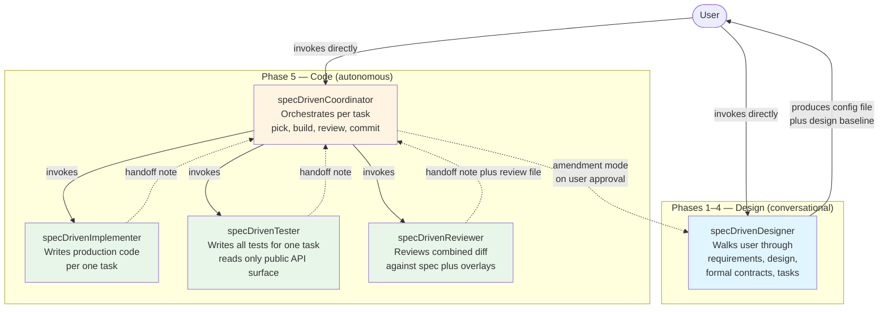

| Agent | Phase | Role | Writes to |
|---|---|---|---|
| **specDrivenDesigner** | 1–4 (Design) and 5 (Amendment mode) | **Design mode:** walks the user from a vague idea to a reviewed design baseline. Conversational, phase-gated. **Amendment mode (Phase 5):** non-conversationally edits scoped design files when implementer or tester raised a `design-change-needed`. | `design/*`, the project config file |
| **specDrivenCoordinator** | 5 (Code) | Orchestrates one task at a time: pick next task, invoke implementer, tester, reviewer, commit and push. Runs the convergence loop. Surfaces design-change requests to the user. | progress log, open-questions log, code-review files. Git commits. |
| **specDrivenImplementer** | 5 (sub-agent) | Writes production code for one task. Clean Code plus language best practices. Writes one characterization test per new class. Raises `design-change-needed` when the spec is insufficient, silent, or wrong. | `src/main/**`, build files |
| **specDrivenTester** | 5 (sub-agent) | Writes comprehensive unit, integration, and property tests for one task, **independently** — reads only the implementer's public surface, not bodies. Raises `design-change-needed` when a contract test cannot be written against the spec as written. | `src/test/**` only |
| **specDrivenReviewer** | 5 (sub-agent) | Reviews the combined implementer plus tester diff for one task, pre-commit. Inherits the language reviewer's rulebook plus Spec-Adherence plus configured overlays. Emits one review file per round. | code-review files only |

**Key property — narrow scope enforced at the filesystem level:**
- Implementer cannot write tests.
- Tester cannot modify production code.
- Reviewer cannot change code of any kind.
- Coordinator cannot edit design docs (except the progress log, open-questions log, and code-review files).

---

## 3. The two phases: design and code

The whole system runs in two sequential phases. Phase 1–4 is human-driven and conversational. Phase 5 is autonomous.

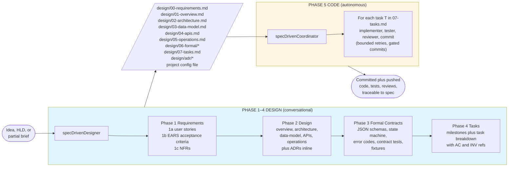

### Phase 1–4 has explicit review gates

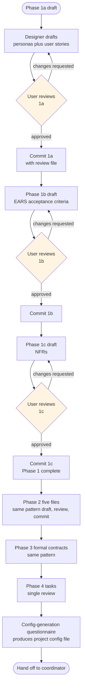

### Phase 5 is per-task autonomous

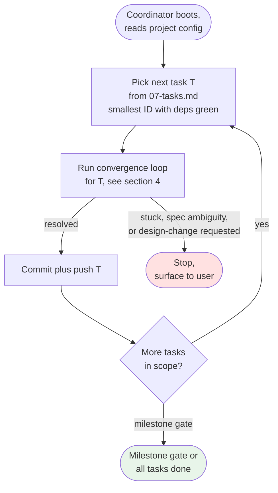

---

## 4. The convergence loop — how code gets produced

For each task, the coordinator runs a two-phase loop: first the implementer and tester converge on passing tests, then the implementer or tester plus the reviewer converge on a clean review.

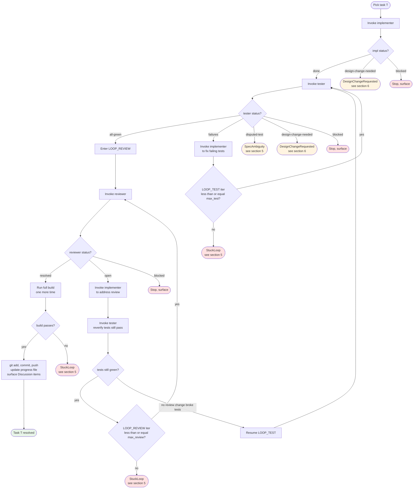

### Global bound

Total iteration count (LOOP_TEST plus LOOP_REVIEW) across the task is capped at `max_total_iterations_per_task` (default 10). Exceeded means `StuckLoop`, stop, surface.

### Independence disciplines

- **Tester reads only the implementer's public API** (signatures, Javadoc). Never method bodies. This catches drift between what the class claims and what it does.
- **Reviewer reads the combined diff** — implementer's plus tester's output — and checks both against the spec. Independent of each.
- **Implementer writes one characterization test per new class** (happy-path instantiation). The tester writes everything else.

---

## 5. The three escalations — how the system stops safely

Unbounded AI agent loops are how things go sideways. The system has exactly three ways to stop besides success: **StuckLoop, SpecAmbiguity, DesignChangeRequested.** Each one halts the coordinator and surfaces to the user with artifacts.

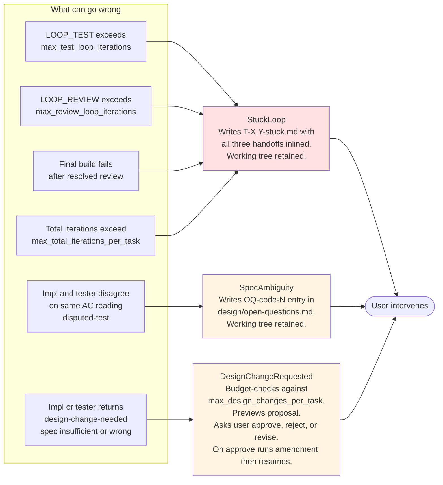

### How to distinguish them

| Situation | Which escalation | Why | User's next step |
|---|---|---|---|
| Implementer's 4th bug-fix still fails tests | `StuckLoop` | Bounded retries exhausted | Read `T-X.Y-stuck.md`, decide to simplify task, amend spec, or override |
| Full build fails after resolved review | `StuckLoop` | Integration hidden behind unit tests | Read build output, fix the gap (probably a new task) |
| Impl says "AC-1.4 means X", tester says "AC-1.4 means Y" and both are reasonable | `SpecAmbiguity` | Spec admits two readings | Resolve AC-1.4's wording in the spec (likely via designer conversation) |
| Impl can't proceed because no NFR pins the retry count | `DesignChangeRequested` | Spec is silent on a load-bearing decision | Approve, reject, or revise the proposal. On approve, coordinator invokes designer in amendment mode |
| Impl wants to "improve the design while I'm here" | **Rejected at source** | Scope creep, not a valid DCR | Implementer must not raise this. Do the task as scoped |

### What's intentional about these three paths

- **No auto-retry past the bound.** The user is the arbiter of "is this a dead-end or worth another try?"
- **Working tree retained on stop.** The user can inspect what the implementer and tester produced before deciding.
- **The coordinator never originates a DCR.** Only the implementer or tester raises it, from an honest "I've hit a wall" signal. The coordinator routes it.
- **The reviewer never raises `design-change-needed`.** If the reviewer spots a spec problem, it files a `Discussion` comment in the review file. The coordinator routes `Discussion` items as a separate lane after the task resolves.

---

## 6. Design-change amendments — fixing the spec mid-flight

When the implementer or tester genuinely cannot proceed because the spec is insufficient, silent, or wrong (not ambiguous — that's `SpecAmbiguity`), the system has a structured path to amend the spec without breaking the phase-gate discipline.

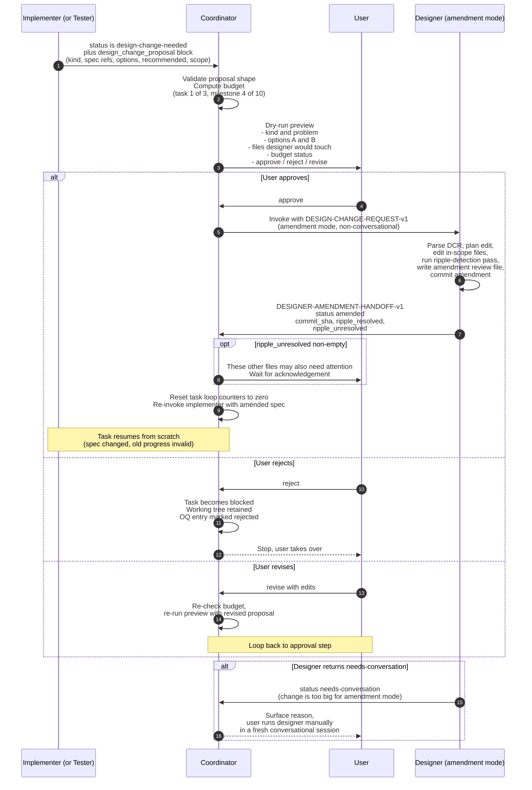

### Why amendment mode exists

Without it, a spec gap that surfaces mid-implementation would require:

1. Coordinator stops with `SpecAmbiguity` (wrong escalation — it's not ambiguous, it's insufficient).
2. You manually switch contexts to run the designer conversationally.
3. You remember to come back and re-invoke the coordinator.
4. Audit trail fragments across two sessions.

With amendment mode:

1. Implementer proposes the change in structured form.
2. You see a one-screen preview and decide.
3. Designer edits the spec files silently, commits, returns.
4. Coordinator resumes the task with the amended spec.
5. Audit trail is one `OQ-design-N` entry, one amendment commit, one code commit that references it.

### Bounded to prevent abuse

- `max_design_changes_per_task: 3` — a 4th amendment on the same task requires explicit user override.
- `max_design_changes_per_milestone: 10` — an 11th amendment in a milestone requires explicit user override.
- Soft warnings at 3/3 and 8/10: "you're near the limit, consider whether the design is soft."

### Scope discipline in amendment mode

The designer in amendment mode is non-conversational and **scope-strict**:

- Edits ONLY files listed in `scope_of_design_edit`.
- If executing the edit coherently requires touching other files, the designer runs a **ripple-detection pass**:
  - **Mechanical ripple** (renames, cross-reference updates): fixed in the same commit, logged to `ripple_resolved_mechanically`.
  - **Semantic ripple** (needs human judgment): NOT fixed, logged to `ripple_unresolved` for user review before code resumes.
- If the change is genuinely too big for amendment mode (touches Phase 1a user stories, requires numeric NFR negotiation, and so on), the designer returns `status: needs-conversation` — the user runs the designer in a fresh conversational session.

### Full traceability

Every DCR creates three durable artifacts:

1. **`OQ-design-N`** entry in `design/open-questions.md` (lifecycle: raised, approved, amended, resumed).
2. **Amendment commit** with message `<prefix>amendment DCR-N: <title>` that edits the spec files plus writes an amendment review file.
3. **Code commit** that references the amendment SHA in its body: `Spec amendment: abc1234 (DCR-N)`.

`grep` the git log to find which amendment produced which code commit, in either direction.

---

## 7. Project configuration

Every spec-driven project has a single config file at its root: `.spec-driven.yaml` (or a similar well-known path of your choice). The designer produces it at the end of Phase 4. The coordinator reads it at boot.

### Example 1 — a personal Maven project

```yaml
# Identity
project_name: url-shortener
project_root: /home/alice/projects/url-shortener
language: java
language_version: "17"

# Build tool
build_tool: maven
build_command: "mvn clean verify"
test_command: "mvn test"
integration_test_command: "mvn verify -P integration"
build_check_command: "mvn compile"

# Design artifact locations (relative to project_root)
design_dir: design/
requirements_file: design/00-requirements.md
overview_file: design/01-overview.md
architecture_file: design/02-architecture.md
data_model_file: design/03-data-model.md
apis_file: design/04-apis.md
operations_file: design/05-operations.md
tasks_file: design/07-tasks.md
formal_dir: design/06-formal/
adr_dir: design/adr/
reviews_dir: design/reviews/
code_reviews_dir: design/reviews/code/

# Source layout
source_dirs:
  - "src/main/java/**"
build_files:
  - "pom.xml"
test_dirs:
  - "src/test/java/**"
test_fixtures_dir: "src/test/resources/fixtures"
integration_test_tag: "integration"

# Reviewer
language_reviewer_skill: java-code-reviewer
reviewer_overlays: []    # no overlays for a plain Maven library
shared_review_rubric: _shared/review-rubric.md

# Progress plus escalation
progress_file: design/07-tasks-progress.md
open_questions_file: design/open-questions.md

# Git
git_remote: origin
git_branch: main
commit_message_prefix: ""
push_on_task_resolution: true

# Coordinator behavior
autonomy_mode: autonomous
max_test_loop_iterations: 3
max_review_loop_iterations: 3
max_total_iterations_per_task: 10
stop_at_milestone_gates: true

# Design-change amendment flow
max_design_changes_per_task: 3
max_design_changes_per_milestone: 10
design_change_warn_at_task: 3
design_change_warn_at_milestone: 8

# AWS — OMIT this block entirely if the project does not use AWS.
# When absent, every use_aws call is refused at the agent level.
# See section 10.
```

### Example 2 — a Spring Boot service with a Postgres database and a message consumer

```yaml
# Identity
project_name: order-processor
project_root: /home/alice/work/order-processor
language: java
language_version: "21"

# Build tool
build_tool: gradle
build_tool_dsl: kotlin                   # build.gradle.kts
build_command: "./gradlew build"
test_command: "./gradlew test"
integration_test_command: "./gradlew integrationTest"
build_check_command: "./gradlew compileJava"

# Design artifact locations
design_dir: design/
requirements_file: design/00-requirements.md
overview_file: design/01-overview.md
architecture_file: design/02-architecture.md
data_model_file: design/03-data-model.md
apis_file: design/04-apis.md
operations_file: design/05-operations.md
tasks_file: design/07-tasks.md
formal_dir: design/06-formal/
adr_dir: design/adr/
reviews_dir: design/reviews/
code_reviews_dir: design/reviews/code/

# Source layout
source_dirs:
  - "src/main/java/**"
build_files:
  - "build.gradle.kts"
  - "settings.gradle.kts"
test_dirs:
  - "src/test/java/**"
test_fixtures_dir: "src/test/resources/fixtures"
integration_test_tag: "integration"

# Service shape — drives the reviewer overlays
package_type: web-service                # library, web-service, cli, message-consumer
service_entry_class: com.acme.orders.OrderProcessorApplication

# Reviewer — language reviewer plus stackable overlays
language_reviewer_skill: java-code-reviewer
reviewer_overlays:
  - spring-boot                          # layered architecture, @Transactional discipline, config-properties hygiene
  - message-consumer                     # shutdown handling, bounded executor, at-least-once delivery
shared_review_rubric: _shared/review-rubric.md

# Progress plus escalation
progress_file: design/07-tasks-progress.md
open_questions_file: design/open-questions.md

# Git
git_remote: origin
git_branch: main
commit_message_prefix: ""
push_on_task_resolution: true

# Coordinator behavior
autonomy_mode: autonomous
max_test_loop_iterations: 3
max_review_loop_iterations: 3
max_total_iterations_per_task: 10
stop_at_milestone_gates: true

# Design-change amendment flow
max_design_changes_per_task: 3
max_design_changes_per_milestone: 10
design_change_warn_at_task: 3
design_change_warn_at_milestone: 8

# AWS — present because the message consumer reads from an SQS queue
aws:
  profile: orders-dev                    # named profile in ~/.aws/credentials or ~/.aws/config
  default_region: us-east-1
  scope: full                            # declarative, IAM is real enforcement
  notes: |
    Profile orders-dev is scoped via IAM to the dev account.
    All agents prompt before every use_aws call, no auto-approve.
```

### Field reference

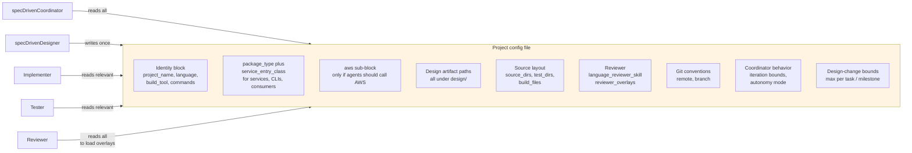

---

## 8. Build tool support

The system is build-tool-agnostic. You declare your build tool and commands in the config, and the coordinator uses them as-is.

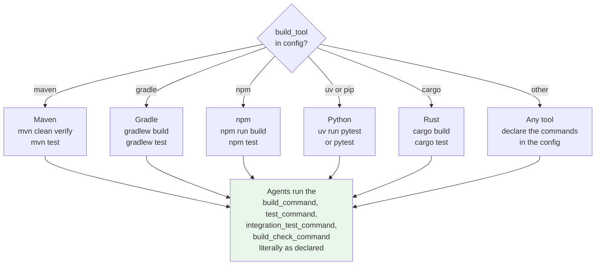

### What goes in the config

- `build_command` — the full verify that gates a commit (e.g., `mvn clean verify`, `./gradlew build`).
- `test_command` — unit tests only (e.g., `mvn test`, `npm test`).
- `integration_test_command` — integration tests only, or empty string if none.
- `build_check_command` — the fast pre-handoff check the implementer runs (e.g., `mvn compile`, `./gradlew compileJava`).

The coordinator executes these commands verbatim at the appropriate points in the convergence loop:

- Implementer runs `build_check_command` before returning its handoff.
- Tester runs `test_command` after writing tests.
- Coordinator runs `build_command` one final time before committing.

### Java MVP

The current implementation has the full `language: java` path wired up. TypeScript, Python, Go, and others require adding a language section to each agent's quality bar. The pattern is the same, only the specifics (language-idiomatic conventions, test frameworks, dependency declarations) differ.

---

## 9. Reviewer overlays — stackable rule lenses

The reviewer composes its rule set in three layers:

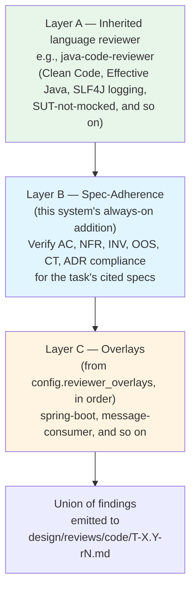

**Key property: overlays only add rules, they never remove inherited rules.** If `java-code-reviewer` flags a `catch (Exception e)` as a Blocker, no overlay can weaken that. Overlays extend.

### Example overlay: `spring-boot` (for `package_type: web-service`)

**Category in findings:** `Spring-Boot-Hygiene`

Representative rules:

| Severity | Finding |
|---|---|
| Blocker | `@Transactional` on a private method (Spring's proxy-based AOP ignores it) |
| Blocker | Field injection with `@Autowired` on a required dependency — use constructor injection |
| Blocker | `@ConfigurationProperties` class missing `@Validated` when it declares constraints |
| Major | Controller layer directly calls a repository, bypassing the service layer |
| Major | `@Service` annotated class with no public methods (dead code) |
| Major | Exposing a JPA entity directly as a REST response (risk of serialization issues, tight coupling) |
| Minor | Missing `@Profile` on a `@Component` that is environment-specific |
| Discussion | Flyway migration uses a destructive operation (`DROP TABLE`, `ALTER ... DROP COLUMN`) — flag for verification |

### Example overlay: `message-consumer` (for `package_type: message-consumer`)

Works for Kafka, RabbitMQ, SQS, or any polling consumer.

**Category in findings:** `Message-Consumer-Correctness`

Representative rules:

| Severity | Finding |
|---|---|
| Blocker | No shutdown handler — SIGTERM must stop polling, drain in-flight messages, close clients |
| Blocker | `while (true)` poll loop with no shutdown signal check |
| Blocker | Message acknowledgement called before handler success — at-most-once bug |
| Blocker | Swallowed `Exception` in poll loop (silent failure) |
| Blocker | Swallowed `InterruptedException` (shutdown will hang) |
| Blocker | DLQ / dead-letter strategy not documented in `design/05-operations.md` AND no in-code routing |
| Major | Unbounded executor (`newCachedThreadPool()`) for handler invocation |
| Major | Polling without long-poll or back-pressure (hot loop on empty queue) |
| Major | Missing metrics for `MessagesReceived`, `MessagesProcessed`, `MessagesFailed` |
| Minor | Batch size not maximized (leaves throughput on the table) |
| Minor | Handler logs don't include message ID |
| Discussion | No queue-depth metric published |

**Framework-neutral:** doesn't require a specific metrics library or messaging framework. Requires the invariants (shutdown, bounded executor, ack-after-success, three counters). Mechanism is free.

### Writing your own overlay

An overlay is a rule set with:
- A **category name** for findings
- A **trigger condition** (e.g., `config.package_type == web-service` or `config.reviewer_overlays contains 'spring-boot'`)
- A **scope** (which files the overlay inspects — typically a subset of the diff)
- A **rule list** with severity, citation, and detection heuristic for each

Add overlays to your local copy of the reviewer's skill document. The coordinator picks them up automatically when `config.reviewer_overlays` lists them.

---

## 10. AWS access — named profiles, no auto-approve (optional)

Many projects don't use AWS, and the system works fine without it. If your project does, the agents can call AWS via the `use_aws` tool — but every call prompts the user.

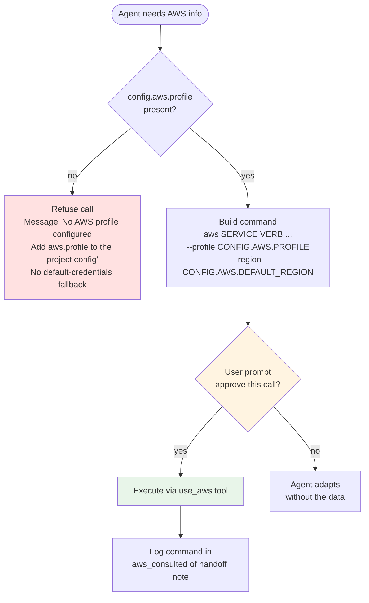

### Non-negotiable rules

1. **Every `use_aws` call MUST pass `--profile <config.aws.profile>`.** No default credentials, ever.
2. **Every call MUST pass `--region <config.aws.default_region>`** unless the task explicitly names another region.
3. **Absence of `aws:` block** means agents refuse `use_aws` entirely, no fallback.
4. **No verb gating in prompts.** `scope: full` is declarative. IAM on the profile is the sole real enforcement. If you want read-only, create a read-only IAM profile.
5. **Audit trail:** every agent logs AWS commands in its handoff note under `aws_consulted`.

### Per-agent use cases

| Agent | Typical use |
|---|---|
| Designer | Reading real AWS resource shapes to ground a spec (pin queue attributes into an AC) |
| Implementer | One-time read to understand an AWS response shape before writing a mock — save response as a fixture |
| Tester | Construct fixtures from real AWS shapes. NEVER call AWS inside a test body |
| Reviewer | Verify a claim in the implementer or tester's handoff (e.g., metric namespace exists) |
| Coordinator | Rarely, `sts get-caller-identity` during boot at most |

### Forbidden uses (universal)

- Writing production code that calls AWS directly (violates offline-testability).
- Using live AWS as the test oracle (tests stay offline).
- Any write verb (`create-*`, `put-*`, `delete-*`) without user-approving the prompt.
- Default credentials — ever.

---

## 11. Hard rules — the system's non-negotiables

These are the rules that keep the system safe and the agents honest.

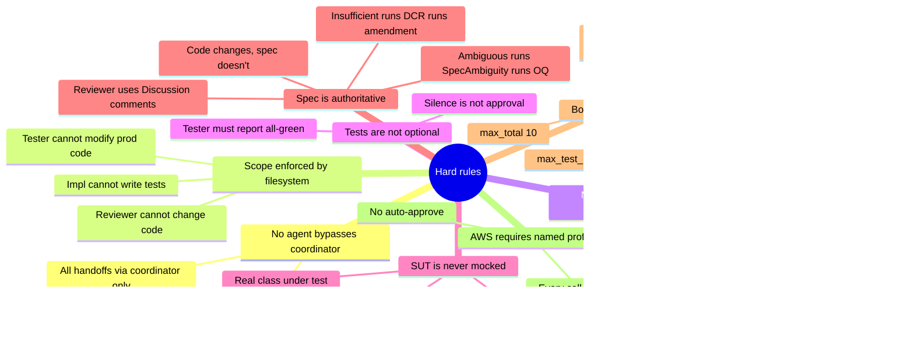

**In order of criticality:**

1. **No agent bypasses the coordinator.** Sub-agents communicate only through handoff artifacts routed by the coordinator.
2. **No agent writes outside its scope.** Enforced via write-path allow-lists in the agent configuration.
3. **No commit without a resolved review.** Coordinator never pushes if `reviewer.status != resolved`.
4. **Tests are not optional.** Implementer output without green tester output is not committable.
5. **SUT is not mocked.** The tester's own class under test is instantiated for real. Only external dependencies (HTTP, subprocesses, filesystem, AWS) are mocked.
6. **Spec is authoritative.** Code changes to match spec, never the other way. Ambiguity runs to `SpecAmbiguity`. Insufficiency, silence, or wrongness runs to `DesignChangeRequested`. Reviewer-spotted spec gaps become `Discussion` comments.
7. **Bounded retries are non-negotiable.** Stuck means surface means user intervenes.
8. **AWS requires named profile.** No default credentials, no auto-approve.

---

## 12. How to actually use it — common workflows

### Workflow A — Starting a new project from a vague idea

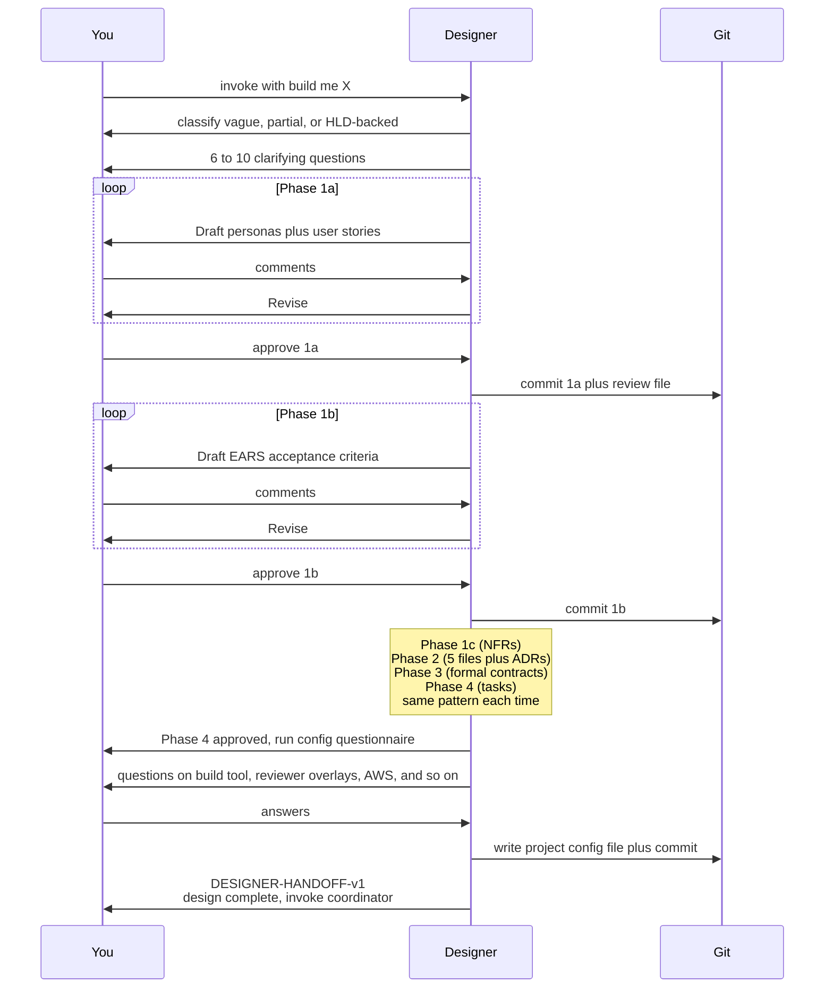

### Workflow B — Implementing Phase 5 code (autonomous)

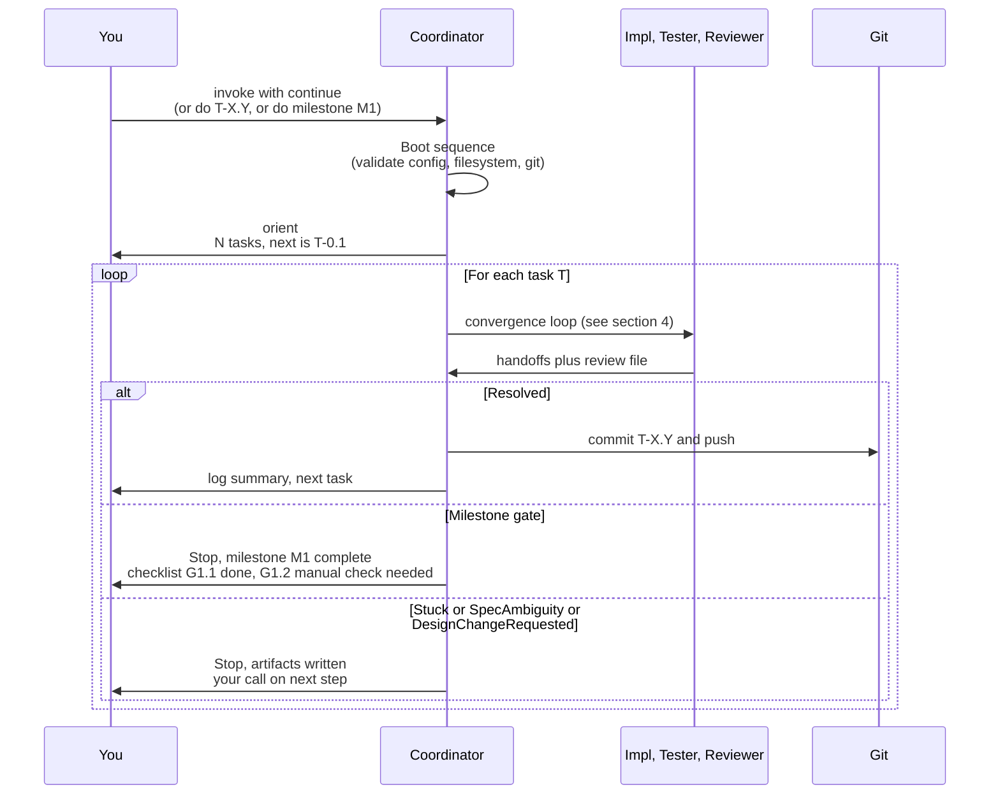

### Workflow C — DCR for a missing NFR

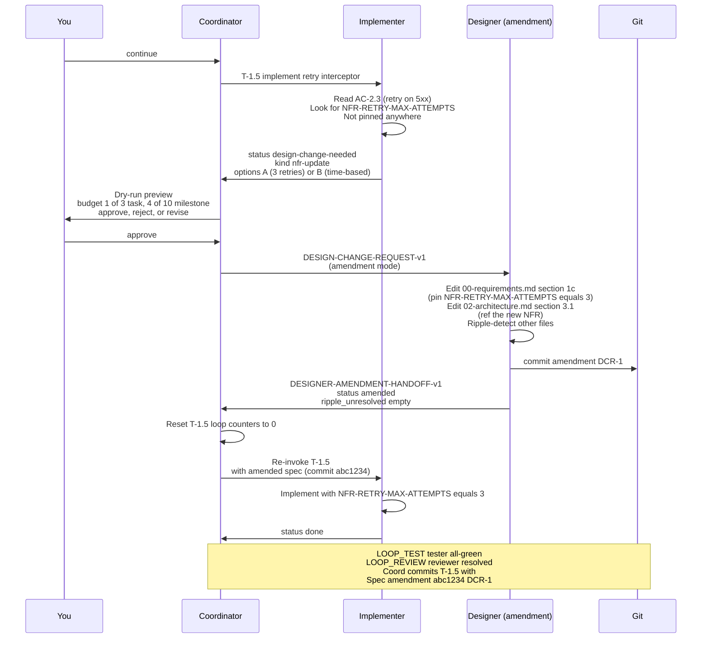

### Workflow D — Running two projects side-by-side on the same machine

You can have a personal Maven library at `~/projects/url-shortener/` and a Gradle Spring Boot service at `~/work/order-processor/` on the same machine, each with its own project config.

- Invoke from `~/projects/url-shortener/` runs Maven behavior, no overlays, no AWS profile.
- Invoke from `~/work/order-processor/` runs Gradle behavior, `spring-boot + message-consumer` overlays, AWS profile `orders-dev`.

Same agents, different config, different behavior. The agents read the config at the project root, so there's no cross-contamination.

---

## 13. Troubleshooting — when things go sideways

### "Coordinator refuses to boot"

Most likely the filesystem-invariant checks failed. The coordinator validates:

- Project config file exists at or above CWD.
- Required fields (`project_root`, `language`, `tasks_file`, git settings) are present.
- Language is supported (currently Java MVP).
- Design baseline is resolved (`07-tasks.md` front-matter shows `status: resolved`).

**Fix:** Read the specific failure message. Usually either the designer didn't complete Phase 4, or you're running from the wrong directory.

### "Task T-X.Y is stuck after max iterations"

Read `design/reviews/code/T-X.Y-stuck.md`. It has all three handoffs inlined. Usually one of:

- **Implementer keeps making the same mistake.** Task may be too large — consider splitting it in `07-tasks.md` and restarting.
- **Tester keeps failing on an edge case.** AC may be too vague — consider tightening it via DCR.
- **Build fails at final verify.** Integration issue hidden behind unit tests — add an integration test before retrying.

### "Design change requested — do I approve?"

Read the preview carefully:

- **Problem statement** cites specific spec IDs (AC-N, NFR-X, ADR-Y). If no specific ID is cited, it's probably scope creep disguised as DCR — reject.
- **Options considered** should have at least two. If both options say "do the thing the implementer wants anyway," reject — that's not a real proposal.
- **Scope of design edit** should name specific files plus sections. If it says "update the whole design," reject — amendment mode is for scoped edits.
- **Budget** — if this is amendment 3 of 3 or 9 of 10, pause and ask: is the design genuinely this soft, or are we masking a deeper architecture issue?

### "Reviewer keeps opening the same blocker"

The implementer and reviewer are bouncing on the same point. Usually:

- **Implementer disagrees** — they should either implement per the reviewer's reading or raise `SpecAmbiguity` (if the AC admits their reading too) or `design-change-needed` (if the spec is insufficient).
- **Reviewer is wrong** — the AC doesn't actually say what the reviewer thinks. In that case you'd see an `open-questions` entry with the AC text and both readings. Resolve via designer conversation.

If nothing resolves after `max_review_loop_iterations`, it's a `StuckLoop` — you intervene.

### "I want to skip the designer and manually write design docs"

You can, but:

- You must produce `design/07-tasks.md` with front-matter `status: resolved` before the coordinator will proceed.
- You must produce the project config file with all required fields.
- You must produce at minimum `00-requirements.md`, `01-overview.md`, `02-architecture.md`, `07-tasks.md` — the coordinator checks for their existence.

The designer exists because doing this manually is harder than it looks — especially the traceability chain (every AC references a US, every NFR is referenced by an AC, every task row cites AC or INV). If you do it manually, use the designer to review your drafts before handoff.

### "Agent prompts me for AWS access but I don't want it"

Remove the `aws:` block from the project config. Agents will refuse all `use_aws` calls. The prompt to approve won't appear because the agent won't attempt the call.

### "My project uses a language or framework the system doesn't cover"

See section 14 on adapting the system.

---

## 14. Adapting the system to your stack

The system is structured so that the parts you're most likely to change are isolated.

### Adding a new language

Each agent's skill document has a `## Quality bar — <Language>` section. To add, say, Python:

1. Copy the `## Quality bar — Java` section in each of the four Phase-5 agent skill documents (implementer, tester, reviewer, coordinator).
2. Rewrite it with Python-idiomatic conventions (PEP 8, type hints, `logging` over `print`, pytest conventions, virtualenv discipline, and so on).
3. Have the coordinator's boot-sequence language check accept the new language.

The agents dispatch on `config.language` — the structural machinery (handoff schemas, convergence loop, escalations, review files) is language-agnostic.

### Adding a new reviewer overlay

A reviewer overlay is a self-contained rule set. To add one (say, `react-frontend`):

1. In the reviewer's skill document, add a section `#### Overlay: react-frontend` under Layer C.
2. Declare the trigger (`applied when config.reviewer_overlays contains 'react-frontend'`).
3. Declare the scope (which files the overlay inspects).
4. List the rules with severity, category (e.g., `React-Hygiene`), and detection heuristic.
5. Add to the category list in the review-file template at the top of the reviewer's document.

Overlays compose. A project with `reviewer_overlays: [spring-boot, react-frontend]` would run both — if it's a full-stack monorepo, both lenses apply to their respective parts of the diff.

### Adding a new `package_type`

`package_type` selects sub-rules in the implementer (what a new class looks like) and reviewer (what overlay-level rules fire). To add (say) `graphql-service`:

1. In the implementer's skill, add a table row and `package_type`-specific section with expected shape (resolver classes, schema file location, error-handling pattern).
2. In the reviewer's skill, add a `graphql-service` overlay to Layer C or make `spring-boot`-style overlay rules conditional on `package_type`.
3. Update the designer's Phase-4 questionnaire to include the new option.
4. Update the tester's per-type test guidance.

### Adding a new build tool

The simplest adaptation. The coordinator executes `config.build_command`, `config.test_command`, and `config.build_check_command` verbatim, so any build tool works as long as you can describe it in those commands.

For a truly novel tool (e.g., Bazel), the only concern is whether the implementer knows how to edit the build file. Add a brief note to the implementer's skill document about the tool's conventions (e.g., Bazel's `BUILD.bazel` file, target declarations).

### Adding a new AI platform

This document describes the agent behavior, not the runtime. The handoff schemas, review file formats, and config schema are plain text and YAML — portable across AI runtimes. What's platform-specific is the **agent configuration** (tool wiring, write-path allow-lists, auto-approve settings). That's a separate file per agent in your runtime.

---

## 15. Glossary

| Term | Definition |
|---|---|
| **AC (Acceptance Criterion)** | EARS-style testable statement under a user story, e.g., `AC-1.4`. Every implementation must satisfy the ACs cited by its task. |
| **Amendment mode** | Non-conversational mode of `specDrivenDesigner`, invoked by coordinator with a `DESIGN-CHANGE-REQUEST-v1`. Edits scoped design files, writes amendment review file, commits. |
| **Amendment commit** | A git commit made by the designer in amendment mode, with message format `<prefix>amendment DCR-N: <title>`. |
| **Characterization test** | One happy-path test per new class, written by the implementer. Verifies instantiation plus basic flow. The tester writes all other tests. |
| **Convergence loop** | The per-task loop: implementer, tester, reviewer, with bounded retries. See section 4. |
| **CT (Contract Test)** | Test specification in `design/06-formal/contract-tests.md`, traceable to an AC. Has a fixture in `design/06-formal/fixtures/`. |
| **DCR (Design-Change Request)** | Structured proposal from implementer or tester to amend the spec. Triggers `DesignChangeRequested` escalation. |
| **design-change-needed** | Handoff status set by implementer or tester when the spec itself is insufficient, silent, or wrong and implementation cannot proceed. |
| **DesignChangeRequested** | Coordinator escalation type that surfaces a DCR to the user and, on approval, invokes the designer in amendment mode. |
| **Discussion (comment)** | Finding severity in review files. Spec-level observation, never blocks resolution. Coordinator routes as a separate lane after task commit. |
| **EARS** | "Easy Approach to Requirements Syntax" — five templates for ACs: `[ubiquitous]`, `[event-driven]`, `[state-driven]`, `[unwanted]`, `[optional]`. |
| **Handoff note** | Structured YAML-like text block returned by each sub-agent at the end of its turn. Parsed by coordinator. Schemas: `IMPLEMENTER-HANDOFF-v1`, `TESTER-HANDOFF-v1`, `REVIEWER-HANDOFF-v1`, `DESIGNER-AMENDMENT-HANDOFF-v1`. |
| **INV (Invariant)** | State-machine invariant in `design/06-formal/state-machine.md`, numbered `INV-N`. Preserved by code, verified by tests. |
| **Milestone gate** | Boolean-checkable criteria at the end of a milestone (G0 to G5 in `07-tasks.md`). Coordinator stops for user check-in even in autonomous mode. |
| **NFR** | Non-Functional Requirement. Every NFR has a numeric value, version, or platform. Defined in `00-requirements.md section 1c`. |
| **OOS** | Out-of-Scope item explicitly excluded in `00-requirements.md`. Reviewer flags code that creeps into OOS as Blocker. |
| **Overlay** | Stackable reviewer rule set applied after the language reviewer. Configured via `reviewer_overlays` in the project config. See section 9. |
| **package_type** | Code-shape designator: `library`, `web-service`, `cli`, `message-consumer`. Deployment-agnostic. Drives per-type rules in implementer, tester, and reviewer overlays. |
| **Review file** | Markdown file at `design/reviews/code/T-X.Y-rN.md` with structured findings (severity, category, spec citation, suggested fix). Produced by reviewer. |
| **Ripple detection** | Designer's amendment-mode pass that scans other design files for references to changed symbols. Mechanical ripples fixed in same commit. Semantic ripples surfaced to user. |
| **SpecAmbiguity** | Coordinator escalation when implementer and tester cite the same AC but disagree on its reading. Written to `design/open-questions.md`. |
| **StuckLoop** | Coordinator escalation when iteration bounds are exceeded. Writes `T-X.Y-stuck.md` with all handoffs inlined. |
| **SUT (System Under Test)** | The class being tested. SUT is **never** mocked. Mock only its external dependencies (HTTP, subprocesses, filesystem, AWS). |
| **US (User Story)** | Persona-centered capability statement in `design/00-requirements.md section 1a`, numbered `US-N`. |

---

## Appendix — Project artifact layout

```
<project-root>/
├── <project-config>.yaml                 ← the project config (see section 7)
└── design/
    ├── 00-requirements.md                ← Phase 1 (personas, US, AC, NFR)
    ├── 01-overview.md                    ← Phase 2 — context, actors, quality attributes
    ├── 02-architecture.md                ← Phase 2 — components, flows, ADRs
    ├── 03-data-model.md                  ← Phase 2 — domain types, invariants, state machine
    ├── 04-apis.md                        ← Phase 2 — external contracts prose
    ├── 05-operations.md                  ← Phase 2 — build, run, observability, DLQ (for consumers)
    ├── 06-formal/                        ← Phase 3 — schemas, state machine, CTs, fixtures
    │   ├── *.schema.json
    │   ├── state-machine.md
    │   ├── error-codes.md
    │   ├── contract-tests.md
    │   └── fixtures/
    ├── 07-tasks.md                       ← Phase 4 — milestones plus task breakdown
    ├── 07-tasks-progress.md              ← coordinator writes here per resolved task
    ├── adr/                              ← ADRs authored during Phase 2
    │   └── NNNN-*.md
    ├── open-questions.md                 ← SpecAmbiguity plus DCR plus Discussion lifecycle
    └── reviews/
        ├── TEMPLATE.md
        ├── YYYY-MM-DD-<slug>-rN.md       ← design-phase reviews
        └── code/
            └── T-X.Y-rN.md               ← code-phase reviews (one per task round)
```

---

**About this pattern:** The spec-driven approach described here treats the design baseline as the authoritative input to code generation, with independent agents verifying each other's output before any commit lands. The five-agent structure — one designer, one coordinator, and three independent workers (implementer, tester, reviewer) — is the novel contribution. It avoids the classic single-agent failure mode where the same model writes the code, writes the tests, and declares the work done.

The pattern is runtime-agnostic and language-agnostic. The implementation described in this document is a Java MVP, but the structural machinery (handoff schemas, convergence loop, escalations, reviewer overlays) applies to any stack.

Questions, feedback, or extensions — reach out in the comments.
