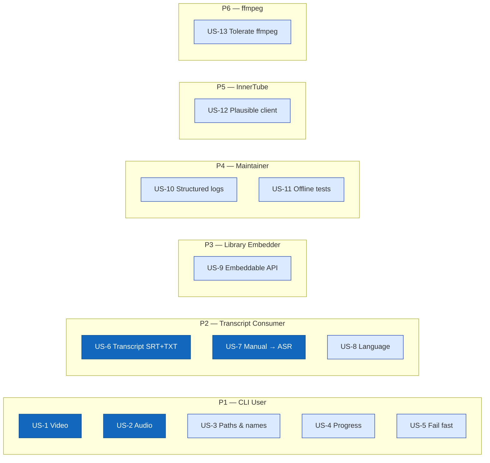

# 00 — Requirements

This document is the **what** and **why** of youtubeDownloader. The **how** lives in `02-architecture.md`; the **formal contracts** live in `06-formal/`.

Requirements are built in three sub-phases, each reviewed and approved before the next:

| Sub-phase | Contents | Status |
|---|---|---|
| 1a | Personas + user stories | **resolved** (review: [`1481921`](./reviews/2026-05-02-requirements-phase-1a-r1.md)) |
| 1b | Acceptance criteria (EARS format) | in progress |
| 1c | Non-functional requirements | pending |

> **Scope anchor:** this project is inspired by `yt-dlp` but deliberately covers a tiny subset: one YouTube video URL → video / audio / transcript / thumbnail on local disk. Every other site, feature, and edge case `yt-dlp` supports is out of scope for the MVP.

---

## Personas

youtubeDownloader is a local CLI tool. It has no server, no multi-user session, and no customer-facing API. The personas below are the humans and external systems whose outcomes depend on its correctness — framed from whose perspective a capability matters.

| ID  | Persona                             | Role                                                                                                                                                                                                                                                                                                          |
| --- | ----------------------------------- | ------------------------------------------------------------------------------------------------------------------------------------------------------------------------------------------------------------------------------------------------------------------------------------------------------------- |
| P1  | **CLI User (Researcher / Learner)** | A developer, student, journalist, or researcher who runs the tool on their own machine against YouTube URLs they are licensed to download. They want the video, audio, or transcript as local files so they can study, quote, transcribe, remix, or archive the content offline. This is the primary persona. |
| P2  | **Transcript Consumer**             | Someone who downloads a video specifically for its transcript — to feed into an LLM summariser, to search textually, to quote in writing, or to accessibility-caption derived work. Their success depends on the transcript being complete, timestamped when requested, and in a format they can process.     |
| P3  | **Java Library Embedder**           | A developer who wants to invoke youtubeDownloader's core functionality from their own Java program (e.g., a personal task-manager that auto-downloads a queued URL, a Discord bot, a batch script). They care about a clean, embeddable API — not a CLI.                                                      |
| P4  | **Maintainer (Future Self)**        | The developer (likely the original author, six months later) who has to diagnose why the tool suddenly fails because YouTube changed something. They care about clear error messages, source attribution for wire-format assumptions, and a fast edit-compile-test loop.                                      |
| P5  | **YouTube's InnerTube API**         | The reverse-engineered upstream. Not a person. The tool must be a well-behaved client of this API — reasonable request rates, a plausible `User-Agent` and client identity, graceful handling when responses change shape without notice.                                                                     |
| P6  | **ffmpeg (external binary)**        | The external process responsible for muxing the separate video and audio streams into a single MP4, and for converting audio to MP3 when requested. Its success or failure is reported upward; the tool must handle its absence, its errors, and its version differences gracefully.                          |

---

## User stories

Stories are grouped by persona. Each story has a stable ID (`US-N`) that acceptance criteria (Phase 1b) and tasks (Phase 4) will reference.

### CLI User (P1)

#### US-1 — Download a full video from a URL

> **As** a CLI User,
> **I want** to pass a YouTube video URL to the tool and get a playable local MP4 file containing the best-quality video and audio available,
> **so that** I can watch or study the video offline without going back to the browser.

**Notes:**
- "Best quality" in the MVP means the highest-resolution video stream plus the best audio stream that can be muxed together, selected by the tool — not a user-controlled format selector.
- Muxing requires `ffmpeg` on `PATH`.

#### US-2 — Extract audio only

> **As** a CLI User,
> **I want** to request audio-only from a YouTube URL and get an M4A or MP3 file on disk,
> **so that** I can listen to podcasts, lectures, and music on a device that doesn't need the video track, at a smaller file size.

**Notes:**
- M4A comes directly from YouTube (no re-encoding). MP3 requires `ffmpeg` to transcode.

#### US-3 — Choose where files land and what they're named

> **As** a CLI User,
> **I want** to specify an output directory and (optionally) a filename, and have sane defaults when I don't,
> **so that** I can integrate the tool into my own file-organization habits and scripts without surprise paths.

**Notes:**
- Default filename pattern candidates (to be pinned in Phase 1b): `<title> [<videoId>].<ext>` or similar.
- Default output directory: current working directory.

#### US-4 — See progress while a download runs

> **As** a CLI User,
> **I want** to see download progress (bytes downloaded, total size, percentage, rate, ETA) in my terminal while the tool runs,
> **so that** I know the tool is making progress and I can estimate when it will finish.

**Notes:**
- Long downloads (multi-GB videos on slow networks) without feedback feel broken even when they're not.

#### US-5 — Fail fast with a useful error

> **As** a CLI User,
> **I want** the tool to tell me — in one clear sentence — why it failed, when it fails,
> **so that** I can fix the root cause (invalid URL, no network, video unavailable, ffmpeg missing) without reading stack traces or source code.

**Notes:**
- "Useful" means the message identifies which boundary failed: URL parse, InnerTube call, stream download, caption download, ffmpeg, filesystem.

### Transcript Consumer (P2)

#### US-6 — Download the transcript of a video

> **As** a Transcript Consumer,
> **I want** to request the transcript of a YouTube video and get it as an SRT file (with timestamps) and a plain-text file (without),
> **so that** I can feed the text into an LLM, search it, or quote it — and keep the timestamped version for reference.

**Notes:**
- SRT is a de facto standard; plain text is the most useful form for LLM input.

#### US-7 — Prefer human-authored captions, fall back to auto-generated

> **As** a Transcript Consumer,
> **I want** the tool to use the creator's uploaded captions when they exist, and fall back to YouTube's auto-generated ASR captions when they don't,
> **so that** I get the most accurate transcript available without having to check the video manually first.

#### US-8 — Pick the transcript language

> **As** a Transcript Consumer working in a non-English context,
> **I want** to specify which language's caption track to download,
> **so that** videos with multiple caption languages give me the one I actually want, not a default I have to re-translate.

**Notes:**
- Default language behaviour when no flag is given (English-preferred vs video's primary language) is pinned in Phase 1b.

### Java Library Embedder (P3)

#### US-9 — Invoke the downloader from a Java program

> **As** a Java Library Embedder,
> **I want** to call a small, stable Java API to resolve a YouTube URL, pick the formats I need, and download them — all without shelling out to the CLI,
> **so that** I can integrate video / audio / transcript downloads into my own Java projects with compile-time type safety.

**Notes:**
- The CLI is built on top of this library. The library is the primary artifact; the CLI is one of its consumers.

### Maintainer / Future Self (P4)

#### US-10 — Diagnose why something broke

> **As** the Maintainer,
> **I want** the tool to emit structured, level-filtered logs (debug, info, warn, error) covering every external boundary call (InnerTube request + response summary, stream HTTP status, ffmpeg command line, filesystem write),
> **so that** when YouTube changes a response shape or a video refuses to play, I can reproduce the failure and fix it without adding more logging first.

#### US-11 — Run without a network (for a subset of features)

> **As** the Maintainer running the unit test suite,
> **I want** every wire-format parsing path (InnerTube response parse, caption parse, format selection) to be testable offline against fixture files,
> **so that** I can develop on a plane, catch regressions deterministically, and avoid every unit test depending on a flaky third-party endpoint.

### YouTube InnerTube API (P5)

#### US-12 — Behave as a plausible InnerTube client

> **As** the YouTube InnerTube API (as a boundary contract),
> **I want** youtubeDownloader's requests to look like a plausible ANDROID-client request — correct `client` context block, plausible `User-Agent`, one player request per video, no per-second polling —,
> **so that** the tool doesn't get blocked by fingerprint-based anti-abuse defences and doesn't contribute to noisy traffic that degrades service for real clients.

**Notes:**
- The ANDROID client was chosen (vs WEB) primarily because its responses do not require JavaScript signature deciphering — an ADR in Phase 2 will record this.

### ffmpeg (P6)

#### US-13 — Tolerate an ffmpeg that is missing, too old, or fails

> **As** the tool interacting with ffmpeg,
> **I want** to detect at startup whether ffmpeg is on `PATH` and new enough, report a clear error if it isn't, and surface ffmpeg's own stderr when it fails mid-process,
> **so that** users aren't stuck with an opaque "mux failed" message when the real problem is an old ffmpeg, a missing binary, or a genuine encoding error.

**Notes:**
- MP4 mux and MP3 conversion both require ffmpeg. Video-only or transcript-only downloads do not.

---

## Story map (at a glance)

> Blue (filled) stories drive the core user value — getting video, audio, and transcripts on disk. Blue (outline) stories are the operational and contract must-haves that make the filled ones trustworthy.

---

## Out of scope (explicit non-goals)

Every item below was considered, and is deliberately **not** part of the MVP. Each has a home elsewhere — usually "a future phase" or "use `yt-dlp` for this".

| ID | Excluded | Why |
|---|---|---|
| OOS-1 | **Playlists / channels / search** | Scope expands 10x. MVP is single-URL. A future release can add a thin wrapper. |
| OOS-2 | **Signature deciphering (JavaScript execution of YouTube's `player.js`)** | The single most complex piece of `yt-dlp`. Avoided in MVP by using the `ANDROID` InnerTube client, whose responses do not need it. Videos that only return cipher-protected URLs will fail with a clear error (US-5). |
| OOS-3 | **Live streams** | Live DASH/HLS handling is its own subsystem (manifest parsing, chunk polling, live-from-start). MVP rejects `is_live = true` videos with a clear error. |
| OOS-4 | **yt-dlp-style format-selection DSL** (`-f "bv*[height<=720][fps>30]+ba/b"`) | Requires a parser, a sorter, and a filter expression language. MVP auto-picks the best video + audio the tool can mux. |
| OOS-5 | **Concurrent-fragment parallel downloads** (for DASH / HLS) | MVP downloads streams via a single HTTP GET (with byte ranges for resume, if implemented in Phase 1c). Parallelism is a later optimisation. |
| OOS-6 | **Cookies / authenticated sessions / `--cookies-from-browser`** | Needed for age-restricted, member-only, or paid content. MVP works only with publicly-accessible videos. |
| OOS-7 | **Age-restricted videos** | Follows from OOS-6. If the InnerTube response indicates age-restriction, the tool reports it and exits. |
| OOS-8 | **Download archive / resume across process restarts** | Useful for playlists (OOS-1). For single-URL MVP, a failed run is re-run from scratch. |
| OOS-9 | **SponsorBlock integration, chapter splitting, metadata embedding** | All post-processing features `yt-dlp` supports. Out of scope; trivial to add later if ever wanted. |
| OOS-10 | **Any site other than YouTube** | `yt-dlp`'s extractor model is the bulk of its 500k lines of code. This project is deliberately YouTube-only. |
| OOS-11 | **Plugins / extensibility for third-party extractors** | Follows from OOS-10. |
| OOS-12 | **Auto-update of the tool itself** | `yt-dlp -U` has its own signing and release infrastructure. MVP is updated by rebuilding from source. |
| OOS-13 | **GUI** | CLI + library only. |

---

## Open questions / assumptions to validate in Phase 1b/1c

Questions that will be pinned down when we write acceptance criteria (1b) and NFRs (1c). They are listed here so reviewers can flag early if a default is wrong.

| # | Question | Likely answer (to confirm in 1b / 1c) |
|---|---|---|
| OQ-1 | **Default filename pattern** when `--output` is not given | `<sanitized_title> [<videoId>].<ext>`, matching `yt-dlp`'s default |
| OQ-2 | **Default caption language** when `--lang` is not given | Prefer `en`; fall back to the video's primary language; final fallback to any available caption track |
| OQ-3 | **Default audio format** when `--audio-only` is given without an explicit format flag | `m4a` (no re-encoding required, faster, higher quality per bit) |
| OQ-4 | **What counts as "best video"** for muxing | Highest resolution that is <= 1080p by default, to avoid surprise 4K / 8K downloads; user can opt into higher with a flag |
| OQ-5 | **Behaviour on existing output file** | Refuse to overwrite by default; `--force` flag to overwrite |
| OQ-6 | **How cipher-protected videos surface to the user** (OOS-2 follow-on) | Fail with a specific error saying this is out of MVP scope, not a generic "no formats found" |
| OQ-7 | **Minimum ffmpeg version** the tool depends on | To be pinned in Phase 1c NFRs after checking which command-line flags we actually use |

---

## Phase 1a checklist (for the reviewer)

A Phase 1a draft is considered ready for review when:

- [x] Every persona who has a stake in the tool's correctness is listed with a role.
- [x] Every in-scope MVP capability maps to at least one user story.
- [x] Every user story has a stable `US-N` ID.
- [x] Every story is phrased so a Phase 1b acceptance criterion can be derived mechanically (no unqualified "reasonable", "fast", or "easy").
- [x] Story-map Mermaid diagram renders.
- [x] Out-of-scope list names an explicit home (future phase, `yt-dlp`, etc.) for every excluded item.
- [x] Open questions for 1b/1c are listed so the reviewer can push back on defaults early.
