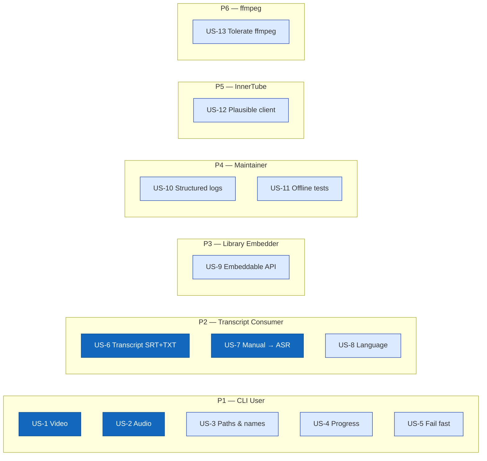

# 00 — Requirements

This document is the **what** and **why** of youtubeDownloader. The **how** lives in `02-architecture.md`; the **formal contracts** live in `06-formal/`.

Requirements are built in three sub-phases, each reviewed and approved before the next:

| Sub-phase | Contents | Status |
|---|---|---|
| 1a | Personas + user stories | **resolved** (review: [`1481921`](./reviews/2026-05-02-requirements-phase-1a-r1.md)) |
| 1b | Acceptance criteria (EARS format) | **resolved** (review: [`d300785`](./reviews/2026-05-02-requirements-phase-1b-r1.md)) |
| 1c | Non-functional requirements | **resolved** (review: [`41eefc0`](./reviews/2026-05-03-requirements-phase-1c-r1.md)) |

**Phase 1 is closed.** The three sub-phase reviews together form the approved requirements baseline. Further changes require a new review round on this file and an explicit phase transition entry.

> **Scope anchor:** this project is inspired by `yt-dlp` but deliberately covers a tiny subset: one YouTube video URL → video / audio / transcript / thumbnail on local disk. Every other site, feature, and edge case `yt-dlp` supports is out of scope for the MVP.

---

## Personas

youtubeDownloader is a local CLI tool. It has no server, no multi-user session, and no customer-facing API. The personas below are the humans and external systems whose outcomes depend on its correctness — framed from whose perspective a capability matters.

| ID  | Persona                             | Role                                                                                                                                                                                                                                                                                                          |
| --- | ----------------------------------- | ------------------------------------------------------------------------------------------------------------------------------------------------------------------------------------------------------------------------------------------------------------------------------------------------------------- |
| P1  | **CLI User (Researcher / Learner)** | A developer, student, journalist, or researcher who runs the tool on their own machine against YouTube URLs they are licensed to download. They want the video, audio, or transcript as local files so they can study, quote, transcribe, remix, or archive the content offline. This is the primary persona. |
| P2  | **Transcript Consumer**             | Someone who downloads a video specifically for its transcript — to feed into an LLM summariser, to search textually, to quote in writing, or to accessibility-caption derived work. Their success depends on the transcript being complete, timestamped when requested, and in a format they can process.     |
| P3  | **Java Library Embedder**           | A developer who wants to invoke youtubeDownloader's core functionality from their own Java program (e.g., a personal task-manager that auto-downloads a queued URL, a Discord bot, a batch script). They care about a clean, embeddable API — not a CLI.                                                      |
| P4  | **Maintainer (Future Self)**        | The developer (likely the original author, six months later) who has to diagnose why the tool suddenly fails because YouTube changed something. They care about clear error messages, source attribution for wire-format assumptions, and a fast edit-compile-test loop.                                      |
| P5  | **YouTube's InnerTube API**         | The reverse-engineered upstream. Not a person. The tool must be a well-behaved client of this API — reasonable request rates, a plausible `User-Agent` and client identity, graceful handling when responses change shape without notice.                                                                     |
| P6  | **ffmpeg (external binary)**        | The external process responsible for muxing the separate video and audio streams into a single MP4, and for converting audio to MP3 when requested. Its success or failure is reported upward; the tool must handle its absence, its errors, and its version differences gracefully.                          |

---

## User stories

Stories are grouped by persona. Each story has a stable ID (`US-N`) that acceptance criteria (Phase 1b) and tasks (Phase 4) will reference.

### CLI User (P1)

#### US-1 — Download a full video from a URL

> **As** a CLI User,
> **I want** to pass a YouTube video URL to the tool and get a playable local MP4 file containing the best-quality video and audio available,
> **so that** I can watch or study the video offline without going back to the browser.

**Notes:**
- "Best quality" in the MVP means the highest-resolution video stream plus the best audio stream that can be muxed together, selected by the tool — not a user-controlled format selector.
- Muxing requires `ffmpeg` on `PATH`.

#### US-2 — Extract audio only

> **As** a CLI User,
> **I want** to request audio-only from a YouTube URL and get an M4A or MP3 file on disk,
> **so that** I can listen to podcasts, lectures, and music on a device that doesn't need the video track, at a smaller file size.

**Notes:**
- M4A comes directly from YouTube (no re-encoding). MP3 requires `ffmpeg` to transcode.

#### US-3 — Choose where files land and what they're named

> **As** a CLI User,
> **I want** to specify an output directory and (optionally) a filename, and have sane defaults when I don't,
> **so that** I can integrate the tool into my own file-organization habits and scripts without surprise paths.

**Notes:**
- Default filename pattern candidates (to be pinned in Phase 1b): `<title> [<videoId>].<ext>` or similar.
- Default output directory: current working directory.

#### US-4 — See progress while a download runs

> **As** a CLI User,
> **I want** to see download progress (bytes downloaded, total size, percentage, rate, ETA) in my terminal while the tool runs,
> **so that** I know the tool is making progress and I can estimate when it will finish.

**Notes:**
- Long downloads (multi-GB videos on slow networks) without feedback feel broken even when they're not.

#### US-5 — Fail fast with a useful error

> **As** a CLI User,
> **I want** the tool to tell me — in one clear sentence — why it failed, when it fails,
> **so that** I can fix the root cause (invalid URL, no network, video unavailable, ffmpeg missing) without reading stack traces or source code.

**Notes:**
- "Useful" means the message identifies which boundary failed: URL parse, InnerTube call, stream download, caption download, ffmpeg, filesystem.

### Transcript Consumer (P2)

#### US-6 — Download the transcript of a video

> **As** a Transcript Consumer,
> **I want** to request the transcript of a YouTube video and get it as an SRT file (with timestamps) and a plain-text file (without),
> **so that** I can feed the text into an LLM, search it, or quote it — and keep the timestamped version for reference.

**Notes:**
- SRT is a de facto standard; plain text is the most useful form for LLM input.

#### US-7 — Prefer human-authored captions, fall back to auto-generated

> **As** a Transcript Consumer,
> **I want** the tool to use the creator's uploaded captions when they exist, and fall back to YouTube's auto-generated ASR captions when they don't,
> **so that** I get the most accurate transcript available without having to check the video manually first.

#### US-8 — Pick the transcript language

> **As** a Transcript Consumer working in a non-English context,
> **I want** to specify which language's caption track to download,
> **so that** videos with multiple caption languages give me the one I actually want, not a default I have to re-translate.

**Notes:**
- Default language behaviour when no flag is given (English-preferred vs video's primary language) is pinned in Phase 1b.

### Java Library Embedder (P3)

#### US-9 — Invoke the downloader from a Java program

> **As** a Java Library Embedder,
> **I want** to call a small, stable Java API to resolve a YouTube URL, pick the formats I need, and download them — all without shelling out to the CLI,
> **so that** I can integrate video / audio / transcript downloads into my own Java projects with compile-time type safety.

**Notes:**
- The CLI is built on top of this library. The library is the primary artifact; the CLI is one of its consumers.

### Maintainer / Future Self (P4)

#### US-10 — Diagnose why something broke

> **As** the Maintainer,
> **I want** the tool to emit structured, level-filtered logs (debug, info, warn, error) covering every external boundary call (InnerTube request + response summary, stream HTTP status, ffmpeg command line, filesystem write),
> **so that** when YouTube changes a response shape or a video refuses to play, I can reproduce the failure and fix it without adding more logging first.

#### US-11 — Run without a network (for a subset of features)

> **As** the Maintainer running the unit test suite,
> **I want** every wire-format parsing path (InnerTube response parse, caption parse, format selection) to be testable offline against fixture files,
> **so that** I can develop on a plane, catch regressions deterministically, and avoid every unit test depending on a flaky third-party endpoint.

### YouTube InnerTube API (P5)

#### US-12 — Behave as a plausible InnerTube client

> **As** the YouTube InnerTube API (as a boundary contract),
> **I want** youtubeDownloader's requests to look like a plausible ANDROID-client request — correct `client` context block, plausible `User-Agent`, one player request per video, no per-second polling —,
> **so that** the tool doesn't get blocked by fingerprint-based anti-abuse defences and doesn't contribute to noisy traffic that degrades service for real clients.

**Notes:**
- The ANDROID client was chosen (vs WEB) primarily because its responses do not require JavaScript signature deciphering — an ADR in Phase 2 will record this.

### ffmpeg (P6)

#### US-13 — Tolerate an ffmpeg that is missing, too old, or fails

> **As** the tool interacting with ffmpeg,
> **I want** to detect at startup whether ffmpeg is on `PATH` and new enough, report a clear error if it isn't, and surface ffmpeg's own stderr when it fails mid-process,
> **so that** users aren't stuck with an opaque "mux failed" message when the real problem is an old ffmpeg, a missing binary, or a genuine encoding error.

**Notes:**
- MP4 mux and MP3 conversion both require ffmpeg. Video-only or transcript-only downloads do not.

---

## Story map (at a glance)

> Blue (filled) stories drive the core user value — getting video, audio, and transcripts on disk. Blue (outline) stories are the operational and contract must-haves that make the filled ones trustworthy.

---

## Out of scope (explicit non-goals)

Every item below was considered, and is deliberately **not** part of the MVP. Each has a home elsewhere — usually "a future phase" or "use `yt-dlp` for this".

| ID | Excluded | Why |
|---|---|---|
| OOS-1 | **Playlists / channels / search** | Scope expands 10x. MVP is single-URL. A future release can add a thin wrapper. |
| OOS-2 | **Signature deciphering (JavaScript execution of YouTube's `player.js`)** | The single most complex piece of `yt-dlp`. Avoided in MVP by using the `ANDROID` InnerTube client, whose responses do not need it. Videos that only return cipher-protected URLs will fail with a clear error (US-5). |
| OOS-3 | **Live streams** | Live DASH/HLS handling is its own subsystem (manifest parsing, chunk polling, live-from-start). MVP rejects `is_live = true` videos with a clear error. |
| OOS-4 | **yt-dlp-style format-selection DSL** (`-f "bv*[height<=720][fps>30]+ba/b"`) | Requires a parser, a sorter, and a filter expression language. MVP auto-picks the best video + audio the tool can mux. |
| OOS-5 | **Concurrent-fragment parallel downloads** (for DASH / HLS) | MVP downloads streams via a single HTTP GET (with byte ranges for resume, if implemented in Phase 1c). Parallelism is a later optimisation. |
| OOS-6 | **Cookies / authenticated sessions / `--cookies-from-browser`** | Needed for age-restricted, member-only, or paid content. MVP works only with publicly-accessible videos. |
| OOS-7 | **Age-restricted videos** | Follows from OOS-6. If the InnerTube response indicates age-restriction, the tool reports it and exits. |
| OOS-8 | **Download archive / resume across process restarts** | Useful for playlists (OOS-1). For single-URL MVP, a failed run is re-run from scratch. |
| OOS-9 | **SponsorBlock integration, chapter splitting, metadata embedding** | All post-processing features `yt-dlp` supports. Out of scope; trivial to add later if ever wanted. |
| OOS-10 | **Any site other than YouTube** | `yt-dlp`'s extractor model is the bulk of its 500k lines of code. This project is deliberately YouTube-only. |
| OOS-11 | **Plugins / extensibility for third-party extractors** | Follows from OOS-10. |
| OOS-12 | **Auto-update of the tool itself** | `yt-dlp -U` has its own signing and release infrastructure. MVP is updated by rebuilding from source. |
| OOS-13 | **GUI** | CLI + library only. |

---

## Open questions / assumptions to validate in Phase 1b/1c

Questions that will be pinned down when we write acceptance criteria (1b) and NFRs (1c). They are listed here so reviewers can flag early if a default is wrong.

| # | Question | Likely answer (to confirm in 1b / 1c) |
|---|---|---|
| OQ-1 | **Default filename pattern** when `--output` is not given | `<sanitized_title> [<videoId>].<ext>`, matching `yt-dlp`'s default |
| OQ-2 | **Default caption language** when `--lang` is not given | Prefer `en`; fall back to the video's primary language; final fallback to any available caption track |
| OQ-3 | **Default audio format** when `--audio-only` is given without an explicit format flag | `m4a` (no re-encoding required, faster, higher quality per bit) |
| OQ-4 | **What counts as "best video"** for muxing | Highest resolution that is <= 1080p by default, to avoid surprise 4K / 8K downloads; user can opt into higher with a flag |
| OQ-5 | **Behaviour on existing output file** | Refuse to overwrite by default; `--force` flag to overwrite |
| OQ-6 | **How cipher-protected videos surface to the user** (OOS-2 follow-on) | Fail with a specific error saying this is out of MVP scope, not a generic "no formats found" |
| OQ-7 | **Minimum ffmpeg version** the tool depends on | To be pinned in Phase 1c NFRs after checking which command-line flags we actually use |

---

## Phase 1a checklist (for the reviewer)

A Phase 1a draft is considered ready for review when:

- [x] Every persona who has a stake in the tool's correctness is listed with a role.
- [x] Every in-scope MVP capability maps to at least one user story.
- [x] Every user story has a stable `US-N` ID.
- [x] Every story is phrased so a Phase 1b acceptance criterion can be derived mechanically (no unqualified "reasonable", "fast", or "easy").
- [x] Story-map Mermaid diagram renders.
- [x] Out-of-scope list names an explicit home (future phase, `yt-dlp`, etc.) for every excluded item.
- [x] Open questions for 1b/1c are listed so the reviewer can push back on defaults early.

---

# Phase 1b — Acceptance criteria

Each user story is decomposed into testable acceptance criteria using the **EARS** (Easy Approach to Requirements Syntax) template. Every AC is type-tagged:

| Tag | Shape | Used for |
|---|---|---|
| `[ubiquitous]` | `The system SHALL <behaviour>.` | Universal invariants that hold everywhere. |
| `[event-driven]` | `WHEN <trigger> THEN the system SHALL <response>.` | Reactions to external events. |
| `[state-driven]` | `WHILE <state> the system SHALL <behaviour>.` | Continuous behaviours during a mode. |
| `[unwanted]` | `IF <condition> THEN the system SHALL <mitigation>.` | Error and failure handling. |
| `[optional]` | `WHERE <feature> the system SHALL <behaviour>.` | Configurable or feature-flagged behaviours. |

AC IDs are stable: `AC-<story>.<N>`. Tasks (Phase 4) and tests (`06-formal/contract-tests.md`) reference them by ID.

> **Threshold policy:** behavioural defaults (what the tool does) are pinned in Phase 1b. Numeric thresholds (how much, how fast, how many, which versions) are pinned in Phase 1c NFRs and referenced here symbolically (e.g., `NFR-PROGRESS-INTERVAL`, `NFR-MIN-FFMPEG-VERSION`). Phase 1b pins **behaviour**, Phase 1c pins **numbers**.

---

## Resolved open questions from Phase 1a

The following behavioural defaults are pinned as part of this phase. They are the ground truth that ACs below reference. Numeric thresholds remain open for Phase 1c.

| OQ | Status | Resolution |
|---|---|---|
| **OQ-1** Default filename pattern | **resolved** | `<sanitized_title> [<video_id>].<ext>`. Sanitization rules are defined in AC-3.3 and AC-3.4. |
| **OQ-2** Default caption language | **resolved** | Deterministic preference order: (1) `en` if available; (2) the video's primary audio language if declared in the InnerTube response; (3) the first caption track listed in the InnerTube response. See AC-8.1. |
| **OQ-3** Default audio format when `--audio-only` has no explicit format | **resolved** | `m4a`. No re-encoding — taken directly from YouTube's audio stream. See AC-2.2, AC-2.3. |
| **OQ-4** "Best video" selection when `--max-height` is not given | **resolved** | Highest resolution ≤ **1080p**, with **compatibility-first codec preference** (H.264 > VP9 > AV1). See AC-1.3, AC-1.4. |
| **OQ-5** Behaviour on existing output file | **resolved** | Refuse to overwrite by default with a distinct exit code; `--force` to override. See AC-3.5, AC-3.6. |
| **OQ-6** Behaviour on cipher-protected videos | **resolved** | Fail with a specific exit code and named error message directing the user to yt-dlp. See AC-5.3. |
| **OQ-7** Minimum ffmpeg version | **open** | Pinned in Phase 1c as `NFR-MIN-FFMPEG-VERSION` once the implementation-side command-line needs are known. |

---

## Conventions used below

- **Symbolic NFR references** — ACs mention NFRs like `NFR-PROGRESS-INTERVAL` or `NFR-MIN-FFMPEG-VERSION`. Their numeric values are pinned in Phase 1c; until then, treat them as named placeholders.
- **"The system"** means youtubeDownloader as a whole (the CLI process and the embedded library together, unless explicitly scoped).
- **"Exit with code N"** means the CLI process exits with that POSIX exit code. Code 0 is success; all non-zero codes are documented in `06-formal/cli-exit-codes.md` (Phase 3).
- **Error messages** are always written to stderr. Progress output is also stderr. Stdout is reserved for optional machine-readable output (e.g., when `--print-json` is added in a future phase — not in MVP).

---

### US-1 — Download a full video from a URL

- **AC-1.1 `[event-driven]`** — WHEN the user invokes the CLI with a URL argument, THEN the system SHALL parse the URL to extract a canonical YouTube `videoId` BEFORE making any network call — accepting at minimum: `https://www.youtube.com/watch?v=<id>` (with arbitrary additional query parameters), `https://youtu.be/<id>` (short link), `https://www.youtube.com/shorts/<id>` (shorts link), and `https://m.youtube.com/watch?v=<id>` (mobile link).
- **AC-1.2 `[event-driven]`** — WHEN a `videoId` has been parsed, THEN the system SHALL issue exactly one POST request to YouTube's InnerTube `/youtubei/v1/player` endpoint using the `ANDROID` client context, from which it derives the set of available media formats, caption tracks, thumbnails, and the `is_live` / `playability` flags.
- **AC-1.3 `[ubiquitous]`** — The system SHALL filter the available video formats to those whose `height ≤ max-height` (default 1080, user-overridable via `--max-height`; `--max-height 0` disables the cap).
- **AC-1.4 `[ubiquitous]`** — Among the filtered formats that contain a video stream, the system SHALL select one video format by applying the following tiebreak order, highest first: (a) resolution (height), (b) codec preference `H.264 > VP9 > AV1` (compatibility-first), (c) bitrate (tbr).
- **AC-1.5 `[ubiquitous]`** — The system SHALL independently select one audio format with the highest audio bitrate available, preferring `m4a`/AAC over `webm`/Opus for MP4 mux compatibility.
- **AC-1.6 `[event-driven]`** — WHEN both a video format and an audio format have been selected, THEN the system SHALL download each as a single HTTP GET against its resolved CDN URL, writing each to a distinct `.part` file in the temp directory AND SHALL mux them into a single MP4 by invoking `ffmpeg`, deleting the `.part` files after a successful mux.
- **AC-1.7 `[unwanted]`** — IF the InnerTube response indicates `is_live = true` OR `playability = LIVE_STREAM_OFFLINE`, THEN the system SHALL NOT attempt the download; it SHALL exit with a distinct error code (see AC-5.2) naming "live streams are not supported in this MVP".

### US-2 — Extract audio only

- **AC-2.1 `[event-driven]`** — WHEN the user invokes the CLI with `--audio-only`, THEN the system SHALL NOT select or download any video format — only an audio format.
- **AC-2.2 `[ubiquitous]`** — The system SHALL select the audio format with the highest audio bitrate, preferring `m4a`/AAC over `webm`/Opus.
- **AC-2.3 `[event-driven]`** — WHEN the user specifies `--audio-only` with no explicit `--audio-format`, THEN the system SHALL write the selected audio stream to disk as `.m4a` without re-encoding, even if the original stream was `webm`/Opus (in the latter case the file extension follows the stream's container and the system SHALL log a notice that re-encoding was skipped).
- **AC-2.4 `[optional]`** — WHERE the user passes `--audio-format mp3`, the system SHALL invoke ffmpeg to transcode the selected audio stream to MP3 at the bitrate configured in `NFR-DEFAULT-MP3-BITRATE`, writing the output as `.mp3`.
- **AC-2.5 `[unwanted]`** — IF `--audio-only` is combined with `--max-height` OR any other video-specific flag, THEN the system SHALL log a warning naming the ignored flag but SHALL NOT fail.

### US-3 — Choose where files land and what they're named

- **AC-3.1 `[ubiquitous]`** — The system SHALL write all output files to the current working directory when `--output-dir` is not given.
- **AC-3.2 `[ubiquitous]`** — WHEN `--output-dir <path>` is given AND the path exists AND is a writable directory, the system SHALL write output files under that directory. WHEN the path does not exist, the system SHALL create it (including parents, `mkdir -p`-equivalent) before writing.
- **AC-3.3 `[ubiquitous]`** — The system SHALL derive a default base filename from the video's title using the pattern `<sanitized_title> [<video_id>]` where the sanitization rules are: remove characters in the set `/ \ : * ? " < > |` and all ASCII control characters (0x00–0x1F, 0x7F); collapse runs of whitespace to a single space; trim leading and trailing dots and whitespace; if the sanitized title is empty, fall back to `video`.
- **AC-3.4 `[ubiquitous]`** — The system SHALL cap the total base filename length (excluding extension) at `NFR-MAX-FILENAME-LENGTH`. IF truncation is required, the `[<video_id>]` suffix SHALL be preserved intact and the title SHALL be truncated from the right.
- **AC-3.5 `[event-driven]`** — WHEN `--output <name>` is given, THEN the system SHALL use that name as the base filename (stripped of any extension the user may have supplied), applying extensions per output type (`.mp4`, `.m4a`, `.mp3`, `.srt`, `.txt`, `.jpg`) — the user SHALL NOT be required to supply the extension.
- **AC-3.6 `[unwanted]`** — IF any intended output file already exists, THEN the system SHALL exit with a distinct error code (see AC-5.2) naming which file would have been overwritten, UNLESS `--force` was given, in which case the system SHALL overwrite.

### US-4 — See progress while a download runs

- **AC-4.1 `[state-driven]`** — WHILE a stream is downloading, the system SHALL write a progress line to stderr containing: bytes-downloaded, total-bytes (or `?` if unknown), percentage (or `?`), instantaneous rate in bytes/sec, and estimated time remaining.
- **AC-4.2 `[state-driven]`** — WHILE a stream is downloading AND the process stderr is attached to an interactive terminal (isatty), the system SHALL refresh the progress line in place using a carriage return — producing one visible progress line, not a scrollback trail.
- **AC-4.3 `[state-driven]`** — WHILE a stream is downloading AND stderr is NOT interactive (redirected to a file or pipe), the system SHALL emit progress as distinct newline-terminated lines at a cadence no faster than `NFR-PROGRESS-INTERVAL`.
- **AC-4.4 `[optional]`** — WHERE the user passes `--quiet`, the system SHALL suppress all progress output but SHALL NOT suppress errors.

### US-5 — Fail fast with a useful error

- **AC-5.1 `[ubiquitous]`** — On any non-success exit, the system SHALL write exactly one human-readable error line to stderr in the form `Error: <category>: <specific detail>`, where `<category>` is one of a fixed, documented set (see AC-5.2).
- **AC-5.2 `[ubiquitous]`** — The system SHALL use a fixed mapping from failure category to POSIX exit code, documented canonically in `06-formal/cli-exit-codes.md`. The MVP category set is: `0` success; `2` argument / URL parse error; `10` network failure (DNS, TCP, TLS, or HTTP error reaching YouTube); `11` InnerTube response parse error (shape changed); `20` video unavailable (private, deleted, geo-blocked); `21` video live / not-yet-premiered; `22` video requires signature deciphering (see AC-5.3); `30` no matching format after filtering; `40` caption track not available in requested language; `50` output file already exists (AC-3.6); `60` ffmpeg missing or failed (AC-13.*); `70` filesystem error (cannot write, disk full, permissions).
- **AC-5.3 `[unwanted]`** — IF the InnerTube response contains media URLs whose `signatureCipher` field is non-empty for all candidate formats (i.e., all streams require JavaScript signature deciphering), THEN the system SHALL exit with code `22` and the message `Error: cipher: this video requires JavaScript signature deciphering, which is out of scope for this tool. Use yt-dlp for this URL.`
- **AC-5.4 `[ubiquitous]`** — The system SHALL NOT print a Java stack trace on stderr on normal failure paths (the categories in AC-5.2) — the stack trace is suppressed in favour of the one-line message.
- **AC-5.5 `[optional]`** — WHERE the user passes `--debug`, the system SHALL print the full stack trace to stderr after the one-line error message on any failure path.

### US-6 — Download the transcript of a video

- **AC-6.1 `[event-driven]`** — WHEN the user invokes the CLI with `--transcript` (alone or combined with `--video`/`--audio-only`), THEN the system SHALL resolve exactly one caption track per the selection rules in AC-7.* and AC-8.* AND fetch its timed-text data via the URL in the InnerTube response's `captions.playerCaptionsTracklistRenderer.captionTracks[].baseUrl`.
- **AC-6.2 `[ubiquitous]`** — The system SHALL write the transcript to disk in two files alongside the video (or audio, or on its own): `<base>.srt` (SubRip format with numbered cue blocks and `HH:MM:SS,mmm --> HH:MM:SS,mmm` timestamps) and `<base>.txt` (plain text, one caption line per row, no timestamps, no cue numbers, no blank separator lines between cues).
- **AC-6.3 `[ubiquitous]`** — The system SHALL strip HTML entities (e.g., `&amp;`, `&#39;`) from caption text during conversion to both SRT and TXT, writing decoded characters.
- **AC-6.4 `[event-driven]`** — WHEN a video has no caption tracks at all (neither manual nor auto-generated) AND `--transcript` was requested, THEN the system SHALL exit with code `40` and the message `Error: captions: no caption tracks available for this video.`

### US-7 — Prefer human-authored captions, fall back to auto-generated

- **AC-7.1 `[ubiquitous]`** — The system SHALL classify each caption track in the InnerTube response as "manual" or "asr" using the track's `kind` field: `kind == "asr"` → auto-generated; absence of `kind` or any other value → manual.
- **AC-7.2 `[event-driven]`** — WHEN selecting a caption track AND at least one manual track matches the language preference chain (AC-8.*), THEN the system SHALL select that manual track and SHALL NOT consider ASR tracks.
- **AC-7.3 `[event-driven]`** — WHEN selecting a caption track AND no manual track matches the language preference chain, THEN the system SHALL select the best-matching ASR track AND SHALL log an info-level message stating that ASR was used as a fallback.
- **AC-7.4 `[unwanted]`** — IF the only available captions are ASR AND `--no-asr` was passed, THEN the system SHALL exit with code `40` and the message `Error: captions: only auto-generated captions available; --no-asr prevents their use.`

### US-8 — Pick the transcript language

- **AC-8.1 `[ubiquitous]`** — The system SHALL resolve the caption language using this preference chain, stopping at the first match: (1) the value of `--lang <code>` if given; (2) `en` if any English track (manual or ASR) exists; (3) the video's primary audio language from `videoDetails.audioLanguage` in the InnerTube response, if declared; (4) the first caption track listed in the InnerTube response.
- **AC-8.2 `[event-driven]`** — WHEN `--lang <code>` is given AND `<code>` matches a BCP-47 language tag in the caption tracks (either exactly or by primary-language subtag match — e.g., `--lang en` matches `en`, `en-US`, `en-GB`), THEN the system SHALL select that track per the manual-vs-ASR rules of AC-7.*.
- **AC-8.3 `[unwanted]`** — IF `--lang <code>` is given AND no caption track matches `<code>` (exact or primary-subtag), THEN the system SHALL exit with code `40` and the message `Error: captions: no caption track available for language '<code>'. Available: <comma-separated list>.`
- **AC-8.4 `[ubiquitous]`** — Language resolution SHALL be deterministic — the same input URL and `--lang` flag on the same video SHALL always select the same caption track.

### US-9 — Invoke the downloader from a Java program

- **AC-9.1 `[ubiquitous]`** — The system's library module SHALL expose a public API surface consisting of: a `YoutubeDownloader` entrypoint class, a `DownloadRequest` input type, a `DownloadResult` output type, and a typed exception hierarchy rooted at a single checked `YoutubeDownloaderException`.
- **AC-9.2 `[ubiquitous]`** — The library SHALL NOT call `System.exit(...)` from any code path.
- **AC-9.3 `[ubiquitous]`** — The library SHALL NOT write to `System.out` or `System.err` directly — all output SHALL go through an injectable logger (see AC-10.1) AND an injectable progress listener interface.
- **AC-9.4 `[ubiquitous]`** — Each AC-5.2 failure category SHALL map to exactly one subtype of `YoutubeDownloaderException` — library callers can catch by category without parsing strings.
- **AC-9.5 `[ubiquitous]`** — The CLI module SHALL invoke only the public API of the library module — it SHALL NOT reach into library internals. This is verified by the CLI module depending on the library module's public interface, not its implementation classes.

### US-10 — Diagnose why something broke

- **AC-10.1 `[ubiquitous]`** — The system SHALL use a single logging facade (SLF4J) for all diagnostic output, at standard levels: `TRACE`, `DEBUG`, `INFO`, `WARN`, `ERROR`.
- **AC-10.2 `[ubiquitous]`** — The system SHALL emit at `INFO` level at least the following events on every run: URL parsed (with `videoId`), InnerTube player request sent (with client name), InnerTube player response received (with HTTP status and response size), format selected (video and audio, with itag, codec, resolution, bitrate), stream download started (with URL's host), stream download finished (with bytes and duration), ffmpeg invocation (with command-line arguments), output file written (with path).
- **AC-10.3 `[ubiquitous]`** — The system SHALL emit at `WARN` level events that are not failures but merit attention: ASR caption fallback used (AC-7.3), ignored flag (AC-2.5), unknown InnerTube response field not in our schema.
- **AC-10.4 `[ubiquitous]`** — The system SHALL emit at `ERROR` level exactly once per failure: the one-line error message of AC-5.1 and, when `--debug` is set, the stack trace of AC-5.5.
- **AC-10.5 `[optional]`** — WHERE the user passes `--debug`, the system SHALL set the effective log level to `DEBUG` for all loggers — revealing HTTP request/response headers, InnerTube request body, caption track list, and ffmpeg stderr streaming.

### US-11 — Run without a network (for a subset of features)

- **AC-11.1 `[ubiquitous]`** — The system's InnerTube response parser, caption-track parser, format selector, filename sanitizer, and caption-to-SRT/TXT converter SHALL each be implemented as pure functions over in-memory inputs, with no network or filesystem I/O embedded in them.
- **AC-11.2 `[ubiquitous]`** — The test suite SHALL include unit tests for each of the components in AC-11.1, run entirely offline against fixture files checked into `src/test/resources/`.
- **AC-11.3 `[ubiquitous]`** — The test suite SHALL fail its default run (`mvn test`) if any unit test makes a network call. Network access in tests is enabled only in a separate, explicitly-named integration profile (`mvn verify -P integration`).
- **AC-11.4 `[unwanted]`** — IF a unit test attempts to open a network socket during `mvn test`, THEN the test SHALL fail with a clear message naming the component that reached out.

### US-12 — Behave as a plausible InnerTube client

- **AC-12.1 `[ubiquitous]`** — The system SHALL construct every InnerTube request body with a `context.client` block whose `clientName = "ANDROID"`, `clientVersion` matches `NFR-ANDROID-CLIENT-VERSION`, and `androidSdkVersion`, `hl`, and `gl` fields present with the values documented in `06-formal/innertube-player-request.schema.json` (Phase 3).
- **AC-12.2 `[ubiquitous]`** — The system SHALL set the HTTP `User-Agent` header on every InnerTube request to `NFR-ANDROID-USER-AGENT`.
- **AC-12.3 `[ubiquitous]`** — The system SHALL issue at most one InnerTube `/player` request per invocation of the CLI for a given video — it SHALL NOT poll, retry in a tight loop, or fan out multiple player requests for the same video.
- **AC-12.4 `[unwanted]`** — IF an InnerTube request fails with an HTTP 5xx OR a network error, THEN the system SHALL retry at most `NFR-INNERTUBE-MAX-RETRIES` times with exponential backoff starting from `NFR-INNERTUBE-BACKOFF-BASE`, AND SHALL exit with code `10` if retries are exhausted.

### US-13 — Tolerate an ffmpeg that is missing, too old, or fails

- **AC-13.1 `[event-driven]`** — WHEN the selected operation requires ffmpeg (MP4 muxing per AC-1.6; MP3 transcoding per AC-2.4), THEN the system SHALL, before downloading any stream, verify that an `ffmpeg` binary is available on `PATH` by executing `ffmpeg -version` and parsing the reported version.
- **AC-13.2 `[unwanted]`** — IF the `ffmpeg -version` probe fails (binary not found, non-zero exit, or version output unparseable), THEN the system SHALL exit with code `60` and the message `Error: ffmpeg: ffmpeg not found on PATH or version check failed. Install ffmpeg from https://ffmpeg.org/ and ensure it is on PATH.`
- **AC-13.3 `[unwanted]`** — IF the detected ffmpeg version is below `NFR-MIN-FFMPEG-VERSION`, THEN the system SHALL exit with code `60` and the message `Error: ffmpeg: detected version <X.Y.Z>, but version <NFR-MIN-FFMPEG-VERSION> or higher is required.`
- **AC-13.4 `[event-driven]`** — WHEN an ffmpeg subprocess invoked during mux or transcode exits with non-zero status, THEN the system SHALL surface the last `NFR-FFMPEG-STDERR-LINES` lines of ffmpeg's stderr in the error message AND exit with code `60`.
- **AC-13.5 `[ubiquitous]`** — The system SHALL NOT perform the ffmpeg availability check when the requested operation is transcript-only or audio-only-m4a (where ffmpeg is not invoked) — these operations SHALL succeed on machines without ffmpeg installed.

---

## NFR symbolic references introduced in Phase 1b

The following NFR IDs are referenced by ACs above and will be defined with numeric values in Phase 1c.

| NFR ID | What it pins | Referenced by |
|---|---|---|
| `NFR-DEFAULT-MP3-BITRATE` | MP3 transcode target bitrate | AC-2.4 |
| `NFR-MAX-FILENAME-LENGTH` | Max base-filename length, excluding extension | AC-3.4 |
| `NFR-PROGRESS-INTERVAL` | Min interval between progress lines in non-TTY output | AC-4.3 |
| `NFR-ANDROID-CLIENT-VERSION` | `clientVersion` value in InnerTube request context | AC-12.1 |
| `NFR-ANDROID-USER-AGENT` | HTTP `User-Agent` for InnerTube requests | AC-12.2 |
| `NFR-INNERTUBE-MAX-RETRIES` | Max retry attempts on 5xx or network error | AC-12.4 |
| `NFR-INNERTUBE-BACKOFF-BASE` | Starting backoff duration for exponential retry | AC-12.4 |
| `NFR-MIN-FFMPEG-VERSION` | Minimum supported ffmpeg version (resolves OQ-7) | AC-13.3 |
| `NFR-FFMPEG-STDERR-LINES` | How many trailing ffmpeg stderr lines to echo on failure | AC-13.4 |

---

## Phase 1b checklist (for the reviewer)

A Phase 1b draft is considered ready for review when:

- [x] Every user story US-1..US-13 has at least one AC.
- [x] Every AC is tagged with exactly one EARS type.
- [x] Every AC has a stable `AC-<story>.<N>` ID.
- [x] Every pinned open question from Phase 1a has an explicit resolution in the "Resolved open questions" table.
- [x] Every numeric threshold used in an AC is referenced by a symbolic `NFR-*` name, not embedded as a literal number.
- [x] The failure-category → exit-code mapping is defined once (AC-5.2) and referenced from every failure-related AC.
- [x] No AC depends on a specific library, framework, or class name (those belong in `02-architecture.md`).

---

# Phase 1c — Non-functional requirements

This section pins the numeric, version, and platform thresholds the tool depends on. Behavioural defaults were pinned in Phase 1b; Phase 1c is where the numbers land.

NFRs use stable IDs of the form `NFR-<NAME>` and are organized into groups. ACs in Phase 1b reference these IDs symbolically; implementation and tests bind the values pinned here.

> **Policy:** an NFR value cannot be silently changed by an implementation CR. Changes to any value in this section require a new review round (`-r2`, `-r3`, ...) on this file and an explicit phase transition entry in the front-matter.

---

## Group 1 — Platform and build

| NFR | Value | Rationale |
|---|---|---|
| `NFR-JAVA-VERSION` | **17** | Java 17 LTS. Stable across macOS and Linux, no Java 21-only language features needed for MVP. Already selected during scope discussion; made contractual here. |
| `NFR-BUILD-TOOL` | **Maven 3.9+** | Matches sibling `myUtils` projects (`taskTracker`, `focusGuard`). Fat-jar build via `maven-shade-plugin`. |
| `NFR-SUPPORTED-OS` | **macOS 13+ (x86_64, aarch64); Linux (x86_64, aarch64) with glibc 2.31+** | Windows deliberately excluded for MVP — reduces testing matrix, sidesteps path-separator and executable-extension edge cases. Can be added later without architectural change if someone asks. |
| `NFR-MAX-MEMORY` | **JVM default heap cap** (no explicit `-Xmx` in CLI invocation) | Streams are expected to flow through, not buffer whole files. The implementation is expected to hold this invariant; at 1080p a typical run should peak well under 200 MB even with default sizing. If a future run shows persistent heap growth, a cap gets added via a new NFR round. |
| `NFR-MIN-DISK-FREE` | **2 × expected final file size** at the start of a run | `.part` files for video + audio during download plus the muxed final file briefly coexist. The implementation should probe free space before starting a download and fail fast with exit code `70` if insufficient. |

## Group 2 — InnerTube client identity

These values define how we identify ourselves to YouTube's reverse-engineered InnerTube API. They are the single most likely values to need updating if the tool stops working — that's expected, and a new NFR round is how we respond.

| NFR | Value | Rationale |
|---|---|---|
| `NFR-ANDROID-CLIENT-VERSION` | **`21.02.35`** | Android YouTube app version observed to work with InnerTube `/player` via the ANDROID client context without signature deciphering. Bumped from `19.09.37` on 2026-05-06 (DCR-1) after the prior version began returning HTTP 400. Source: current yt-dlp master. See ADR-0001 § Client-version refresh log. |
| `NFR-ANDROID-USER-AGENT` | **`com.google.android.youtube/21.02.35 (Linux; U; Android 11) gzip`** | The exact `User-Agent` the Android YouTube app sends. Must match the `clientVersion` in the request body (mismatched versions occasionally trigger anti-abuse responses). Bumped from `19.09.37 / Android 14` on 2026-05-06 (DCR-1). |
| `NFR-ANDROID-SDK-VERSION` | **`30`** | Android 11 SDK level. Matches the OS string in the User-Agent. Sent in the InnerTube `context.client.androidSdkVersion` field. Bumped from `34` (Android 14) on 2026-05-06 (DCR-1). |
| `NFR-INNERTUBE-HL` | **`en`** | `context.client.hl` — UI language hint. English keeps response strings predictable for log parsing. Unaffected by the caption-language preference chain in AC-8.1. |
| `NFR-INNERTUBE-GL` | **`US`** | `context.client.gl` — geolocation hint. `US` gives the broadest catalog access by default. Users who care about geo-restricted videos are outside MVP scope (OOS-6). |

## Group 3 — Network timeouts and retries

| NFR | Value | Rationale |
|---|---|---|
| `NFR-NETWORK-TIMEOUT-CONNECT` | **10 seconds** | TCP connect + TLS handshake for every HTTP request. Covers slow networks without wedging a run indefinitely. |
| `NFR-NETWORK-TIMEOUT-READ` | **30 seconds** | Idle-read timeout between bytes mid-stream. Generous because YouTube CDN bursts can pause briefly mid-file. |
| `NFR-INNERTUBE-REQUEST-TIMEOUT` | **30 seconds total** | End-to-end budget for one InnerTube `/player` call including connect, send, server processing, receive. Shorter than stream reads because the response is tiny (~50-200 KB). |
| `NFR-CAPTION-DOWNLOAD-TIMEOUT` | **10 seconds total** | Caption files are small (rarely > 200 KB). A slower fetch almost always means the track is unavailable or the endpoint is misrouting. |
| `NFR-THUMBNAIL-DOWNLOAD-TIMEOUT` | **10 seconds total** | Thumbnails are tens to hundreds of KB. Same rationale as captions. |
| `NFR-STREAM-DOWNLOAD-TIMEOUT` | **unlimited (bounded by `NFR-NETWORK-TIMEOUT-READ` between bytes)** | Large files on slow networks are legitimate. Idle timeout between bytes protects against hangs; total-time cap would punish slow connections unfairly. |
| `NFR-INNERTUBE-MAX-RETRIES` | **3** | Pinning AC-12.4. Three retries with exponential backoff covers transient 5xx and single-flight network blips. Beyond this, the failure is persistent and should be surfaced to the user. |
| `NFR-INNERTUBE-BACKOFF-BASE` | **500 ms**, exponential with factor 2 | Pinning AC-12.4. First retry waits 500 ms, second 1000 ms, third 2000 ms. Total worst-case retry budget: 3.5 seconds. |
| `NFR-STREAM-MAX-RETRIES` | **2** | Separate retry budget for the stream download itself (video or audio). Fewer retries because streams are long — a retry restarts from byte 0, which is expensive. |

## Group 4 — Output and file handling

| NFR | Value | Rationale |
|---|---|---|
| `NFR-MAX-FILENAME-LENGTH` | **200 characters** (excluding extension) | Pinning AC-3.4. Safely under the 255-byte `NAME_MAX` limit of APFS, ext4, and NTFS even for multi-byte UTF-8 titles. Leaves headroom for the `.mp4`, `.srt`, `.txt` extensions and the `[<video_id>]` suffix. |
| `NFR-DEFAULT-MP3-BITRATE` | **192 kbps** | Pinning AC-2.4. Matches yt-dlp's default. Good quality/size balance — transparent to most listeners for spoken content, near-transparent for music. |
| `NFR-TEMP-DIR-STRATEGY` | **`<output-dir>/.yt-tmp/`** created on demand, cleaned on success | `.part` files land here during the run. Same filesystem as output (no cross-device `rename`). Cleaned after successful mux; left in place on failure so the user can inspect. Directory is removed only when it's empty. |

## Group 5 — Progress and logging

| NFR | Value | Rationale |
|---|---|---|
| `NFR-PROGRESS-INTERVAL` | **1000 ms minimum** between progress lines in non-TTY (piped or redirected) mode | Pinning AC-4.3. Frequent enough for `tail -f` to feel responsive; infrequent enough to keep log files and CI job output readable. |
| `NFR-PROGRESS-TTY-REFRESH` | **100 ms minimum** between progress-line redraws in TTY mode | Pinning AC-4.2 behaviour. Smooth enough to feel live, slow enough not to flicker or burn CPU on small writes. |
| `NFR-LOG-PATTERN` | **`HH:mm:ss.SSS <LEVEL> <logger> - <message>`** | Consistent across all loggers. Millisecond precision helps correlate InnerTube response time with stream download start. |

## Group 6 — ffmpeg integration

| NFR | Value | Rationale |
|---|---|---|
| `NFR-MIN-FFMPEG-VERSION` | **4.0** | Pinning AC-13.3 and resolving OQ-7. Released 2018. Shipped by every supported macOS Homebrew release and every maintained Linux distribution. Covers all `ffmpeg` command-line flags we plan to use (`-i`, `-c copy`, `-map`, `-b:a`, `-loglevel`). A higher floor would exclude Debian 11 and older Ubuntu LTS for no real gain. |
| `NFR-FFMPEG-STDERR-LINES` | **20** trailing lines echoed on failure | Pinning AC-13.4. Enough to see the actual error (encoder, stream info, offending line); not so many that the CLI error message becomes unreadable. |
| `NFR-FFMPEG-INVOCATION-TIMEOUT` | **600 seconds (10 minutes)** per subprocess | Covers a 1-hour 1080p mux-remux on a slow machine with margin. A hung ffmpeg is a real failure mode. Exits via code `60` if exceeded. |
| `NFR-FFMPEG-LOGLEVEL` | **`error`** at standard verbosity; **`info`** when `--debug` is set | Keeps the mux step quiet on success, verbose when the user is troubleshooting. Matches the logging level split in AC-10.5. |

## Group 7 — Test suite thresholds

| NFR | Value | Rationale |
|---|---|---|
| `NFR-UNIT-TEST-COVERAGE-MINIMUM` | **80% line coverage** on the library module | Enforced by JaCoCo during `mvn test`. The CLI module is excluded — it's mostly glue and picocli annotations. |
| `NFR-UNIT-TEST-RUNTIME-BUDGET` | **30 seconds total** for `mvn test` on a developer laptop | If unit tests get slow, the offline-testability discipline of US-11 erodes. A budget makes slowness visible. |
| `NFR-FIXTURE-RECORDING-DATE` | **`x-captured-on: YYYY-MM-DD`** in every InnerTube fixture's accompanying `.meta.json` | YouTube responses change without notice. When a parser starts failing, the fixture date tells a maintainer how stale the test data is. Same discipline as the `x-captured-on` field on JSON Schemas per `06-formal/README.md`. |

---

## NFR → AC coverage check

Every `NFR-*` symbol referenced by any AC in Phase 1b has a row above. Cross-check:

| NFR referenced in Phase 1b | Referenced by | Pinned in Group |
|---|---|---|
| `NFR-DEFAULT-MP3-BITRATE` | AC-2.4 | 4 |
| `NFR-MAX-FILENAME-LENGTH` | AC-3.4 | 4 |
| `NFR-PROGRESS-INTERVAL` | AC-4.3 | 5 |
| `NFR-ANDROID-CLIENT-VERSION` | AC-12.1 | 2 |
| `NFR-ANDROID-USER-AGENT` | AC-12.2 | 2 |
| `NFR-INNERTUBE-MAX-RETRIES` | AC-12.4 | 3 |
| `NFR-INNERTUBE-BACKOFF-BASE` | AC-12.4 | 3 |
| `NFR-MIN-FFMPEG-VERSION` | AC-13.3 | 6 |
| `NFR-FFMPEG-STDERR-LINES` | AC-13.4 | 6 |

All nine symbolic references from Phase 1b are now bound to values.

---

## Phase 1c checklist (for the reviewer)

A Phase 1c draft is considered ready for review when:

- [x] Every `NFR-*` symbol referenced by an AC in Phase 1b has a concrete value pinned.
- [x] Every NFR has a stable ID, a concrete value, and a one-line rationale.
- [x] Values are numeric, version-shaped, or platform-named — no unqualified adjectives.
- [x] Additional NFRs not pre-referenced in 1b (platform, build, memory, disk, logging format, test coverage) are grouped and labelled so reviewers can push back on individual numbers.
- [x] The Android client-identity values (version, User-Agent, SDK level, hl, gl) are called out as most-likely-to-need-updating, so future rounds are expected rather than surprising.
- [x] No NFR introduces behaviour that should have been specified as an AC — all values here pin thresholds, not new capabilities.
