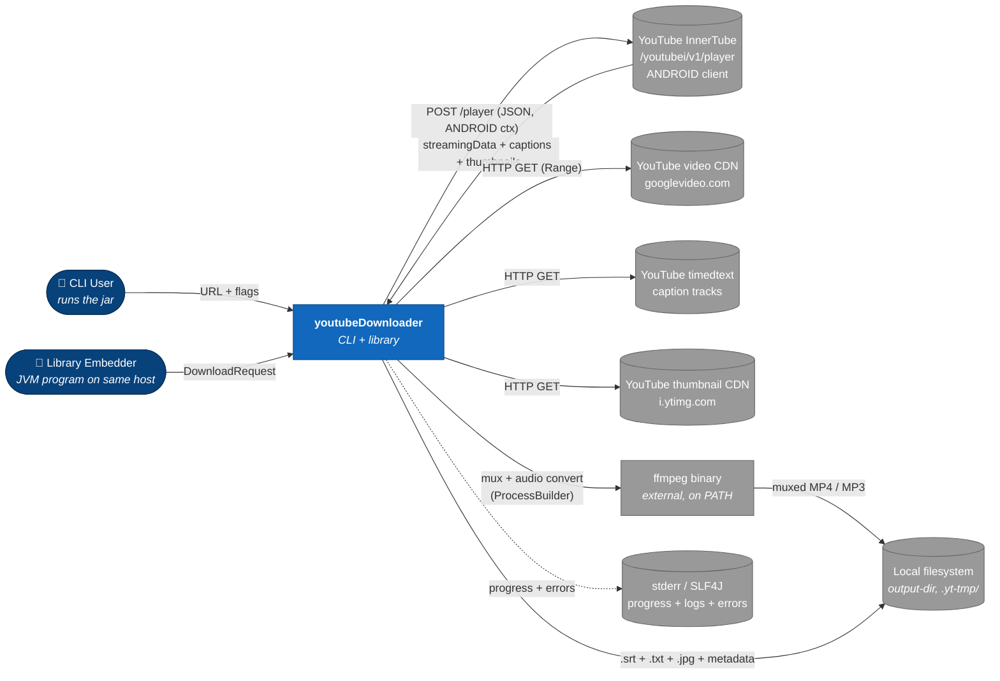

# 01 — Overview

This document is the reader's map for youtubeDownloader. It exists so a new engineer, reviewer, or operator can read one file, get oriented, and decide which of `02-architecture.md`, `03-data-model.md`, `04-apis.md`, or `05-operations.md` they need next.

> **Traceability:** every capability described here maps to at least one user story in [`00-requirements.md`](./00-requirements.md). Every quality attribute maps to at least one NFR. The overview is a readable surface — requirements are the source of truth.

---

## Purpose

youtubeDownloader is a small, single-site Java tool that takes one YouTube video URL and produces, on local disk, any combination of: a playable muxed MP4, an audio-only file (M4A or MP3), the video's transcript as SRT + plain text, and the thumbnail. It ships as a CLI and, as a byproduct, a thin embeddable Java library.

Its job is narrow and well-defined: **resolve one YouTube URL, read stream metadata from YouTube's InnerTube API via the ANDROID client, select the best video + audio formats under a compatibility-first policy, download them, mux them with `ffmpeg`, fetch the transcript if requested, emit the results to the local filesystem — with honest, one-line error messages on every failure path.**

## Problem it solves

`yt-dlp` exists. It is feature-rich, mature, and covers ~1700 sites. This tool is not trying to compete with it.

What this tool is, instead:

1. **A learning project.** Building the InnerTube client, the format selector, and the ffmpeg integration from scratch in Java is valuable in itself — the author understands the domain deeper afterwards than they could by running `brew install yt-dlp`.
2. **Java-embeddable.** `yt-dlp` is a Python CLI. Embedding it in a Java program means shelling out to a subprocess, parsing stdout, and paying a 500 ms start-up tax on every invocation. This tool ships as a Java library (US-9) with a typed API surface (AC-9.1..AC-9.5); a Java program can invoke it directly on the JVM.
3. **Narrow and honest about its limits.** `yt-dlp` has to handle every edge case for every site. This tool supports one site (YouTube), one URL at a time (no playlists — OOS-1), the formats the ANDROID client exposes without signature deciphering (OOS-2), and publicly-accessible non-live videos (OOS-3, OOS-6, OOS-7). Everything else fails fast with a specific exit code (AC-5.2) that names the limit.

The value proposition is not "better than yt-dlp." The value is "small enough to read, simple enough to maintain, pure Java so it composes with other Java code, and written with enough discipline that when YouTube changes the API the broken test fires in the right place."

## Scope

### In scope (MVP)

- Single YouTube video URL → video / audio / transcript / thumbnail on local disk. URL shapes accepted: `www.youtube.com/watch?v=<id>`, `youtu.be/<id>`, `www.youtube.com/shorts/<id>`, `m.youtube.com/watch?v=<id>` (AC-1.1).
- Video download: best resolution up to 1080p by default, `--max-height` override including `0` for uncapped (AC-1.3, AC-1.4). Codec preference H.264 > VP9 > AV1, compatibility-first. Muxed MP4 via `ffmpeg` (AC-1.6).
- Audio-only download: M4A without re-encoding by default; MP3 via `ffmpeg` transcode at 192 kbps (`NFR-DEFAULT-MP3-BITRATE`) when requested (AC-2.3, AC-2.4).
- Transcript download: SRT with timestamps + plain TXT (AC-6.2), preferring manual captions with ASR fallback (AC-7.*), with a language-resolution chain that prefers `--lang`, then `en`, then the video's primary audio language, then the first listed track (AC-8.1).
- Thumbnail download.
- Progress reporting on stderr, TTY-aware, suppressible with `--quiet` (AC-4.*).
- One-line error on stderr with a specific exit code for each of 11 documented failure categories; full stack trace only behind `--debug` (AC-5.*).
- Embeddable library: `YoutubeDownloader` entrypoint, `DownloadRequest` / `DownloadResult` types, a typed exception hierarchy, an injectable progress listener, an injectable logger (AC-9.*).

### Out of scope (MVP)

All items from [`00-requirements.md § Out of scope`](./00-requirements.md#out-of-scope-explicit-non-goals). Summary:

| Concern | Home |
|---|---|
| Playlists, channels, search (OOS-1) | A future release if ever wanted |
| Signature deciphering — JavaScript execution of YouTube's `player.js` (OOS-2) | Use `yt-dlp` for videos that require it — this tool fails with exit code `22` per AC-5.3 |
| Live streams (OOS-3) | Rejected with exit code `21` per AC-1.7 |
| yt-dlp-style format selection DSL (OOS-4) | `--max-height` covers the only user-facing format tuning MVP needs |
| Concurrent fragment downloads — DASH / HLS parallelism (OOS-5) | A later optimisation; MVP uses one HTTP GET per stream |
| Cookies / authenticated sessions / age-restricted videos (OOS-6, OOS-7) | Out of scope; fails with exit code `20` |
| Download archive / cross-run resume (OOS-8) | Not useful without playlists |
| Post-processing features: SponsorBlock, chapter split, metadata embedding (OOS-9) | `yt-dlp` |
| Any site other than YouTube (OOS-10) | `yt-dlp` |
| Plugin system (OOS-11) | Follows from OOS-10 |
| Self-update (OOS-12) | Rebuild from source |
| GUI (OOS-13) | CLI + library only |

## Actors

Re-framed from the Phase 1a personas for design-reader perspective — who interacts with the tool, and how, and how often.

| Actor | Interaction | Frequency |
|---|---|---|
| **CLI User** (P1) | Invokes `java -jar youtube-downloader-1.0.0.jar <URL> [flags]` at the shell | Per-URL, interactive |
| **Java Library Embedder** (P3) | Instantiates `YoutubeDownloader`, builds a `DownloadRequest`, calls `download(...)`, handles typed exceptions | Per-URL, programmatic |
| **Transcript Consumer** (P2) | Always invokes with `--transcript`; may pipe the resulting `.txt` directly into another tool | Variant of CLI User above |
| **YouTube InnerTube API** (P5) | Target of the single POST we send per run; returns a JSON payload with stream URLs, caption tracks, thumbnails, availability flags | One POST per run |
| **YouTube video CDN** (`googlevideo.com`) | Target of one or two HTTP GETs per run (video stream + audio stream) with HTTP range support | One long-lived GET per stream |
| **YouTube timedtext endpoint** | Target of one HTTP GET for the selected caption track when `--transcript` is requested | Zero or one GET per run |
| **YouTube thumbnail CDN** (`i.ytimg.com`) | Target of one HTTP GET for the thumbnail | Zero or one GET per run |
| **ffmpeg (external binary)** (P6) | Invoked as a child process via `ProcessBuilder`, two invocations at most per run (mux; or audio transcode); stderr is read and surfaced on failure | Zero to two `exec` per run |
| **Maintainer / Future Self** (P4) | Reads structured `SLF4J` logs to diagnose; runs `mvn test` offline; runs `mvn verify -P integration` when needed | On incidents and during development |

## System context (C4 Level 1)

The box is the **tool as a whole** (CLI + library together). Internal decomposition is covered in [`02-architecture.md`](./02-architecture.md).

---

## External contracts (assumed)

The tool's correctness depends on four upstream boundaries (YouTube's three endpoints plus `ffmpeg`) and one downstream boundary (the local filesystem). This section summarises the assumptions; the full prose specification lives in [`04-apis.md`](./04-apis.md) and the machine-checkable schemas live in [`06-formal/`](./06-formal/) (populated during Phase 3).

### Upstream 1: InnerTube `/youtubei/v1/player` (ANDROID client)

The single InnerTube call per run (AC-1.2, AC-12.3). Returns a JSON payload from which we extract:

- **`streamingData.adaptiveFormats`** — an array of format descriptors, each containing `itag`, `mimeType`, `bitrate`, `width`/`height`/`fps` for video, `audioQuality`/`audioSampleRate` for audio, a CDN `url`, and (for cipher-protected videos) a `signatureCipher` field. Our filter rejects formats whose `signatureCipher` is non-empty (AC-5.3).
- **`captions.playerCaptionsTracklistRenderer.captionTracks[]`** — an array of caption track descriptors, each with a `baseUrl`, `languageCode`, and an optional `kind = "asr"` field that distinguishes auto-generated from manual tracks (AC-7.1).
- **`videoDetails`** — `videoId`, `title`, `isLive`, `isPrivate`, and the optional `audioLanguage` used as a language-resolution fallback (AC-8.1, step 3).
- **`playabilityStatus.status`** — `OK` / `UNPLAYABLE` / `LIVE_STREAM_OFFLINE` / `LOGIN_REQUIRED` / `ERROR` / `AGE_VERIFICATION_REQUIRED`, mapped to exit codes `20` (unavailable) or `21` (live) per AC-5.2.
- **`thumbnail.thumbnails[]`** — an array of `{ url, width, height }` from which we pick the highest-resolution option.

The request body is constructed with `context.client` = ANDROID v`NFR-ANDROID-CLIENT-VERSION`, `androidSdkVersion = NFR-ANDROID-SDK-VERSION`, `hl = NFR-INNERTUBE-HL`, `gl = NFR-INNERTUBE-GL`. The HTTP `User-Agent` is `NFR-ANDROID-USER-AGENT`. All values are pinned in Phase 1c Group 2.

> **Fragility note.** The ANDROID client path was chosen because, as of the Phase 1 capture date, it returns CDN URLs without requiring JavaScript signature deciphering. YouTube tightens anti-abuse defences regularly; the ANDROID client version we pin (`21.02.35`) may become ineffective without notice. Response-shape tests (Phase 3 `06-formal/`) and the category-11 exit code (AC-5.2 — "InnerTube response parse error") are our early-warning system.

### Upstream 2: YouTube video CDN (`googlevideo.com`)

Target of one HTTP GET per selected stream (AC-1.6). The URL is read from `streamingData.adaptiveFormats[N].url` in the InnerTube response and carries its own signed query parameters valid for a bounded window (typically ~6 hours). We use HTTP `Range` requests so the download can resume within a single run if the transport hiccups (not across process restarts — see OOS-8).

`Content-Length` is present; it drives the progress-bar total (AC-4.1). `Content-Type` is `video/mp4` or `audio/mp4` or `video/webm` or `audio/webm` and is not further parsed — the container came from the InnerTube `mimeType`.

### Upstream 3: YouTube timedtext endpoint

Target of one HTTP GET when `--transcript` is requested (AC-6.1). The URL is read from `captions.playerCaptionsTracklistRenderer.captionTracks[N].baseUrl`. We request the default response format (XML); response is parsed into a sequence of `{ startMs, durationMs, text }` cues and converted to SRT (AC-6.2) and plain TXT (AC-6.2) with HTML entities decoded (AC-6.3).

### Upstream 4: YouTube thumbnail CDN (`i.ytimg.com`)

Target of one HTTP GET. URL comes from `videoDetails.thumbnail.thumbnails[]`, choosing the highest-resolution entry. Response is written to disk as `<base>.jpg` verbatim.

### Upstream 5: `ffmpeg` binary

Invoked as a child process via `ProcessBuilder` (AC-13.*). Two invocation sites:

- **Mux** — `ffmpeg -i <video.part> -i <audio.part> -c copy -map 0:v:0 -map 1:a:0 -y <output.mp4>` after both streams have downloaded (AC-1.6). No re-encoding; this is a stream copy.
- **Audio transcode** — `ffmpeg -i <audio.part> -c:a libmp3lame -b:a 192k -y <output.mp3>` when `--audio-format mp3` is requested (AC-2.4).

`ffmpeg -version` is invoked once at startup when either operation is required, to verify the binary is on `PATH` and the version meets `NFR-MIN-FFMPEG-VERSION = 4.0` (AC-13.1, AC-13.3). Transcript-only and audio-only-m4a runs skip this check (AC-13.5). On non-zero exit, the last `NFR-FFMPEG-STDERR-LINES = 20` lines of stderr are surfaced in the error message (AC-13.4).

### Downstream: Local filesystem

- Writes go under `<output-dir>` (default: current working directory per AC-3.1; overridable via `--output-dir` per AC-3.2).
- `.part` files and any intermediate state live in `<output-dir>/.yt-tmp/` per `NFR-TEMP-DIR-STRATEGY`. Cleaned on success; retained on failure for inspection.
- Filename pattern `<sanitized_title> [<video_id>].<ext>` per AC-3.3, capped at `NFR-MAX-FILENAME-LENGTH = 200` characters per AC-3.4.
- Free-space probe: `NFR-MIN-DISK-FREE = 2 × expected final file size` at run start; fail fast with exit `70` if insufficient.
- Overwrite refused by default per AC-3.6; `--force` overrides.

---

## Key quality attributes

The numbers a reader should remember. For the full list see [`00-requirements.md § Phase 1c`](./00-requirements.md#phase-1c--non-functional-requirements).

| Attribute | Value | NFR |
|---|---|---|
| Java runtime | **17** (LTS) | `NFR-JAVA-VERSION` |
| Build | **Maven 3.9+**, fat jar via shade plugin | `NFR-BUILD-TOOL` |
| Supported OS | **macOS 13+** (x86_64, aarch64); **Linux** (x86_64, aarch64) with glibc 2.31+ | `NFR-SUPPORTED-OS` |
| JVM memory | **No explicit cap** — defaults apply; streaming is the discipline | `NFR-MAX-MEMORY` |
| InnerTube request budget | **30 s total**; up to **3** retries at 500ms exp backoff | `NFR-INNERTUBE-REQUEST-TIMEOUT`, `NFR-INNERTUBE-MAX-RETRIES`, `NFR-INNERTUBE-BACKOFF-BASE` |
| Stream download budget | **Unlimited total** (bounded by **30 s** idle-read timeout between bytes) | `NFR-STREAM-DOWNLOAD-TIMEOUT`, `NFR-NETWORK-TIMEOUT-READ` |
| Stream retry budget | **2** retries; each restarts from byte 0 | `NFR-STREAM-MAX-RETRIES` |
| ffmpeg floor | **4.0** | `NFR-MIN-FFMPEG-VERSION` |
| ffmpeg per-invocation cap | **600 s** (10 min) | `NFR-FFMPEG-INVOCATION-TIMEOUT` |
| Progress cadence (non-TTY) | ≥ **1000 ms** between lines | `NFR-PROGRESS-INTERVAL` |
| Progress cadence (TTY) | ≥ **100 ms** between refreshes | `NFR-PROGRESS-TTY-REFRESH` |
| Filename length cap | **200** chars excluding extension | `NFR-MAX-FILENAME-LENGTH` |
| Default MP3 bitrate | **192 kbps** | `NFR-DEFAULT-MP3-BITRATE` |
| Unit test coverage gate | **80%** line coverage on library module | `NFR-UNIT-TEST-COVERAGE-MINIMUM` |
| Unit test runtime budget | **30 s** for `mvn test` | `NFR-UNIT-TEST-RUNTIME-BUDGET` |

## Operating envelope

| Dimension | Value | Source |
|---|---|---|
| Language / runtime | Java 17 | `NFR-JAVA-VERSION` |
| Build | Maven 3.9+, shade plugin for fat jar | `NFR-BUILD-TOOL` |
| Deploy target | Local developer machine (macOS 13+ or Linux); no server deployment, no container image as an MVP deliverable | `NFR-SUPPORTED-OS` |
| External binary dependency | `ffmpeg` ≥ 4.0 on `PATH` (required only for muxed MP4 and MP3 transcode; transcript-only and audio-m4a-only runs tolerate absent `ffmpeg` per AC-13.5) | `NFR-MIN-FFMPEG-VERSION` |
| Network | Any IPv4 or IPv6 network path to `www.youtube.com`, `*.googlevideo.com`, `i.ytimg.com`. No proxy support in MVP. | — |
| Scope of a process | Exactly one video URL per invocation | AC-1.1, OOS-1 |
| Concurrency | None — one HTTP GET per stream; sequential mux step after download | OOS-5, AC-1.6 |
| Persistence | Output-dir on local filesystem; no database, no cross-run state | OOS-8 |
| Authentication | None — public videos only | OOS-6 |

## Open questions / assumptions to validate

Every assumption that might force a future design round has a home in this list until it is resolved. **New assumptions discovered during Phase 2 and later are added here.**

| # | Assumption | Why it matters | Owner | Target resolution |
|---|---|---|---|---|
| OQ-A | **The ANDROID client version triplet (`21.02.35`, SDK 30, matching User-Agent) still works against InnerTube `/player` without signature deciphering** at the time Phase 5 implementation begins. *(Triplet refreshed from 19.09.37/SDK 34/Android 14 at commit 9501351 — see DCR-1.)* | If the pinned version has been deprecated by YouTube's anti-abuse, the tool fails on first contact and an NFR round is needed to roll forward. The specific failure mode (exit `10` network vs exit `11` parse vs exit `30` no formats) depends on how YouTube rejects the request. | srk | Before Phase 5 implementation begins. Verify by issuing one real request during a Phase 2 ADR write-up (planned: ADR 0001 — ANDROID InnerTube client). |
| OQ-B | **The unlimited total stream download timeout (`NFR-STREAM-DOWNLOAD-TIMEOUT = unlimited`) is safe in practice** — i.e., the 30s idle-read timeout between bytes is sufficient protection against a stalled CDN socket | If a production-ish run shows a hung stream where `Content-Length` bytes arrive in very slow bursts (e.g., one byte every 29s), the download could legitimately take days without tripping any timeout. Probably fine, but worth confirming. | srk | After Phase 5 — gather evidence from real runs; if a hang is observed, add `NFR-STREAM-TOTAL-CAP` in an NFR round. |
| OQ-C | **80% line-coverage gate on the library module is achievable without test pathology** — i.e., without tests that poke at trivial getters to pad coverage | Worst case is either (a) we drop the gate because it forces bad tests, or (b) we keep the gate and accept some trivial-test smell. Either is survivable. | srk | Phase 5 — after the first ADR-worthy parser / selector is implemented and its real tests are written, evaluate whether 80% is honest. If not, adjust in an NFR round. |
| OQ-D | **The `.yt-tmp/` convention for temp files (`NFR-TEMP-DIR-STRATEGY`) is OK with users** — i.e., nobody cares about a hidden subdirectory appearing in their output folder briefly and being cleaned on success | Alternative is a system temp dir via `Files.createTempDirectory()`. The trade-off is same-filesystem rename (fast) vs clean separation (safer on some configurations). | srk | Phase 2 — may surface in `02-architecture.md` and be resolved with an ADR. |

## Future work

Items that are out of scope today but known to matter eventually. Each one becomes its own design document (or ADR) when it graduates from "future" to "now".

- **Playlist support (OOS-1)** — requires a new `resolve-playlist` flow that calls a different InnerTube endpoint and fans out to per-video download. Shares most of the current code paths.
- **Signature deciphering (OOS-2)** — the single most complex feature `yt-dlp` implements. Would require embedding a JavaScript engine (GraalJS, Nashorn, Rhino) and a parser for YouTube's obfuscated `player.js`. A large Phase-2-equivalent design effort on its own.
- **Concurrent fragment downloads (OOS-5)** — relevant for DASH-manifest videos. The ANDROID client mostly returns direct URLs today; if YouTube shifts toward DASH-only, this moves from "optimisation" to "required".
- **Windows support** — filename sanitization rules (AC-3.3) already accommodate Windows-illegal chars; main cost is testing. `ffmpeg` on Windows needs `.exe` extension resolution but no other changes.
- **Proxy support** — currently no way to route InnerTube / CDN traffic through a proxy. Easy to add via OkHttp; waiting on a real need.
- **Cookies / `--cookies-from-browser`** — needed for age-restricted and members-only content (OOS-6, OOS-7). Several browser-keyring decryption implementations exist; separate ADR territory.
- **`--print-json` / infojson output** — stdout-only machine-readable metadata. Useful for embedding in shell pipelines. Trivial to add.
- **SponsorBlock integration (OOS-9)** — external API call per run; cheap feature; out-of-scope only to keep MVP tight.

## Reading onward

From here:

- Go to [`02-architecture.md`](./02-architecture.md) to see the component decomposition inside the single box in the C4 Level 1 diagram — how URL parse, InnerTube call, format selection, stream download, caption fetch, mux, and emit are split across components, and how each component maps to specific ACs.
- Go to [`03-data-model.md`](./03-data-model.md) to see the internal domain types (`VideoId`, `Format`, `CaptionTrack`, `DownloadRequest`, `DownloadResult`) and the download-lifecycle state machine with its invariants.
- Go to [`04-apis.md`](./04-apis.md) for the full prose specification of the external contracts summarized above — InnerTube request / response structure, timedtext XML schema, ffmpeg CLI contract, our CLI contract, and the Java library public API.
- Go to [`05-operations.md`](./05-operations.md) for build, run, troubleshoot, and upgrade procedures — including a "my video won't download" flowchart that maps failure modes to exit codes to remediation.
- Go to [`06-formal/`](./06-formal/) for the machine-checkable JSON schemas and state-machine invariants once Phase 3 is underway.

ADRs emerge during `02-architecture.md` drafting; check the index in [`design/README.md`](./README.md#architecture-decision-records).
