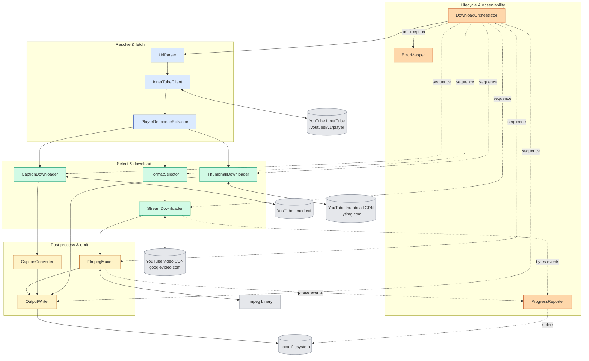
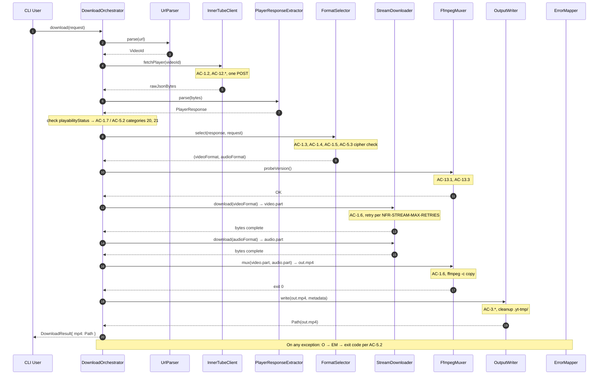
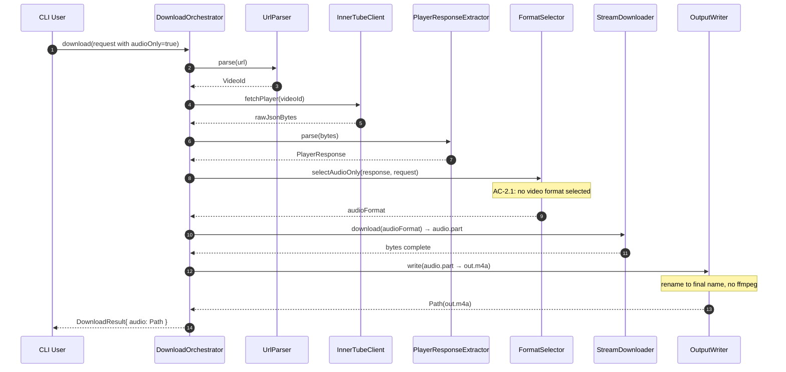
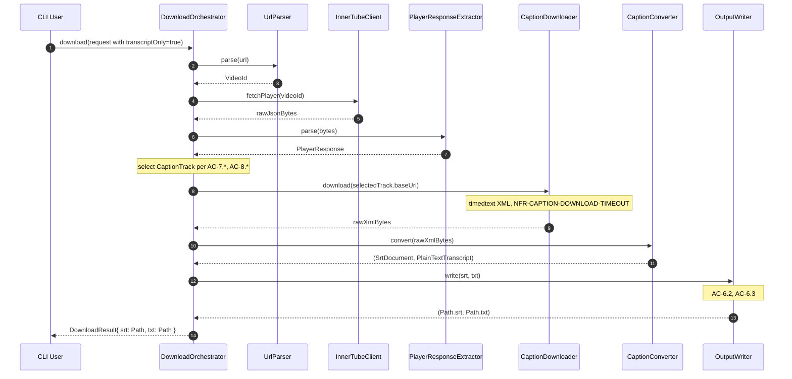

# 02 — Architecture

This document is the **how** of youtubeDownloader. It decomposes the tool into named components, shows how a URL flows through them for each of the three main operations (video + audio, audio-only, transcript), documents the failure-handling matrix, the retry model, and the shutdown and concurrency models.

> **Scope:** this document describes the single-process runtime of one CLI invocation (or one library `download(...)` call). There is no fleet, no scheduler, no persistent state across runs — each run is self-contained (OOS-8).

> **ADR placeholders.** Where a decision is invoked below (e.g., "use the ANDROID InnerTube client"), a placeholder `[ADR-NNNN — pending]` marks the spot. ADRs 0001–0004 land as separate commits after this document is reviewed. When they do, the placeholders are rewritten to live links.

---

## 1. Component view

One invocation of youtubeDownloader is composed of 11 components grouped into four subsystems:

- **Resolve & fetch** — parse the URL, call InnerTube, extract the stream / caption / thumbnail catalog
- **Select & download** — pick formats, download media and captions from YouTube's CDNs
- **Post-process & emit** — mux via ffmpeg, convert captions, write outputs to disk
- **Lifecycle & observability** — drive the sequence, report progress, map errors, shut down cleanly

Each component has a single, well-bounded responsibility. Components communicate through method calls on typed interfaces, not shared state — the same discipline that keeps US-9 (library embedder) and US-11 (offline-testable parsers) achievable.

### 1.1 Diagram



### 1.2 Component responsibilities

#### 1.2.1 Resolve & fetch

| Component | Responsibility | Key invariants |
|---|---|---|
| `UrlParser` | Accepts a raw string URL and produces a `VideoId` value type. Accepts the four URL shapes enumerated in AC-1.1 (`watch?v=`, `youtu.be/`, `/shorts/`, `m.youtube.com`). Rejects everything else with a typed parse error mapped to exit code `2` (AC-5.2). | Pure function, no network or filesystem I/O (AC-11.1). A `VideoId` is a validated, 11-character string — the type exists so no later component has to re-validate. |
| `InnerTubeClient` | Issues exactly one POST to `https://www.youtube.com/youtubei/v1/player` per invocation (AC-12.3) using the ANDROID client context ([ADR-0001](./adr/0001-android-innertube-client.md)). Sets the request body per `NFR-ANDROID-CLIENT-VERSION`, `NFR-ANDROID-SDK-VERSION`, `NFR-INNERTUBE-HL`, `NFR-INNERTUBE-GL` (AC-12.1) and HTTP `User-Agent` per `NFR-ANDROID-USER-AGENT` (AC-12.2). Returns the raw JSON bytes and the HTTP status. HTTP transport is OkHttp ([ADR-0002 — pending]). | One outbound request per call. Retries per `NFR-INNERTUBE-MAX-RETRIES`/`NFR-INNERTUBE-BACKOFF-BASE` happen **inside** this component; callers never see transient failures. Total budget bounded by `NFR-INNERTUBE-REQUEST-TIMEOUT = 30s`. |
| `PlayerResponseExtractor` | Parses the InnerTube JSON bytes into an immutable `PlayerResponse` domain object with typed fields for `adaptiveFormats`, `captionTracks`, `thumbnails`, `videoDetails`, `playabilityStatus`. Uses Jackson with permissive unknown-field handling ([ADR-0004 — pending]). | Pure function over in-memory bytes — testable offline against captured fixtures (AC-11.1, AC-11.2). Rejects with typed parse error on unexpected shape, mapped to exit code `11` (AC-5.2). Surfaces `playabilityStatus` verbatim so callers can distinguish `UNPLAYABLE` (exit `20`) from `LIVE_STREAM_OFFLINE` (exit `21`) from `LOGIN_REQUIRED` (exit `20`). |

#### 1.2.2 Select & download

| Component | Responsibility | Key invariants |
|---|---|---|
| `FormatSelector` | Given a `PlayerResponse` and a `DownloadRequest`, selects zero-or-one video `Format` and zero-or-one audio `Format`. Applies the `--max-height` cap (AC-1.3, default 1080, `0` = uncapped); applies codec preference H.264 > VP9 > AV1 (AC-1.4 — compatibility-first per OQ-4 resolution); applies audio ordering by bitrate with m4a/AAC preferred over webm/Opus (AC-1.5, AC-2.2). Rejects formats whose `signatureCipher` field is non-empty — if **all** candidates have ciphers, throws the category-22 error mapped to AC-5.3. | Pure function. No network, no filesystem. Returns `Optional<Format>` for video and audio independently — audio-only operations are the same code path with video left empty. |
| `StreamDownloader` | Downloads one or two streams (video, audio) from their CDN URLs (`googlevideo.com`) using HTTP GET with `Range` support for same-run resume. Writes each to a distinct `.part` file in `<output-dir>/.yt-tmp/` per `NFR-TEMP-DIR-STRATEGY`. Emits byte-progress events to `ProgressReporter`. Retries up to `NFR-STREAM-MAX-RETRIES = 2` on transient failure, each retry restarting from byte 0. | Streaming I/O — bytes flow through, not buffered in memory. Heap footprint bounded independent of stream size. Idle-read timeout `NFR-NETWORK-TIMEOUT-READ = 30s` between bytes; no total-time cap (`NFR-STREAM-DOWNLOAD-TIMEOUT = unlimited`). |
| `CaptionDownloader` | Fetches one caption track as XML from the `baseUrl` in the selected `CaptionTrack`. Single HTTP GET with `NFR-CAPTION-DOWNLOAD-TIMEOUT = 10s` total budget. Returns the raw XML bytes. | One request per invocation. Never invoked if `--transcript` is not requested. Body is small (typically < 200 KB). |
| `ThumbnailDownloader` | Fetches the highest-resolution thumbnail from `videoDetails.thumbnail.thumbnails[]`. Single HTTP GET with `NFR-THUMBNAIL-DOWNLOAD-TIMEOUT = 10s`. Writes directly to `<base>.jpg` — no conversion. | One request per invocation. Skipped if the user did not request a thumbnail. |

#### 1.2.3 Post-process & emit

| Component | Responsibility | Key invariants |
|---|---|---|
| `FfmpegMuxer` | Invokes `ffmpeg` as a child process via `ProcessBuilder` ([ADR-0003 — pending]). Two invocation shapes: **mux** (`-i video.part -i audio.part -c copy -map 0:v:0 -map 1:a:0 -y out.mp4`) for AC-1.6; **audio transcode** (`-i audio.part -c:a libmp3lame -b:a NFR-DEFAULT-MP3-BITRATE -y out.mp3`) for AC-2.4. On startup (or before first invocation) runs `ffmpeg -version` to validate `NFR-MIN-FFMPEG-VERSION = 4.0` (AC-13.1, AC-13.3). Captures the last `NFR-FFMPEG-STDERR-LINES = 20` lines of stderr for error surfacing (AC-13.4). | Never invoked when not needed — transcript-only and audio-only-m4a paths skip it entirely (AC-13.5). Per-invocation timeout `NFR-FFMPEG-INVOCATION-TIMEOUT = 600s`. On non-zero exit, throws category-60 error mapped to AC-5.2. |
| `CaptionConverter` | Converts raw timedtext XML (from `CaptionDownloader`) into two in-memory products: an `SrtDocument` (cues numbered, `HH:MM:SS,mmm --> HH:MM:SS,mmm` format) and a `PlainTextTranscript` (no timestamps, no cue numbers, no blank-separator lines). Decodes HTML entities (AC-6.3) during conversion. | Pure function over in-memory bytes — testable offline (AC-11.1). Never does I/O. |
| `OutputWriter` | Writes final products to disk under `<output-dir>`: `.mp4` (from FfmpegMuxer), `.m4a` or `.mp3` (from StreamDownloader or FfmpegMuxer depending on path), `.srt` + `.txt` (from CaptionConverter), `.jpg` (from ThumbnailDownloader). Derives filenames per AC-3.3 and AC-3.4 from `videoDetails.title` and `videoId`. Probes free disk per `NFR-MIN-DISK-FREE = 2× final size` before the first write. Refuses to overwrite by default (AC-3.6); `--force` overrides. | Applies the sanitization rules in AC-3.3 (illegal-char strip, whitespace collapse, dot/space trim, empty→`video` fallback). Applies length cap in AC-3.4 (truncate from the right, preserve `[<video_id>]`). On filesystem error (disk full, permission denied) throws category-70 error. |

#### 1.2.4 Lifecycle & observability

| Component | Responsibility | Key invariants |
|---|---|---|
| `DownloadOrchestrator` | The top-level driver. Composes the other components in the order dictated by the selected flow (video+audio, audio-only, or transcript-only). Constructs the `DownloadResult` at the end. Catches domain exceptions and routes them to `ErrorMapper`. | Library entrypoint per AC-9.1. Never calls `System.exit(...)` (AC-9.2). Never writes to `System.out`/`System.err` directly (AC-9.3). Thread-model: one orchestrator instance per `download(...)` call; no shared state between concurrent callers. |
| `ProgressReporter` | Collects byte-progress events from `StreamDownloader` and phase events from `FfmpegMuxer`, throttles them per `NFR-PROGRESS-INTERVAL` (non-TTY: 1000ms) or `NFR-PROGRESS-TTY-REFRESH` (TTY: 100ms), and emits to an injectable `ProgressListener` (AC-9.3). CLI provides a stderr-writing listener; library embedders supply their own. | The CLI's stderr listener chooses in-place refresh vs newline output based on `isatty(stderr)` (AC-4.2, AC-4.3). Suppressed by `--quiet` (AC-4.4). The progress loop runs on a scheduled executor — the only background thread in the process (Section 6). |
| `ErrorMapper` | Translates domain exceptions to the fixed (category, exit-code, one-line-message) tuple documented in AC-5.2 and `06-formal/cli-exit-codes.md` (Phase 3). At the library boundary, domain exceptions surface as typed subclasses of `YoutubeDownloaderException` (AC-9.4); the CLI converts that to `System.exit(code)` per AC-5.2. | Single source of truth for the category → exit-code mapping. No other component decides exit codes. Preserves the original stack trace in the exception chain — visible under `--debug` (AC-5.5). |

---

## 2. Request flows

Three sequence diagrams for the three main operations. Each arrow is annotated with the ACs it fulfills. All flows share the same **Resolve & fetch** prefix (steps 1–4) and diverge after.

### 2.1 Flow A — Video + audio → muxed MP4

The default path when invoked as `java -jar yt.jar <URL>`.



### 2.2 Flow B — Audio-only (no ffmpeg, m4a default)

Invoked with `--audio-only` (no `--audio-format`, so m4a is implicit per AC-2.3). ffmpeg is **not** invoked (AC-13.5).



When the user passes `--audio-format mp3`, an extra step is inserted: after `SD` reports bytes complete, `O → MX: transcode(audio.part, 192k) → out.mp3` per AC-2.4. The ffmpeg version probe (AC-13.1) runs before the transcode.

### 2.3 Flow C — Transcript (no video, no audio, no ffmpeg)

Invoked with `--transcript` alone. Fast path — ffmpeg is not touched (AC-13.5).



> When `--transcript` is combined with `--video` or `--audio-only`, the orchestrator runs the caption flow in parallel with — or sequentially after — the media flow. The decision is single-threaded-sequential for MVP (Section 6) — caption download happens after the media flow completes, so no resource contention.

---

## 3. Failure handling

Every failure mode in AC-5.2 has a component that detects it and a component that maps it to the exit code. This matrix is canonical; `06-formal/cli-exit-codes.md` (Phase 3) formalizes it as a machine-checkable table.

| Exit code | Category | Detected by | Trigger | User sees (stderr one-liner per AC-5.1) |
|---|---|---|---|---|
| `0` | success | n/a | All components returned normally | — |
| `2` | argument / URL parse error | `UrlParser` (bad URL), CLI picocli layer (bad flag) | URL doesn't match any of the four accepted shapes (AC-1.1); or unknown flag | `Error: args: <what>` |
| `10` | network failure | `InnerTubeClient`, `StreamDownloader`, `CaptionDownloader`, `ThumbnailDownloader` | DNS / TCP / TLS / HTTP transport error after all retries exhausted (AC-12.4) | `Error: network: <host>: <cause>` |
| `11` | InnerTube parse error | `PlayerResponseExtractor` | JSON does not deserialize into `PlayerResponse`; required fields missing | `Error: innertube: response shape unexpected — <field>` |
| `20` | video unavailable | `PlayerResponseExtractor` | `playabilityStatus.status ∈ { UNPLAYABLE, LOGIN_REQUIRED, ERROR, AGE_VERIFICATION_REQUIRED }` | `Error: unavailable: <reason from InnerTube>` |
| `21` | video is live / premiere | `PlayerResponseExtractor` | `videoDetails.isLive = true` OR `playabilityStatus.status = LIVE_STREAM_OFFLINE` (AC-1.7) | `Error: live: live streams are not supported in this MVP` |
| `22` | cipher-protected video | `FormatSelector` | All candidate formats have non-empty `signatureCipher` (AC-5.3) | `Error: cipher: this video requires JavaScript signature deciphering, which is out of scope for this tool. Use yt-dlp for this URL.` |
| `30` | no matching format | `FormatSelector` | Non-empty adaptive-formats list, but none passes filters (e.g., `--max-height 240` and no formats that low) | `Error: format: no video/audio format matches the selection criteria` |
| `40` | caption unavailable in language | `PlayerResponseExtractor` / `FormatSelector` (caption-selection logic in that component for MVP) | No caption track found for the `--lang` preference chain (AC-8.3), OR only ASR available and `--no-asr` is set (AC-7.4), OR no caption tracks at all (AC-6.4) | `Error: captions: no caption track available for language '<code>'. Available: <list>.` |
| `50` | output file exists | `OutputWriter` | Any intended output file already exists and `--force` not given (AC-3.6) | `Error: output: file '<path>' already exists (pass --force to overwrite)` |
| `60` | ffmpeg missing / too old / failed | `FfmpegMuxer` | `ffmpeg -version` fails (AC-13.2); version below floor (AC-13.3); non-zero mux / transcode exit (AC-13.4) | `Error: ffmpeg: <reason>\n<last 20 lines of ffmpeg stderr>` |
| `70` | filesystem error | `OutputWriter` (disk full, permission), `StreamDownloader` (`.part` write fails) | Any `IOException` during write, including free-disk probe failure (`NFR-MIN-DISK-FREE`) | `Error: filesystem: <path>: <cause>` |

Mapping is executed by `ErrorMapper` — every domain exception has a known category; the exit-code number is never decided elsewhere.

---

## 4. Retry model

Retries exist only in two places, with deliberately different budgets.

### 4.1 InnerTube retries (inside `InnerTubeClient`)

Per AC-12.4:

| Attempt | Wait before | Cumulative time |
|---|---|---|
| 1 (initial) | 0 | 0 |
| 2 | 500 ms (`NFR-INNERTUBE-BACKOFF-BASE`) | 0.5 s |
| 3 | 1000 ms (×2 factor) | 1.5 s |
| 4 | 2000 ms (×2 factor) | 3.5 s |
| → fail | — | ≤ 3.5 s of retry, up to 30 s total (`NFR-INNERTUBE-REQUEST-TIMEOUT`) |

Retryable: HTTP 5xx, connection reset, read timeout on request body. **Not** retryable: HTTP 4xx (permanent auth / argument issue — surfaces as parse error or `20`/`21`), DNS resolution failure after the connect timeout (no DNS → no amount of retries will help). Max 3 retries (4 total attempts).

### 4.2 Stream retries (inside `StreamDownloader`)

Per `NFR-STREAM-MAX-RETRIES = 2`. Each retry restarts the stream from byte 0 — we do **not** attempt mid-stream resume across retries because the CDN URL carries time-limited signed query parameters and re-using a URL mid-stream after a pause is prone to 403 responses. Trading simplicity for a small amount of re-download on rare transient failures.

Retryable: connection reset, read timeout. **Not** retryable: HTTP 403 (signed URL expired — we would need a fresh `fetchPlayer` call, which is a new run), HTTP 404 (format gone — likely InnerTube response was stale).

### 4.3 Caption and thumbnail retries

**None.** Both have tight total-time budgets (`NFR-CAPTION-DOWNLOAD-TIMEOUT`, `NFR-THUMBNAIL-DOWNLOAD-TIMEOUT` = 10s each), and failure of either is non-fatal to a media download (when the user requested the combined flow). In MVP, a caption-fetch failure is reported as a warning; a thumbnail-fetch failure is reported as a warning and the main output still succeeds. Implementation note for Phase 5: this needs a small "partial-success" reporting path on the `DownloadResult` — not a full retry loop.

### 4.4 What is not retried

- **ffmpeg failures** — determined to be terminal. A failed mux means the inputs are wrong; retrying won't help. Exit `60`.
- **Filesystem failures** — no auto-retry. If disk is full or a directory is not writable, fix it and rerun. Exit `70`.
- **Format selection failures** — no retry. Either the criteria match or they don't. Exit `30`.

---

## 5. Shutdown / signal handling

### 5.1 SIGINT (Ctrl-C)

Typical user interruption. Expected behaviour:

1. The JVM receives SIGINT and runs the installed shutdown hook.
2. The shutdown hook (installed by `DownloadOrchestrator` at run start) calls `close()` on any in-progress `StreamDownloader` (aborts the ongoing HTTP body read), any in-progress `FfmpegMuxer` (sends SIGTERM to the child ffmpeg process, waits up to 5 s, then SIGKILL), and flushes the `ProgressReporter`'s scheduled executor.
3. `.yt-tmp/` files are **retained** on user-initiated interruption. Rationale: the user may want to inspect what was downloaded so far, and re-running with `--force` will clean them up anyway.
4. Exit with code `130` (standard for SIGINT; not in our AC-5.2 category set because it's a signal, not a failure category — CLI convention).

### 5.2 SIGTERM

Same behaviour as SIGINT, exit code `143`.

### 5.3 Normal exit on failure

The `ErrorMapper` is invoked, emits the one-line stderr message, `System.exit(code)` is called with the AC-5.2 code. On failure, `.yt-tmp/` is **retained** (not cleaned up) so the user can inspect partial downloads. On subsequent re-run, if output files don't already exist (AC-3.6 path), download proceeds; if they do, the user sees exit `50` until they pass `--force`.

### 5.4 Normal exit on success

`.yt-tmp/` is **cleaned** on success: `.part` files are deleted, and the directory is removed if empty (`NFR-TEMP-DIR-STRATEGY`).

---

## 6. Concurrency model

Single-threaded per `download(...)` call, with one small exception.

**The main orchestration thread** runs UrlParser → InnerTubeClient → PlayerResponseExtractor → FormatSelector → StreamDownloader → FfmpegMuxer → OutputWriter sequentially. There is no worker pool, no fork-join, no concurrent format downloads. This is deliberate — OOS-5 explicitly excludes concurrent fragment downloading, and the MVP simplicity win is large.

**One background thread** runs the `ProgressReporter`'s scheduled flush — redrawing the progress line at `NFR-PROGRESS-TTY-REFRESH = 100ms` (TTY) or emitting a new line every `NFR-PROGRESS-INTERVAL = 1000ms` (non-TTY). This thread is a single-thread `ScheduledExecutorService` owned by the orchestrator, shut down in the shutdown hook (Section 5.1). The reporter is thread-safe because the only write path from the orchestration thread into it is an atomic counter update.

**Library callers** who want concurrency (embedder use case — US-9) call `download(...)` from N of their own threads. Each call gets its own `DownloadOrchestrator` instance with its own progress executor; there is no shared mutable state between orchestrators. This is the contract that makes the library safe to embed in a server-side job runner.

**What is explicitly not in MVP:**
- Concurrent fragment downloading (OOS-5) — one HTTP GET per stream.
- Parallel video + audio download — deliberately sequential so progress output shows one stream at a time and failures are easier to diagnose.
- Parallel media + caption download when both are requested — sequential for the same reason; can be added later without architectural change.

---

## 7. CLI vs library module boundary

The Maven project will be a two-module build (pinned in Phase 4 tasks, not here): a library module `yt-core` and a CLI module `yt-cli`. The boundary is an AC-9 requirement, not an implementation detail.

### 7.1 What lives where

| Module | Contents |
|---|---|
| `yt-core` (library) | All 11 components in Section 1. Domain types (`VideoId`, `Format`, `CaptionTrack`, `PlayerResponse`, `DownloadRequest`, `DownloadResult`, `SrtDocument`, `PlainTextTranscript`). The typed exception hierarchy rooted at `YoutubeDownloaderException`. SLF4J logging calls only — no backend configured. No `System.*` calls. |
| `yt-cli` (CLI) | picocli-annotated entrypoint (`Cli` class with `@Command`, `@Option`, `@Parameters`). One `ProgressListener` implementation that writes to stderr (TTY-aware per AC-4.2/AC-4.3). An SLF4J backend binding (slf4j-simple or logback). `System.exit` mapping from caught `YoutubeDownloaderException` → exit code per AC-5.2. |

### 7.2 Dependency direction

`yt-cli` depends on `yt-core`. Never the reverse. This is enforceable with Maven's `<dependency>` plus a Maven Enforcer rule that blocks circular deps.

### 7.3 Public API of `yt-core`

The surface exposed to embedders (US-9, AC-9.1):

```
com.srk.myutils.yd.core
├── YoutubeDownloader           // entrypoint
│   + download(DownloadRequest): DownloadResult   // throws YoutubeDownloaderException
├── DownloadRequest             // record-like builder
├── DownloadResult              // record-like result with optional Paths
├── ProgressListener            // injectable interface (AC-9.3)
├── YoutubeDownloaderException  // checked base
│   ├── UrlParseException
│   ├── NetworkException
│   ├── InnerTubeParseException
│   ├── VideoUnavailableException
│   ├── LiveStreamException
│   ├── CipherRequiredException
│   ├── NoMatchingFormatException
│   ├── CaptionUnavailableException
│   ├── OutputExistsException
│   ├── FfmpegException
│   └── FilesystemException
├── VideoId, Format, CaptionTrack  // value types
└── PlayerResponse                  // read-only view of parsed InnerTube response
```

The exception hierarchy is one-to-one with AC-5.2's category set — see AC-9.4. Callers catch by exception subtype without parsing strings.

### 7.4 What the CLI adds

- picocli CLI parsing — `@Command(name = "yt-downloader")`, `@Option(names = "--audio-only")`, etc.
- stderr-writing `ProgressListener` — uses ANSI escape codes for in-place refresh when stdout is a TTY.
- SLF4J backend binding — `slf4j-simple` for MVP. When `--debug` is set, the level is turned up to `DEBUG`.
- `System.exit(code)` mapping — one `try/catch(YoutubeDownloaderException)` around the orchestrator call, exit code pulled from the exception's category.
- Optional `--version` output.

### 7.5 Library embedder example (illustrative — not committed code)

```java
// What an embedder's code looks like:
YoutubeDownloader yd = new YoutubeDownloader();
DownloadRequest req = DownloadRequest.builder()
    .url("https://www.youtube.com/watch?v=dQw4w9WgXcQ")
    .audioOnly(true)
    .audioFormat(AudioFormat.MP3)
    .outputDir(Paths.get("/tmp/downloads"))
    .progressListener(new MyProgressListener())
    .build();
try {
    DownloadResult r = yd.download(req);
    System.out.println("Saved to: " + r.audioPath().get());
} catch (CipherRequiredException e) {
    // specific handling — e.g., fall back to yt-dlp subprocess
} catch (YoutubeDownloaderException e) {
    // catch-all for other categories
}
```

---

## 8. Open questions surfaced by this document

New items, added to `01-overview.md`'s OQ list on the next round:

| # | Question | Why it matters | Target resolution |
|---|---|---|---|
| OQ-E | **Should caption / thumbnail download run in parallel with media download** when the user requests a combined flow? | Potential 1–2 s wall-clock win. Costs: second progress emitter confuses users; thread-model complicates US-11 offline-testability. | Phase 5 — after profiling a real run. MVP stays sequential (Section 6). |
| OQ-F | **Does `.yt-tmp/` get retained on user-initiated interrupt but cleaned on normal failure?** Section 5 says retained in both cases — is that right? | Some users would expect a clean failure to also clean up. Counter-argument: if the next run uses `--continue` (future feature, OOS-8 adjacent), retention is what enables resume. | Phase 5 — behave as Section 5 says for MVP; revisit if a `--continue` feature is added. |

---

## 9. What this document pins

Everything above is **architecture** — the "how it's shaped" layer. The following adjacent questions are **not** pinned here and will be addressed elsewhere:

- **InnerTube request body exact JSON shape** — `06-formal/innertube-player-request.schema.json` (Phase 3)
- **InnerTube response exact shape of the fields we read** — `06-formal/innertube-player-response.schema.json` (Phase 3)
- **Timed-text caption XML shape** — `06-formal/caption-track.schema.json` (Phase 3)
- **Exact CLI flag list, help text, and exit-code contract** — `04-apis.md` (next in Phase 2) and `06-formal/cli-exit-codes.md` (Phase 3)
- **Exact ffmpeg command-line for every invocation shape** — `04-apis.md`
- **Exact Java library public method signatures** — `04-apis.md`
- **Domain types and state machine** — `03-data-model.md` (next in Phase 2)
- **Individual design decisions** — ADRs 0001–0004 (following commits)
