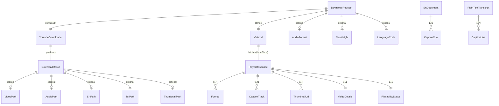
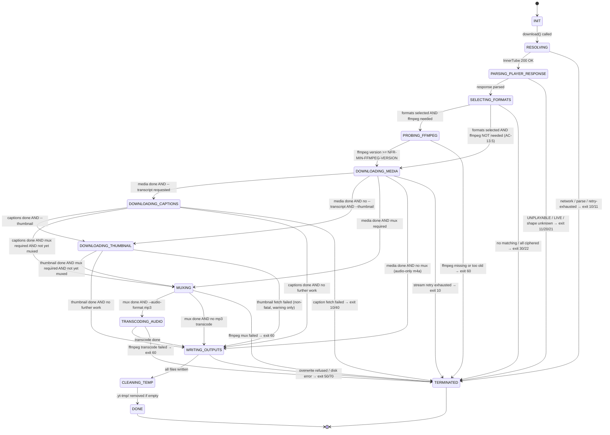

# 03 — Data Model

This document describes the **types and state** that flow through youtubeDownloader — the domain objects that live in memory during a run, the entities that cross module boundaries, and the lifecycle state machine that governs a download.

> **Scope split:** the **wire-format contracts** (exact shape of InnerTube JSON, caption XML, etc.) live in [`04-apis.md`](./04-apis.md) and formally in [`06-formal/`](./06-formal/) (Phase 3). This document describes the **internal** types the tool uses after parsing wire formats into domain objects.

---

## 1. Type overview

Eleven domain types across five groups. Every type is **immutable** (Java `record`), matching AC-9.1 / AC-11.1 discipline — library public API exposes only records and interfaces; no mutable state crosses component boundaries.



| Group | Types |
|---|---|
| 1. Request & Result (public library API) | `DownloadRequest`, `DownloadResult`, `AudioFormat` (enum), `ProgressEvent` |
| 2. Parsed InnerTube (public, read-only view) | `PlayerResponse`, `VideoDetails`, `PlayabilityStatus` (enum), `Format`, `CaptionTrack`, `ThumbnailUrl` |
| 3. Validated IDs and codes (value types) | `VideoId`, `LanguageCode` |
| 4. Caption intermediate forms | `CaptionCue`, `SrtDocument`, `PlainTextTranscript` |
| 5. Internal (not on public API) | `DownloadContext` (orchestrator working state) |

### 1.1 Full type table

| Type | Kind | Package | Public? | Purpose |
|---|---|---|---|---|
| `YoutubeDownloader` | class | `com.srk.myutils.yd.core` | ✅ public | Library entrypoint (AC-9.1). Single method `download(DownloadRequest): DownloadResult`. |
| `DownloadRequest` | record | `com.srk.myutils.yd.core` | ✅ public | Immutable input: URL, flags, output paths, optional `ProgressListener`. |
| `DownloadResult` | record | `com.srk.myutils.yd.core` | ✅ public | Immutable output: optional `Path` for each emitted file (mp4, audio, srt, txt, thumbnail) plus metadata. |
| `AudioFormat` | enum | `com.srk.myutils.yd.core` | ✅ public | `M4A`, `MP3`. |
| `ProgressListener` | interface | `com.srk.myutils.yd.core` | ✅ public | Injectable progress callback (AC-9.3). Receives `ProgressEvent`s. |
| `ProgressEvent` | record | `com.srk.myutils.yd.core` | ✅ public | Typed progress event: phase, current bytes, total bytes (or `-1` if unknown), rate, phase-specific detail. |
| `PlayerResponse` | record | `com.srk.myutils.yd.core` | ✅ public (read-only) | Parsed InnerTube response (the fields we consume). |
| `VideoDetails` | record | `com.srk.myutils.yd.core` | ✅ public | Sub-record: `videoId`, `title`, `isLive`, `isPrivate`, `audioLanguage` (optional). |
| `PlayabilityStatus` | enum | `com.srk.myutils.yd.core` | ✅ public | `OK`, `UNPLAYABLE`, `LIVE_STREAM_OFFLINE`, `LOGIN_REQUIRED`, `ERROR`, `AGE_VERIFICATION_REQUIRED`. |
| `Format` | record | `com.srk.myutils.yd.core` | ✅ public | A single `adaptiveFormats[]` entry: `itag`, `mimeType`, `bitrate`, `width`/`height`/`fps` (video), `audioSampleRate` (audio), `url`, `signatureCipher` (empty if direct). |
| `CaptionTrack` | record | `com.srk.myutils.yd.core` | ✅ public | A single caption track descriptor: `baseUrl`, `languageCode`, `kind` (`"asr"` or empty). |
| `ThumbnailUrl` | record | `com.srk.myutils.yd.core` | ✅ public | `url`, `width`, `height`. |
| `VideoId` | record | `com.srk.myutils.yd.core` | ✅ public | Validated 11-char YouTube video id. Constructed via `VideoId.of(String)`; throws `UrlParseException` on invalid input. |
| `LanguageCode` | record | `com.srk.myutils.yd.core` | ✅ public | A BCP-47 language tag. Constructed via `LanguageCode.of(String)`. Supports primary-subtag match (`en` matches `en-US`). |
| `CaptionCue` | record | `com.srk.myutils.yd.core` | ✅ public | `{ startMs: long, durationMs: long, text: String }`. Internal to caption processing. |
| `SrtDocument` | record | `com.srk.myutils.yd.core` | ✅ public | `{ cues: List<CaptionCue> }`. Has `toString()` that produces SRT wire format. |
| `PlainTextTranscript` | record | `com.srk.myutils.yd.core` | ✅ public | `{ lines: List<String> }`. Has `toString()` that produces plain-text wire format. |
| `DownloadContext` | record | `com.srk.myutils.yd.core.internal` | ❌ internal | Orchestrator scratch state (run id, temp dir, selected formats, listener). Not on public API. |

Public types are in `com.srk.myutils.yd.core`; internal scaffolding lives under `com.srk.myutils.yd.core.internal`. The package boundary is enforced by Maven module visibility in `yt-core`.

---

## 2. Type details

### 2.1 `VideoId`

A validated string wrapper for the 11-character YouTube video identifier.

```java
public record VideoId(String value) {
    public static final Pattern PATTERN = Pattern.compile("[A-Za-z0-9_-]{11}");

    public VideoId {
        if (value == null || !PATTERN.matcher(value).matches()) {
            throw new UrlParseException("Invalid video id: " + value);
        }
    }

    public static VideoId of(String raw) { return new VideoId(raw); }
}
```

**Invariants:**
- `value` matches `[A-Za-z0-9_-]{11}` (AC-1.1).
- Not null. Not empty.
- Constructed only via `of(...)` or the canonical constructor, both of which validate.

**Why it exists:** every component downstream of `UrlParser` (AC-1.1) assumes a valid id. Carrying a typed `VideoId` instead of a raw `String` prevents re-validation and accidental passing of URLs where an id is expected.

### 2.2 `LanguageCode`

```java
public record LanguageCode(String value) {
    // BCP-47-ish: <primary> or <primary>-<subtag>
    public static final Pattern PATTERN = Pattern.compile("[a-z]{2,3}(-[A-Za-z0-9]+)?");

    public LanguageCode { ... /* validate, normalize to lowercase-primary */ }

    public String primary() {
        int dash = value.indexOf('-');
        return dash < 0 ? value : value.substring(0, dash);
    }

    public boolean matches(LanguageCode other) {
        // AC-8.2 primary-subtag match: "en" matches "en-US"
        return this.value.equals(other.value) || this.primary().equals(other.primary());
    }
}
```

**Invariants:**
- Primary subtag is 2–3 lowercase ASCII letters.
- Optional region subtag preserves original case.
- `matches` is **reflexive** and **symmetric** over primary subtag — if a user passes `--lang en` and the track is `en-GB`, they match.

**Why it exists:** AC-8.1 requires a deterministic caption-language resolution chain. `LanguageCode.matches` is the single place that encodes the "primary-subtag match" rule from AC-8.2.

### 2.3 `DownloadRequest`

The input to `YoutubeDownloader.download(...)`. Immutable. Constructed via a nested builder.

```java
public record DownloadRequest(
    String url,                              // raw, pre-parse; UrlParser consumes it
    boolean video,                           // include muxed video? (default true when not audioOnly)
    boolean audioOnly,                       // audio-only mode (AC-2.1)
    AudioFormat audioFormat,                 // M4A (default) or MP3 (AC-2.3, AC-2.4)
    boolean transcript,                      // include transcript? (AC-6.*)
    boolean thumbnail,                       // include thumbnail?
    int maxHeight,                           // 0 = uncapped; default 1080 (AC-1.3)
    LanguageCode languageCode,               // null => default chain (AC-8.1); non-null => --lang override
    boolean noAsr,                           // AC-7.4 — refuse ASR fallback
    Path outputDir,                          // null => current working dir (AC-3.1)
    String outputName,                       // null => derive from title (AC-3.3); non-null => --output override (AC-3.5)
    boolean force,                           // overwrite existing outputs (AC-3.6)
    ProgressListener progressListener        // null => no-op listener
) {
    public static Builder builder() { return new Builder(); }
    // Builder omitted here — fluent setters with sensible defaults
}
```

**Invariants:**
- If `audioOnly == true`, then `video == false` (enforced by the builder; `.audioOnly(true)` flips `video` to `false`).
- If `audioFormat == MP3` and `audioOnly == false`, the builder logs a warning per AC-2.5 and proceeds — `audioFormat` only matters in the audio emission step.
- `maxHeight >= 0`. `0` is the sentinel for "no cap" (AC-1.3).
- Exactly one of `video`, `audioOnly`, `transcript`, `thumbnail` must be true (at least one). An empty request is rejected at the entrypoint with `IllegalArgumentException` (not our exception hierarchy — it's a programmer error, not a user error).

**Why it exists:** US-9 requires a stable, typed input. A single record with a builder is idiomatic, discoverable via IDE autocomplete, and avoids the common "45 overloads of `download()`" anti-pattern.

### 2.4 `DownloadResult`

The output. `Optional<Path>` fields for each possible emission.

```java
public record DownloadResult(
    VideoId videoId,                         // always populated
    String title,                            // from InnerTube; may differ from output filename after sanitization
    Optional<Path> videoPath,                // .mp4
    Optional<Path> audioPath,                // .m4a or .mp3
    Optional<Path> srtPath,                  // .srt
    Optional<Path> txtPath,                  // .txt
    Optional<Path> thumbnailPath,            // .jpg
    boolean usedAsrFallback                  // AC-7.3 — true if ASR was substituted for manual
) { }
```

**Invariants:**
- `videoId` and `title` are always populated on successful return. (On failure, the caller sees an exception, not a `DownloadResult` with nothing in it.)
- `videoPath.isPresent()` → request had `video == true` AND mux succeeded.
- `audioPath.isPresent()` → request had `audioOnly == true` AND audio download (and optional transcode) succeeded.
- `(srtPath.isPresent(), txtPath.isPresent())` are either both present or both absent — they are written in the same step (AC-6.2).
- `usedAsrFallback == true` → the selected caption track was `kind = "asr"` after exhausting manual options (AC-7.3). Never `true` when `noAsr == true` in the request (that combo would have failed with `CaptionUnavailableException`).

### 2.5 `AudioFormat`

```java
public enum AudioFormat {
    M4A,   // default (AC-2.3); direct stream copy
    MP3    // requires ffmpeg transcode (AC-2.4)
}
```

### 2.6 `ProgressListener` and `ProgressEvent`

```java
public interface ProgressListener {
    void onProgress(ProgressEvent event);
}

public record ProgressEvent(
    Phase phase,
    long bytesDownloaded,          // -1 when not applicable (e.g., during mux)
    long totalBytes,               // -1 when unknown
    long bytesPerSecond,            // -1 when not applicable
    Duration elapsed,
    Optional<Duration> etaRemaining
) {
    public enum Phase {
        RESOLVING,          // parsing URL, fetching /player
        DOWNLOADING_VIDEO,
        DOWNLOADING_AUDIO,
        DOWNLOADING_CAPTIONS,
        DOWNLOADING_THUMBNAIL,
        MUXING,             // ffmpeg running
        TRANSCODING,        // ffmpeg mp3 transcode
        WRITING_OUTPUTS,
        DONE
    }
}
```

**Invariants:**
- The listener is called at most once per `NFR-PROGRESS-INTERVAL` (non-TTY) or `NFR-PROGRESS-TTY-REFRESH` (TTY) — the throttling is done by `ProgressReporter` before the event reaches the listener.
- `bytesDownloaded == -1` whenever the current phase does not have a meaningful byte count (`RESOLVING`, `MUXING`, `TRANSCODING`, `WRITING_OUTPUTS`, `DONE`). The CLI's listener interprets `-1` as "spinner mode".
- `totalBytes == -1` whenever the server did not return `Content-Length` (rare for streams; possible for captions).

### 2.7 `PlayerResponse` and its sub-records

Read-only view of the parsed InnerTube `/player` response. Only the fields the tool consumes are modelled — everything else is ignored by `@JsonIgnoreProperties(ignoreUnknown = true)` per ADR 0004.

```java
public record PlayerResponse(
    VideoDetails videoDetails,
    PlayabilityStatus playabilityStatus,
    List<Format> adaptiveFormats,              // from streamingData.adaptiveFormats
    List<CaptionTrack> captionTracks,          // from captions.playerCaptionsTracklistRenderer.captionTracks
    List<ThumbnailUrl> thumbnails              // from videoDetails.thumbnail.thumbnails
) { }

public record VideoDetails(
    VideoId videoId,
    String title,
    boolean isLive,
    boolean isPrivate,
    Optional<LanguageCode> audioLanguage       // often absent; AC-8.1 step 3 falls back when absent
) { }

public enum PlayabilityStatus {
    OK,
    UNPLAYABLE,
    LIVE_STREAM_OFFLINE,
    LOGIN_REQUIRED,
    ERROR,
    AGE_VERIFICATION_REQUIRED,
    UNKNOWN     // sentinel — InnerTube returned a status our parser doesn't recognize; mapped to exit 11 not 20
}

public record Format(
    int itag,
    String mimeType,            // e.g. "video/mp4; codecs=\"avc1.640028\""
    long bitrate,
    OptionalInt width,
    OptionalInt height,
    OptionalInt fps,
    OptionalInt audioSampleRate,
    Optional<Long> contentLength,
    String url,                  // direct CDN URL (empty string iff signatureCipher is non-empty)
    String signatureCipher       // empty when direct; non-empty → ADR 0001 fail-fast path
) {
    public boolean isVideo()   { return mimeType.startsWith("video/"); }
    public boolean isAudio()   { return mimeType.startsWith("audio/"); }
    public boolean hasCipher() { return !signatureCipher.isEmpty(); }
}

public record CaptionTrack(
    String baseUrl,
    LanguageCode languageCode,
    String kind                  // "asr" or empty; AC-7.1
) {
    public boolean isAsr() { return "asr".equals(kind); }
}

public record ThumbnailUrl(String url, int width, int height) { }
```

**Invariants on `Format`:**
- `mimeType` is non-null and contains exactly one `;` (separating container from codec hints).
- `url.isEmpty() == hasCipher()` — a format either has a direct URL or a `signatureCipher`, never both and never neither.
- `isVideo() XOR isAudio()` — one and only one of the two is true (YouTube's adaptive formats separate the streams).

### 2.8 Caption intermediate forms

```java
public record CaptionCue(long startMs, long durationMs, String text) {
    public long endMs() { return startMs + durationMs; }
}

public record SrtDocument(List<CaptionCue> cues) {
    @Override public String toString() { /* emit SRT */ }
}

public record PlainTextTranscript(List<String> lines) {
    @Override public String toString() { /* join with \n */ }
}
```

**Invariants:**
- `cues` in an `SrtDocument` are sorted ascending by `startMs`.
- `PlainTextTranscript.lines` are in the same order as the underlying cues; adjacent duplicates (sometimes emitted by YouTube ASR as rolling captions overlap) are collapsed (single implementation choice — collapse if the next cue's text starts with the previous cue's text).
- HTML entities decoded (AC-6.3) before either representation is produced.

### 2.9 `DownloadContext` (internal)

Not on the public API. Orchestrator scratch state for one run.

```java
record DownloadContext(
    String runId,                // UUID; for log correlation
    Path tempDir,                // <output-dir>/.yt-tmp/
    PlayerResponse playerResponse,
    Optional<Format> selectedVideo,
    Optional<Format> selectedAudio,
    Optional<CaptionTrack> selectedCaption,
    Optional<ThumbnailUrl> selectedThumbnail,
    ProgressListener listener,
    Clock clock                  // injectable for test determinism
) { }
```

This is the one type that would be mutable if we were being pragmatic, but we keep it immutable — the orchestrator builds a new `DownloadContext` with `.with...` copy-methods as it progresses through the pipeline. Cost is negligible (one object allocation per phase transition), benefit is that a phase's input is always exactly what it declares.

---

## 3. Lifecycle state machine

A download progresses through a deterministic sequence of states. `DownloadOrchestrator` drives the transitions; `ProgressReporter` emits `ProgressEvent.Phase` values aligned with the state names.



### 3.1 Invariants that hold in every state

1. **At most one `DownloadContext` per run.** No shared mutable state between runs or with a second `download()` call.
2. **`.yt-tmp/` is created before `DOWNLOADING_MEDIA` is entered** and is never referenced from outside `DownloadContext.tempDir`.
3. **`ProgressListener` is invoked on every state change**, not only within downloads. The listener sees phase transitions even for short phases like `SELECTING_FORMATS`.
4. **`TERMINATED` never transitions back into a working state.** Once entered, the run is over.
5. **`CLEANING_TEMP` runs only from `WRITING_OUTPUTS → DONE`** and never from failure paths. On failure, `.yt-tmp/` is retained per the shutdown model in `02-architecture.md` § 5.
6. **The exit code is determined at `TERMINATED` entry** by `ErrorMapper` inspecting the exception that caused the transition. No component else determines the exit code.

### 3.2 SIGINT/SIGTERM handling

At any state that is **not** `TERMINATED` or `DONE`, a JVM shutdown signal:
- Sets a cancellation flag in `DownloadContext`.
- Interrupts the current blocking operation (HTTP read, ffmpeg wait-for).
- Transitions to `TERMINATED` via the `ErrorMapper` with a `ShutdownException` (exit code `130` for SIGINT, `143` for SIGTERM, both outside the AC-5.2 category set because they are signals, not failures).
- `.yt-tmp/` is **retained** (same as a failure path — users can inspect what was downloaded).

### 3.3 State ↔ `ProgressEvent.Phase` alignment

The state machine's state names and `ProgressEvent.Phase` enum values are deliberately aligned so the listener sees exactly what the orchestrator is doing:

| State | `ProgressEvent.Phase` |
|---|---|
| `INIT` | — (not emitted) |
| `RESOLVING` | `RESOLVING` |
| `PARSING_PLAYER_RESPONSE` | `RESOLVING` (merged; no user-visible distinction) |
| `SELECTING_FORMATS` | `RESOLVING` (merged) |
| `PROBING_FFMPEG` | `RESOLVING` (merged) |
| `DOWNLOADING_MEDIA` (video) | `DOWNLOADING_VIDEO` |
| `DOWNLOADING_MEDIA` (audio) | `DOWNLOADING_AUDIO` |
| `DOWNLOADING_CAPTIONS` | `DOWNLOADING_CAPTIONS` |
| `DOWNLOADING_THUMBNAIL` | `DOWNLOADING_THUMBNAIL` |
| `MUXING` | `MUXING` |
| `TRANSCODING_AUDIO` | `TRANSCODING` |
| `WRITING_OUTPUTS` | `WRITING_OUTPUTS` |
| `CLEANING_TEMP` | — (not emitted — too fast to matter) |
| `DONE` | `DONE` |
| `TERMINATED` | — (no event; an exception propagates instead) |

Internal orchestrator states (`PARSING_PLAYER_RESPONSE`, `SELECTING_FORMATS`, `PROBING_FFMPEG`, `CLEANING_TEMP`) are merged into the public `RESOLVING` phase for progress reporting because they are too fast for users to see a meaningful delta.

---

## 4. Object graph at peak

At the moment of the `MUXING` state, the live object graph (roughly):

```
DownloadContext
├── runId: String
├── tempDir: Path
├── playerResponse: PlayerResponse
│   ├── videoDetails: VideoDetails
│   ├── playabilityStatus: PlayabilityStatus.OK
│   ├── adaptiveFormats: List<Format> [ ~30 entries ]
│   ├── captionTracks: List<CaptionTrack> [ ~2-10 entries ]
│   └── thumbnails: List<ThumbnailUrl> [ ~6 entries ]
├── selectedVideo: Optional<Format> (one of the 30)
├── selectedAudio: Optional<Format> (one of the 30)
├── selectedCaption: Optional<CaptionTrack>
├── selectedThumbnail: Optional<ThumbnailUrl>
├── listener: ProgressListener (injected)
└── clock: Clock (Clock.systemUTC() or a test clock)
```

Peak heap footprint for domain objects: well under 1 MB. The bulk of the process's RAM during `MUXING` is the two `.part` files on disk (not in memory), ffmpeg's buffers (out-of-process), and OkHttp's idle connection pool (~1 MB). Total process RSS during a 1080p run is expected to stay under 200 MB — well within the "no heap cap" default per `NFR-MAX-MEMORY`.

---

## 5. Wire-format translation boundary

For clarity, these are the points where **wire** (Jackson, XML, HTTP bytes) becomes **domain** (the types in this doc) and vice-versa.

| Wire representation | Domain representation | Translator component |
|---|---|---|
| Raw URL string | `VideoId` | `UrlParser` |
| InnerTube JSON response body | `PlayerResponse` | `PlayerResponseExtractor` (Jackson per ADR 0004) |
| YouTube timedtext XML | `List<CaptionCue>` | `CaptionConverter` |
| `List<CaptionCue>` | `SrtDocument` | `CaptionConverter` |
| `List<CaptionCue>` | `PlainTextTranscript` | `CaptionConverter` |
| CLI args (picocli) | `DownloadRequest` | CLI-module `Cli` class (not `yt-core`) |
| `SrtDocument` | `.srt` file bytes | `OutputWriter.toString()` + file write |
| `PlainTextTranscript` | `.txt` file bytes | `OutputWriter.toString()` + file write |

All translations are one-way (except `DownloadRequest` construction from picocli, which is a one-shot build). No round-trip serialisation in MVP.

---

## 6. What this document pins vs what comes next

- **Exact JSON shape of InnerTube `/player` request and response** → `04-apis.md` (prose) + `06-formal/innertube-player-request.schema.json` and `innertube-player-response.schema.json` (Phase 3, machine-checkable).
- **Exact timedtext XML shape** → `04-apis.md` + `06-formal/caption-track.schema.json` (Phase 3).
- **Exact ffmpeg command-line syntax** → `04-apis.md`.
- **Exact CLI flag names and help text** → `04-apis.md`.
- **Exact exit-code contract** (category → code → message) → `04-apis.md` + `06-formal/cli-exit-codes.md` (Phase 3).
- **Contract tests** that verify the wire-to-domain translation is correct → `06-formal/contract-tests.md` (Phase 3).
- **Implementation-detail decisions** (e.g., should `DownloadRequest.Builder` be a nested class or a separate class?) → Phase 4 task breakdown and Phase 5 code.
