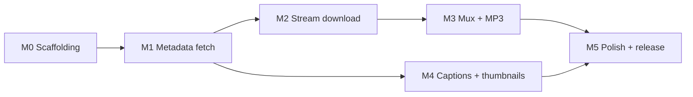

# 07 — Tasks

This document is the **ordered implementation plan** for Phase 5 code. It decomposes the approved design (`01`–`05`, ADRs 0001–0004, formal contracts in `06-formal/`) into milestones and tasks. Each task is the smallest unit a developer picks up, implements, tests, and commits.

> **How to use this doc in Phase 5.** Open the current milestone's task table. Pick the next task whose dependencies are green. Implement it, write/update the tests listed in the test-writing table for that milestone, run `mvn verify`, commit. Move to the next task.

---

## 1. Milestones

| # | Milestone | Goal | Ends when | Est. size |
|---|---|---|---|---|
| M0 | **Scaffolding** | Maven multi-module project builds an empty fat jar | `mvn package` produces a runnable jar that prints a help stub and exits `0` | S |
| M1 | **Metadata fetch** | URL parse + InnerTube call + `PlayerResponse` extraction, no download | CLI invoked on a public URL prints a JSON dump of `PlayerResponse` to stderr (`--debug`) and exits `0`; offline unit tests for all Phase 3 positive + negative fixtures pass | L |
| M2 | **Stream download** | Download one media stream end-to-end to `.yt-tmp/` (no mux) | `--audio-only` on a real URL downloads `.m4a` to `<output-dir>`; progress reporting works | M |
| M3 | **Mux + MP3 transcode** | ffmpeg integration for muxed MP4 and MP3 audio | `--video` produces playable MP4; `--audio-only --audio-format mp3` produces MP3 | M |
| M4 | **Captions + thumbnails** | Transcript flow and thumbnail flow | `--transcript` produces `.srt` + `.txt`; `--thumbnail` produces `.jpg`; manual→ASR fallback works | M |
| M5 | **Polish + release** | Failure paths, exit codes, logging levels, help text, README, release artifacts | All 78 contract tests pass; `mvn verify -P integration` passes for the canonical 4-URL suite; fat-jar ≤ 10 MB; v1.0.0 tag ready | M |

Total size: ~5 person-weeks for a single developer working part-time. Milestones are sequential — M1 cannot start until M0's verification gate is green, etc.

### 1.1 Milestone dependency diagram

M4 can start in parallel with M2 once M1 is green — captions and thumbnails do not depend on the media stream download. M5 requires both branches complete.

---

## 2. Task breakdown

Each task has a stable ID `T-<milestone>.<n>`. Columns:
- **Component** — which component from `02-architecture.md` § 1.2 owns it
- **AC / INV** — acceptance criteria or state-machine invariants this task fulfills
- **Size** — rough effort: S (≤2h), M (half day), L (1–2 days)
- **Deps** — task IDs that must be done first (within the milestone; cross-milestone deps are implicit from the milestone gate)

### 2.1 M0 — Scaffolding

| ID | Task | Component | AC / INV | Size | Deps |
|---|---|---|---|---|---|
| T-0.1 | Create parent `pom.xml` as Maven aggregator (modules: `yt-core`, `yt-cli`) | — | `NFR-BUILD-TOOL` | S | — |
| T-0.2 | Create `yt-core/pom.xml` with Java 17 compiler + dependencies (OkHttp, Jackson, SLF4J API) per ADRs 0002 + 0004 | — | `NFR-JAVA-VERSION`, ADR-0002, ADR-0004 | S | T-0.1 |
| T-0.3 | Create `yt-cli/pom.xml` depending on `yt-core`; add picocli, slf4j-simple | — | — | S | T-0.1 |
| T-0.4 | Configure `maven-shade-plugin` in `yt-cli` with `Cli` main class | — | — | S | T-0.3 |
| T-0.5 | Empty `Cli` class with `@Command` + `--version` + `--help` only; exits `0` | `Cli` (CLI module) | — | S | T-0.3 |
| T-0.6 | Configure JaCoCo plugin in `yt-core` with 80% line-coverage gate | — | `NFR-UNIT-TEST-COVERAGE-MINIMUM` | S | T-0.2 |
| T-0.7 | Configure Maven Surefire + Failsafe for `integration` profile | — | AC-11.3 | S | T-0.2 |
| T-0.8 | Add Enforcer rule forbidding network I/O in unit tests (`mvn test`) | — | AC-11.3, AC-11.4 | M | T-0.7 |
| T-0.9 | README quickstart: `mvn package` → `java -jar ... --help` | — | — | S | T-0.4, T-0.5 |

**M0 verification gate:**
- [ ] `mvn clean verify` succeeds
- [ ] `java -jar yt-cli/target/youtube-downloader-1.0.0.jar --version` prints `youtube-downloader 1.0.0`
- [ ] `java -jar ... --help` prints help, exits `0`
- [ ] No unit tests (nothing to cover yet, but the gate mechanism is wired)
- [ ] Fat jar under 5 MB (just dependencies, no logic)

### 2.2 M1 — Metadata fetch

| ID | Task | Component | AC / INV | Size | Deps |
|---|---|---|---|---|---|
| T-1.1 | `VideoId` record with validated constructor + `of(String)` factory | `VideoId` domain | AC-1.1, INV-5 | S | M0 |
| T-1.2 | `LanguageCode` record with `matches(other)` primary-subtag match | `LanguageCode` domain | AC-8.2 | S | M0 |
| T-1.3 | `UrlParser` component — accept 4 URL shapes, reject others with `UrlParseException` | `UrlParser` | AC-1.1 | M | T-1.1 |
| T-1.4 | Domain records for `PlayerResponse`, `VideoDetails`, `Format`, `CaptionTrack`, `ThumbnailUrl`, `PlayabilityStatus` enum | domain (§ 2.7 of 03-data-model) | AC-9.1, INV-5 | M | M0 |
| T-1.5 | `InnerTubeClient` component — single POST via OkHttp; construct ANDROID context per `06-formal/innertube-player-request.schema.json`; retries per AC-12.4 | `InnerTubeClient` | AC-12.1, AC-12.2, AC-12.3, AC-12.4, INV-9 | L | T-0.2, T-1.1 |
| T-1.6 | OkHttp retry interceptor (3 retries, 500ms exp backoff, retryable-error whitelist) | `InnerTubeClient` | AC-12.4, `NFR-INNERTUBE-MAX-RETRIES`, `NFR-INNERTUBE-BACKOFF-BASE` | M | T-1.5 |
| T-1.7 | `PlayerResponseExtractor` — Jackson-based parser with `@JsonIgnoreProperties(ignoreUnknown=true)` | `PlayerResponseExtractor` | ADR-0004, AC-11.1 | M | T-1.4 |
| T-1.8 | Post-parse playability check — emit `VideoUnavailableException`/`LiveStreamException` per AC-5.2 categories 20/21 | `PlayerResponseExtractor` | AC-1.7, AC-5.2 | S | T-1.7 |
| T-1.9 | Full exception hierarchy (11 subclasses) rooted at `YoutubeDownloaderException` with `exitCode()` method | exceptions | AC-9.4, `cli-exit-codes.md` § 3 | M | M0 |
| T-1.10 | `ErrorMapper` component — translate exceptions → exit codes | `ErrorMapper` | AC-5.1, AC-5.2, INV-11 | S | T-1.9 |
| T-1.11 | `Cli` class flag parsing for `<URL>`, `--debug`, `--quiet` (only the flags M1 needs) | `Cli` (CLI) | AC-5.1, AC-5.4, AC-5.5 | M | T-0.5, T-1.3 |
| T-1.12 | `Cli` calls `YoutubeDownloader.download(...)`, catches `YoutubeDownloaderException`, prints one-line error to stderr, exits with `exitCode()` | `Cli` (CLI) | AC-5.1..AC-5.5 | S | T-1.11, T-1.10 |
| T-1.13 | SLF4J logging at component boundaries — INFO on each external call, WARN on notables, ERROR on failures | all M1 components | AC-10.1..AC-10.5 | M | T-1.5, T-1.7 |
| T-1.14 | `YoutubeDownloader.download(...)` top-level orchestration for M1 scope — parse URL, fetch player, extract, return a stub `DownloadResult` with no download | `DownloadOrchestrator` | AC-9.1, AC-9.2 | M | T-1.3, T-1.5, T-1.7 |

**M1 verification gate:**
- [ ] `java -jar ... <URL>` on a public non-live URL prints INFO logs showing InnerTube response, exits `0`
- [ ] `java -jar ... "not-a-url"` exits `2` with `Error: args: ...`
- [ ] `java -jar ... "https://www.youtube.com/watch?v=xxxxxxxxxxx"` where the id is malformed exits `2`
- [ ] All M1 unit tests green (counts below under § 3)
- [ ] Coverage ≥ 80% on `yt-core` per JaCoCo gate
- [ ] No network call during `mvn test` (enforcer)

### 2.3 M2 — Stream download

| ID | Task | Component | AC / INV | Size | Deps |
|---|---|---|---|---|---|
| T-2.1 | `FormatSelector` — apply `--max-height` + codec preference `H.264 > VP9 > AV1`; pick audio by bitrate (m4a > webm) | `FormatSelector` | AC-1.3, AC-1.4, AC-1.5, AC-2.2 | M | M1 |
| T-2.2 | `FormatSelector` cipher check — throw `CipherRequiredException` if all candidates have `signatureCipher` | `FormatSelector` | AC-5.3 | S | T-2.1 |
| T-2.3 | `StreamDownloader` — HTTP GET with `Range` support; write to `.part`; emit byte-progress events | `StreamDownloader` | AC-1.6, AC-4.1, INV-7 | L | M1 |
| T-2.4 | Stream retry logic — 2 attempts, byte-0 restart, retryable-error whitelist | `StreamDownloader` | AC-12.4, `NFR-STREAM-MAX-RETRIES`, INV-15 | M | T-2.3 |
| T-2.5 | `ProgressReporter` — scheduled executor, throttle non-TTY to 1000ms, TTY to 100ms, TTY-detection via `isatty(stderr)` | `ProgressReporter` | AC-4.1, AC-4.2, AC-4.3, `NFR-PROGRESS-INTERVAL`, `NFR-PROGRESS-TTY-REFRESH` | L | M1 |
| T-2.6 | `ProgressListener` interface + stderr-writing implementation in CLI | `ProgressListener` / CLI | AC-4.1, AC-9.3 | M | T-2.5 |
| T-2.7 | `--quiet` flag suppresses progress (listener no-ops) | `Cli` (CLI) | AC-4.4 | S | T-2.6 |
| T-2.8 | `OutputWriter` — filename derivation (AC-3.3 sanitization + AC-3.4 truncation); `--output-dir`, `--output`, `--force`; free-disk probe | `OutputWriter` | AC-3.1..AC-3.6, `NFR-MAX-FILENAME-LENGTH`, `NFR-MIN-DISK-FREE`, INV-14 | L | M1 |
| T-2.9 | `DownloadContext` internal record + `.yt-tmp/` creation / cleanup-on-success / retain-on-failure | `DownloadOrchestrator` | `NFR-TEMP-DIR-STRATEGY`, INV-6 | M | T-2.8 |
| T-2.10 | `--audio-only` flag path in orchestrator — select audio format, download, write `.m4a`, return `DownloadResult` | `DownloadOrchestrator` | AC-2.1, AC-2.3 | M | T-2.1, T-2.3, T-2.8, T-2.9 |
| T-2.11 | `--max-height` flag handling including `0` = uncapped | `Cli` (CLI) | AC-1.3 | S | T-2.1 |

**M2 verification gate:**
- [ ] `java -jar ... --audio-only <URL>` on a real URL downloads `.m4a` to CWD
- [ ] Progress line visible in terminal; TTY-aware refresh works
- [ ] `--quiet` suppresses progress; errors still shown
- [ ] `--output-dir` + `--output` + `--force` all work; exit `50` on pre-existing file without `--force`
- [ ] Free-disk probe triggers exit `70` on filled disk (test with fixtures)
- [ ] All M2 unit tests green; coverage ≥ 80%

### 2.4 M3 — Mux + MP3 transcode

| ID | Task | Component | AC / INV | Size | Deps |
|---|---|---|---|---|---|
| T-3.1 | `FfmpegMuxer.probeVersion()` — invoke `ffmpeg -version`, parse regex, compare to `NFR-MIN-FFMPEG-VERSION` | `FfmpegMuxer` | AC-13.1, AC-13.2, AC-13.3 | M | M2 |
| T-3.2 | `FfmpegMuxer.mux(...)` — `ProcessBuilder` invocation per ADR 0003 with exact command line from `04-apis.md` § 2.1.2 | `FfmpegMuxer` | AC-1.6, INV-8 | M | T-3.1 |
| T-3.3 | `FfmpegMuxer.transcodeMp3(...)` — MP3 transcode at `NFR-DEFAULT-MP3-BITRATE` per `04-apis.md` § 2.1.3 | `FfmpegMuxer` | AC-2.4 | M | T-3.1 |
| T-3.4 | ffmpeg stderr ring-buffer capture — last `NFR-FFMPEG-STDERR-LINES` lines surfaced in `FfmpegException` message | `FfmpegMuxer` | AC-13.4, `NFR-FFMPEG-STDERR-LINES` | M | T-3.2 |
| T-3.5 | `FfmpegMuxer` shutdown hook cooperation — SIGTERM child on JVM signal; 5s grace; SIGKILL | `FfmpegMuxer` | `02-architecture.md` § 5, INV-8 | M | T-3.2 |
| T-3.6 | `FfmpegMuxer` per-invocation timeout — kill if exceeded `NFR-FFMPEG-INVOCATION-TIMEOUT = 600s` | `FfmpegMuxer` | `NFR-FFMPEG-INVOCATION-TIMEOUT` | S | T-3.5 |
| T-3.7 | `--ffmpeg-location <path>` override | `FfmpegMuxer` / `Cli` | AC-13.2 (escape hatch) | S | T-3.1 |
| T-3.8 | Flow A integration in orchestrator — video + audio download + mux → `.mp4` | `DownloadOrchestrator` | AC-1.6, state-machine flow A | M | T-3.2, T-2.1, T-2.3 |
| T-3.9 | `--audio-format mp3` flag + orchestrator branch — audio download + transcode → `.mp3` | `DownloadOrchestrator` / `Cli` | AC-2.4, state-machine flow B' | M | T-3.3 |
| T-3.10 | Skip-ffmpeg-check optimisation for transcript-only and audio-only-m4a paths | `DownloadOrchestrator` | AC-13.5, INV-10 | S | T-3.1 |

**M3 verification gate:**
- [ ] `java -jar ... <URL>` produces playable `.mp4` on a real video
- [ ] `--audio-format mp3` produces `.mp3` at 192 kbps (verify with `ffprobe`)
- [ ] Missing ffmpeg produces exit `60` with the documented error
- [ ] Old ffmpeg (mocked) produces exit `60` naming detected vs required version
- [ ] Ctrl-C during mux terminates ffmpeg child cleanly
- [ ] Transcript-only path does NOT call `ffmpeg -version`
- [ ] All M3 tests green; coverage ≥ 80%

### 2.5 M4 — Captions + thumbnails

| ID | Task | Component | AC / INV | Size | Deps |
|---|---|---|---|---|---|
| T-4.1 | `FormatSelector.selectCaption(...)` — AC-8.1 preference chain + AC-7.1..AC-7.4 manual/ASR rules | `FormatSelector` | AC-6.4, AC-7.*, AC-8.1, AC-8.3, INV-16 | M | M1 |
| T-4.2 | `CaptionDownloader` — HTTP GET timedtext URL; 10s total timeout | `CaptionDownloader` | AC-6.1, `NFR-CAPTION-DOWNLOAD-TIMEOUT` | M | M1 |
| T-4.3 | `CaptionConverter.parseXml(...)` — parse timedtext XML → `List<CaptionCue>`; HTML entity decode | `CaptionConverter` | AC-6.1, AC-6.3, AC-11.1 | M | T-4.2 |
| T-4.4 | `CaptionConverter.toSrt(...)` — SRT formatting with cue numbers + `HH:MM:SS,mmm` timestamps | `CaptionConverter` | AC-6.2 | M | T-4.3 |
| T-4.5 | `CaptionConverter.toTxt(...)` — plain-text with duplicate-prefix collapsing per § 2.8 invariant | `CaptionConverter` | AC-6.2 | S | T-4.3 |
| T-4.6 | `--transcript`, `--lang`, `--no-asr` flags | `Cli` (CLI) | AC-6.1, AC-7.4, AC-8.2 | S | T-4.1 |
| T-4.7 | `DownloadResult.usedAsrFallback` flag wiring per INV-16 | `DownloadOrchestrator` | AC-7.3, INV-16 | S | T-4.1 |
| T-4.8 | `ThumbnailDownloader` — pick max `width × height` thumbnail; GET bytes; write `.jpg` | `ThumbnailDownloader` | — (general AC-9.1) | S | M1 |
| T-4.9 | `--thumbnail` flag | `Cli` (CLI) | — | S | T-4.8 |
| T-4.10 | Orchestrator integration — caption + thumbnail flows added to Flow A, B, C | `DownloadOrchestrator` | state-machine § 5 flow paths | M | T-4.1..T-4.9 |
| T-4.11 | Transcript-only Flow C | `DownloadOrchestrator` | state-machine Flow C | S | T-4.10 |

**M4 verification gate:**
- [ ] `--transcript` on a video with English manual captions produces `.srt` and `.txt`
- [ ] `--transcript` on a video with only ASR English produces SRT+TXT with `WARN` log about ASR fallback
- [ ] `--transcript --no-asr` on ASR-only video exits `40`
- [ ] `--lang fr` with unavailable French exits `40` with "Available: en, es, ..."
- [ ] `--thumbnail` produces `.jpg`; thumbnail fetch failure is WARN only
- [ ] `--transcript` without media outputs completes without ffmpeg
- [ ] All M4 tests green; coverage ≥ 80%

### 2.6 M5 — Polish + release

| ID | Task | Component | AC / INV | Size | Deps |
|---|---|---|---|---|---|
| T-5.1 | Complete all remaining CLI flags (`--write-comments` etc. not in MVP — verify no scope creep) | `Cli` | `04-apis.md` § 3.1.2 | S | M2, M3, M4 |
| T-5.2 | Exit-code correctness sweep — ensure every failure path maps to the documented code per `cli-exit-codes.md` | `ErrorMapper` | `cli-exit-codes.md` § 4 | M | all prior |
| T-5.3 | `--debug` flag — SLF4J to DEBUG; ffmpeg `-loglevel info`; stack-trace on failure | `Cli` / all | AC-5.5, AC-10.5 | S | all prior |
| T-5.4 | Integration-test suite for `-P integration` profile — 4 canonical URLs | test infra | AC-11 integration path | M | all prior |
| T-5.5 | Replace synthesized fixtures with real captures; update `x-captured-on` dates | fixtures | `contract-tests.md` § 7 TODO(capture) | M | M1 |
| T-5.6 | Project README with install + quickstart + troubleshooting | docs | `05-operations.md` | M | all prior |
| T-5.7 | CI workflow (GitHub Actions) running `mvn verify` on push | CI | — | M | T-5.4 |
| T-5.8 | v1.0.0 tag, GitHub Release with fat-jar artifact attached | release | `05-operations.md` § 6.2 Future Work carve-out | S | T-5.6, T-5.7 |
| T-5.9 | Fat-jar size check — confirm ≤ 10 MB target | — | `05-operations.md` § 6.1 | S | all prior |
| T-5.10 | Smoke-test matrix across macOS 13+, Linux x86_64, Linux aarch64 | test | `NFR-SUPPORTED-OS` | M | T-5.7 |

**M5 verification gate (the overall project completion gate):**
- [ ] All 78 contract tests pass
- [ ] `mvn verify -P integration` passes against the 4 canonical URLs
- [ ] Fat jar ≤ 10 MB
- [ ] Project README publishable
- [ ] v1.0.0 tagged
- [ ] CI green on every push for at least one week
- [ ] Smoke test passes on macOS + Linux x86_64 + Linux aarch64

---

## 3. Test-writing tasks per milestone

Test-writing is not a separate milestone — it is woven into each implementation milestone. Every implementation task has accompanying test tasks; the gate is "coverage ≥ 80% AND all listed contract tests pass".

### 3.1 Counts and coverage

| Milestone | Contract tests in this range | Unit tests target | App-level assertions target |
|---|---|---|---|
| M0 | — (no logic) | — | — |
| M1 | `CT-REQ-*` (9), `CT-RESP-*` (14), `CT-APP-1..7` (7), `CT-EXIT-UNIT-*` (11) | ~25 | 18 |
| M2 | `CT-APP-3..5` (stream + format selection) (3 carryover + 2 new stream-download tests) | ~10 | 5 |
| M3 | `CT-EXIT-60*` integration (2) + ffmpeg stderr-capture unit tests | ~8 | — (integration) |
| M4 | `CT-CAP-*` (6), `CT-CAP-APP-*` (4), `CT-APP-8..10` (3) | ~10 | 7 |
| M5 | All remaining state-machine invariants (INV-1..INV-16) | ~16 property tests | 16 |
| **Total** | 78 | ~69 unit + 16 property | 46 |

### 3.2 Test conventions pinned here

- **Unit tests** — JUnit 5, `@Test` methods under `yt-core/src/test/java/...`, mirror the package structure of the code under test. No network, no filesystem side effects outside `@TempDir`.
- **Integration tests** — JUnit 5 tests marked with `@Tag("integration")`, run under `mvn verify -P integration` only.
- **Fixtures** — loaded via `getClass().getResourceAsStream("/fixtures/...")` from test resources; copies of `design/06-formal/fixtures/*.json` are moved into `yt-core/src/test/resources/fixtures/` as part of T-5.5.
- **Property tests for state-machine invariants** — use jqwik (to be added as a test dependency in T-0.2) or hand-rolled random-walk harness.

---

## 4. Verification gates between milestones

Each gate is a pre-commit checklist for moving from one milestone to the next. Failure to meet a gate blocks starting the next milestone.

| Gate | From | To | Blocking criteria |
|---|---|---|---|
| G0 | M0 | M1 | Fat jar builds; `--version` and `--help` work; enforcer gate active |
| G1 | M1 | M2 | Real URL → parsed `PlayerResponse` logged at INFO; 4 failure paths produce correct exit codes; offline unit tests green; coverage ≥ 80% |
| G2 | M2 | M3 | `--audio-only` produces `.m4a` on real URL; progress reporting TTY-aware; filename rules and overwrite refusal both work |
| G3 | M3 | M4 | Muxed MP4 playable in VLC/QuickTime; MP3 192 kbps confirmed via ffprobe; missing/old ffmpeg paths work |
| G3' | M1 | M4 | (parallel branch) — no additional criteria beyond G1 |
| G4 | M3 + M4 | M5 | All capability paths (video / audio / transcript / thumbnail / combos) work end-to-end; coverage ≥ 80% across both branches |
| G5 | M5 | v1.0.0 | All 78 contract tests; integration suite; size; README; CI; tag |

---

## 5. Risk register

Tasks most likely to slip or require re-planning. Listed so Phase 5 developers see them coming.

| # | Risk | Likelihood | Impact | Mitigation |
|---|---|---|---|---|
| R-1 | **ANDROID client version is deprecated** by YouTube before M1 completes. Unit tests pass (fixture-based) but integration fails with HTTP 403. | Medium | High — blocks real-URL testing for M1, M2, M3 | Capture a fresh `clientVersion` from a live Android YouTube app request; update `NFR-ANDROID-CLIENT-VERSION` in an NFR review round; re-record fixtures. OQ-A's monitoring signal. |
| R-2 | **Signature cipher becomes mandatory for the ANDROID client.** All responses arrive with `signatureCipher`. AC-5.3 fires on every URL. | Low–Medium | Critical — tool works for no videos | This is the scope-cut signal for OOS-2. The MVP says we fail fast; the user-facing error directs to yt-dlp. If this becomes the common case, reopen ADR 0001 and consider adding signature-deciphering (a Phase-2-sized effort on its own). |
| R-3 | **Real fixture capture (T-5.5) produces unexpected shapes** not covered by the response schema. | Medium | Medium — contract tests fail; schema needs an update | Keep the response schema's `additionalProperties: true` discipline intact. Adjust only required fields when captures force it. File an NFR/ADR round if a field type (not just name) changes. |
| R-4 | **ffmpeg across platforms behaves subtly differently.** Linux aarch64 muxes differently than macOS aarch64 in edge cases. | Low | Low | T-5.10 smoke test exists to catch this. Fall back to `ffmpeg -c copy` reliability (which is near-universal) and avoid fancier flags. |
| R-5 | **JaCoCo 80% gate produces test pathology.** Developer pads coverage with trivial getter tests. | Medium | Low (quality degradation) | Honour OQ-C in `01-overview.md` — evaluate honestly during M2/M3 whether 80% is achievable without smell. Adjust to 75% or 70% via NFR review if not. |
| R-6 | **OkHttp 4.x kotlin-stdlib transitive dep bloats fat jar** beyond 10 MB target when combined with other deps. | Low | Low | Track fat jar size at every M*; if crossing 10 MB becomes likely, move to OkHttp 5.x (drops kotlin-stdlib) as a Phase 5 ADR round. |
| R-7 | **Graceful shutdown (ffmpeg SIGTERM + 5s grace) is flaky on macOS** due to signal-delivery quirks. | Medium | Medium | Write a specific integration test for Ctrl-C mid-mux on both macOS and Linux. Accept 10s grace if 5s is not reliably enough. |
| R-8 | **State-machine property tests (INV-1..INV-16) are hard to write.** Phase 5 developer underestimates effort. | Medium | Medium | Phase 5 allocates 16 tests (one per invariant) but some (INV-7 file-handle count) need platform-specific test harness work. If unwilling to write the harness, defer that invariant to code-review-only verification. |

---

## 6. Out-of-scope for Phase 5

Items that may seem like tasks but are deliberately **not** MVP:

- No CI/CD beyond basic GitHub Actions (T-5.7).
- No Homebrew formula / tap (deferred).
- No Maven Central publication of `yt-core` library (deferred — users `git clone` and `mvn install` locally).
- No Docker image (deferred).
- No shell completion scripts (deferred).
- No Windows testing (`NFR-SUPPORTED-OS` excludes it).
- No performance benchmarking harness (the CLI is I/O-bound; profiling is premature).
- No structured metrics emitter (`05-operations.md` § 3 — explicitly out of MVP).

---

## 7. How tasks map to user stories

Cross-reference, for a reader who wants to trace a user story to the tasks that implement it.

| User story | Tasks |
|---|---|
| US-1 (download video) | T-1.3, T-1.4, T-1.5, T-1.7, T-1.8, T-1.14, T-2.1, T-2.3, T-2.8, T-2.9, T-3.1, T-3.2, T-3.5, T-3.8 |
| US-2 (audio only) | T-2.1, T-2.3, T-2.10, T-3.1, T-3.3, T-3.9 |
| US-3 (paths & names) | T-2.8, T-2.11 |
| US-4 (progress) | T-2.5, T-2.6, T-2.7 |
| US-5 (fail fast) | T-1.9, T-1.10, T-1.11, T-1.12, T-5.2, T-5.3 |
| US-6 (transcript SRT+TXT) | T-4.2, T-4.3, T-4.4, T-4.5, T-4.6, T-4.11 |
| US-7 (manual → ASR) | T-4.1, T-4.7 |
| US-8 (language) | T-1.2, T-4.1, T-4.6 |
| US-9 (library embedder) | T-0.2 (yt-core module), T-1.9 (exception hierarchy), T-1.14 (entrypoint), T-4.7 (DownloadResult fields) |
| US-10 (structured logs) | T-1.13, T-5.3 |
| US-11 (offline tests) | T-0.8 (enforcer), all M1–M4 unit tests |
| US-12 (InnerTube client) | T-1.5, T-1.6 |
| US-13 (ffmpeg tolerance) | T-3.1, T-3.4, T-3.5, T-3.6, T-3.7, T-3.10 |

Every user story has at least one task. No orphan stories.

---

## 8. Summary

- **6 milestones** (M0–M5) from scaffolding to v1.0.0 release
- **~45 implementation tasks** (T-0.* through T-5.*)
- **78 contract tests** woven across M1–M5 per `06-formal/contract-tests.md`
- **6 verification gates** (G0–G5)
- **8 risks** identified with mitigations

Phase 5 developer starts at T-0.1.
