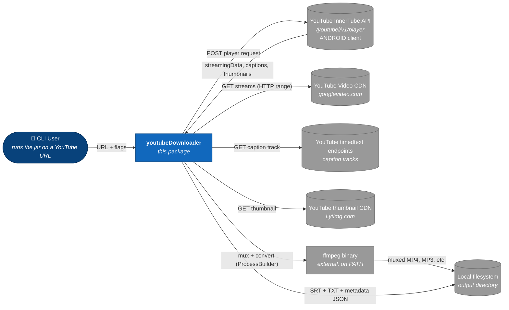

# youtubeDownloader — Design

This folder is the single source of truth for the design of this package. Every architectural decision, diagram, contract, and formal spec lives here in Markdown + Mermaid + JSON Schema so it is reviewable in the same CR as the code it describes.

> **Living doc rule:** if a CR changes behaviour described here, the same CR updates the doc. See [AUTHORING_GUIDE.md](./AUTHORING_GUIDE.md).

## What this system does

Takes a single YouTube video URL and produces, on local disk, any or all of: a muxed MP4 (best available video + audio), an audio-only file (M4A or MP3), the video's transcript (SRT + plain text), and the thumbnail. It reads stream metadata from YouTube's internal **InnerTube API** via the `ANDROID` client (chosen because it returns stream URLs that do not require JavaScript signature deciphering). It shells out to `ffmpeg` for video+audio muxing and for audio format conversion.

## Scope

- **In scope:** single YouTube video URL → video / audio / transcript / thumbnail on local disk, via a CLI and (as a byproduct) a small embeddable Java library.
- **Documented contracts only (not implemented here):**
  - **Upstream** — YouTube InnerTube `/youtubei/v1/player` API as used by the `ANDROID` client, and YouTube's `timedtext` caption endpoints. These are reverse-engineered, unofficial, and subject to change — captured as schemas in `06-formal/`.
  - **Downstream** — `ffmpeg` CLI contract (command-line arguments and expected exit codes).
- **Out of scope (MVP):** playlists, signature deciphering (JS execution), live streams, format-selection DSL, concurrent-fragment downloads, cookies / authenticated sessions, age-restricted videos, non-YouTube sites, download archive / resume.

## System context

## How to read this folder

Read the numbered files in order for a full walkthrough. Jump to a specific file if you know what you need.

| File | What's in it | When to read |
|---|---|---|
| `00-requirements.md` | Personas, user stories, EARS-format acceptance criteria, NFRs, out-of-scope | Start here. |
| `01-overview.md` | Purpose, scope, non-goals, actors, system context, external contracts, quality attributes, open questions | Anyone new. |
| `02-architecture.md` | Components, processing flow, failure handling, shutdown model | You want to understand *how* it works. |
| `03-data-model.md` | InnerTube player-response shape, format objects, caption track shape, output-file model | You're touching schemas or state. |
| `04-apis.md` | External contracts in prose: InnerTube request/response, timedtext, ffmpeg CLI, this project's CLI contract | You're integrating with or extending a boundary. |
| `05-operations.md` | How to build, run, package, troubleshoot, update | You're running the tool or packaging a release. |
| [`06-formal/`](./06-formal/README.md) | JSON Schemas for every wire message, caption-track schema, output-metadata JSON schema, state machine, contract-test index | You're implementing or generating code from contracts. |
| `07-tasks.md` | Ordered implementation task breakdown | You're about to code. |
| [`adr/`](./adr/) | Architecture Decision Records — the *why* behind the *what* | Before you challenge a design decision. |
| [`reviews/`](./reviews/README.md) | Design review rounds (per phase) | You want to see how the design evolved. |
| [`AUTHORING_GUIDE.md`](./AUTHORING_GUIDE.md) | How to write and maintain these docs | Before you add or edit anything here. |

Files marked without a link above do not yet exist — they are created during the phase they belong to.

## Architecture Decision Records

ADRs capture the *why* behind the *what* — decisions whose rationale isn't self-evident from code. New ADRs are added as Phase 2 design hits decision points.

| ADR | Decision | Status |
|---|---|---|
| [0001](./adr/0001-android-innertube-client.md) | Use the ANDROID InnerTube client as the primary stream-metadata source | Accepted |
| [0002](./adr/0002-okhttp.md) | Use OkHttp for HTTP | Accepted |
| [0003](./adr/0003-ffmpeg-processbuilder.md) | Shell out to `ffmpeg` via `ProcessBuilder` for muxing and audio transcoding | Accepted |
| [0004](./adr/0004-jackson-for-json.md) | Use Jackson for InnerTube JSON parsing | Accepted |

## Spec-driven phases

This package is being built spec-first. Phases are gated by review + approval. No phase starts until the previous one is `resolved` via a review file in `reviews/`.

| Phase | Artifact | Status |
|---|---|---|
| 1 — Requirements | `00-requirements.md` | **resolved** (1a `1481921`; 1b `d300785`; 1c `41eefc0`) |
| 2 — Design | `01`–`05`, ADRs | **resolved** (`01` `aceca50`; `02` `ec90ff8`; ADRs 0001–0004 `f44e681`/`bae8a87`/`278f51f`/`1d10c7c`; `03` `5a418a1`; `04` `4088d0f`; `05` `ebcc8b9`) |
| 3 — Formal contracts | `06-formal/` | **resolved** (`12fb5cc`) |
| 4 — Tasks | `07-tasks.md` | **resolved** (`ec9e74b`) |
| 5 — Code | `src/main/**` | next |

Within Phase 1 (Requirements), we followed three sub-phases, each individually reviewed:

| Sub-phase | Contents | Status |
|---|---|---|
| 1a | Personas + user stories | **resolved** ([`1481921`](./reviews/2026-05-02-requirements-phase-1a-r1.md)) |
| 1b | Acceptance criteria (EARS format) | **resolved** ([`d300785`](./reviews/2026-05-02-requirements-phase-1b-r1.md)) |
| 1c | Non-functional requirements | **resolved** ([`41eefc0`](./reviews/2026-05-03-requirements-phase-1c-r1.md)) |

## Quick facts

- **Language / runtime:** Java 17 (confirmed in Phase 1c NFRs)
- **Build:** Maven 3.9+, fat jar via `maven-shade-plugin`
- **CLI parser:** `picocli` (provisional — subject to ADR in Phase 2)
- **HTTP client:** OkHttp (provisional — subject to ADR in Phase 2)
- **JSON:** Jackson (provisional — subject to ADR in Phase 2)
- **External binary:** `ffmpeg` on `PATH` (for mux + audio conversion)
- **Deploy target:** local developer machine (macOS, Linux) — no server deployment

## Out of scope (MVP)

- Playlists, channels, search
- Signature deciphering (JavaScript execution) for videos that require it — will fail with a clear error
- Live streams (`is_live = true` videos rejected with a clear error)
- Format-selection DSL (yt-dlp-style `-f "bv*[height<=720]+ba/b"`)
- Concurrent-fragment parallel downloads (DASH / HLS)
- Cookies / authenticated sessions / age-restricted content
- Download archive / resume across process restarts
- Any site other than YouTube
